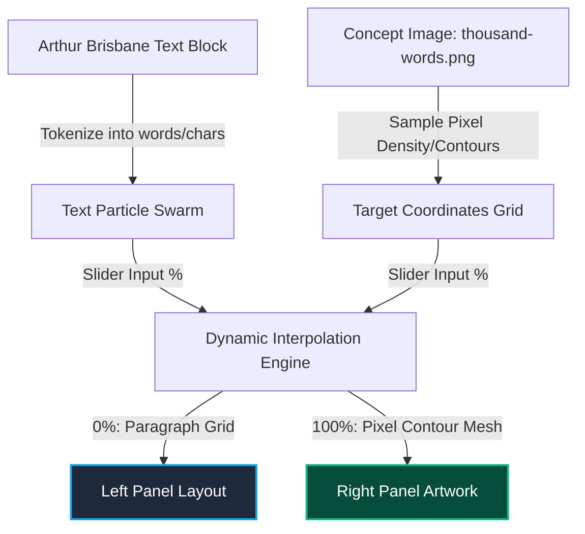

# Feasibility Study: Brisbane Text Flow & Multi-Modal Visual Assembly

This document outlines the technical feasibility, architectural design options, and implementation strategy for the next phase of the VidiFlow Showcase. The goal is to dynamically transition the text block in the left panel to form the visual artwork in the right panel.

## The Concept: Multi-Modal Equivalence

In cognitive science and information theory, this is the ultimate demonstration of representation: showing that the visual representation on the right and the textual representation on the left contain the **exact same underlying semantic information**. 

By making the text literally flow, dissolve, and assemble into the image of the eye, we dramatize the transition from sequential textual decoding to parallel visual recognition.



---

## Technical Implementation Options

We have evaluated three distinct technical architectures to achieve this real-time transition in the browser:

### Option 1: HTML5 Canvas 2D Text-to-Pixel Assembly (Recommended)
This approach provides a great balance of typographic control, high rendering quality, and ease of debugging.

*   **Pixel Scanning Stage:** We load the target image (`thousand-words.png`) into a hidden memory-only canvas. Using `ctx.getImageData()`, we analyze the brightness of each pixel. We extract coordinates of pixels below a certain brightness threshold (forming the contours of the eye and iris).
*   **Text Tokenization Stage:** We split the Brisbane text string into individual characters or short words.
*   **Coordinate Mapping:** We map each character to a target dark pixel coordinate. If there are more characters than target pixels, we discard/fade duplicates. If there are fewer, we repeat the text.
*   **Animation Loop:**
    *   As the slider moves from 0 to 100, the letters on the left side break free from their paragraph flow.
    *   Each letter's position is interpolated from its left panel layout position $(x_{start}, y_{start})$ to its right panel visual target coordinate $(x_{end}, y_{end})$.
    *   We add a noise function (like Perlin or Simplex noise) to the interpolation vector to create an organic, floating fluid current effect.
    *   At 100%, the letters pack tightly to recreate the eye artwork using pure typography (an ASCII/typographic mosaic).
    *   *Hover Micro-interaction:* Moving the cursor over the visual eye repels the letters or enlarges them to reveal the underlying words.

### Option 2: WebGL Vertex & Fragment Shader Swarm (GPU-Accelerated)
This is the highest-performance approach, capable of rendering 10,000+ individual characters at 60 FPS without breaking a sweat, even on mobile devices.

*   **Data Preparation:** We generate a buffer containing the coordinates of every single character in the paragraph. We also generate a target coordinate buffer using the image contours.
*   **SDF Font Rendering:** We pack a high-resolution character set into a Signed Distance Field (SDF) texture.
*   **GPU Interpolation:** We write a custom Vertex Shader. The shader receives:
    *   `attribute vec2 positionText` (Original text position)
    *   `attribute vec2 positionImage` (Target image pixel position)
    *   `uniform float u_progress` (Slider percentage)
*   **Shader Formula:**
    ```glsl
    // Add sinusoidal turbulence during transition
    float wave = sin(u_progress * 3.14159) * 20.0;
    vec2 currentPos = mix(positionText, positionImage, u_progress);
    currentPos.y += wave * sin(positionText.x * 0.05);
    gl_Position = projectionMatrix * modelViewMatrix * vec4(currentPos, 0.0, 1.0);
    ```
*   **Pros:** Absolutely flawless, ultra-smooth motion pathing.
*   **Cons:** Higher complexity; requires setting up WebGL/Three.js context and loading font SDF assets.

### Option 3: SVG TextPath Morphing (Vector Outlines)
A vector-based alternative where text flows along defined paths.

*   **Concept:** The eye image is vector-traced into a series of SVG paths representing the iris, pupil, and eyelids.
*   **Flow:** The text is placed inside SVG `<textPath>` elements linked to these paths.
*   **Animation:** As the slider changes, we animate the text's `startOffset` and scale, making the text "slide" into the eye's shape, wrapping around the contours.
*   **Pros:** Extremely crisp, fully responsive vector text.
*   **Cons:** Doesn't give the same granular "dissolving particle swarm" feel as Canvas or WebGL; text is restricted to lines rather than filling the solid shapes of the artwork.

---

## Proposed Next Steps

To implement this feature in Phase 2 without disrupting the existing clean showcase, we recommend the following plan:

1.  **Build a Hidden Prototype Page:** Create `brisbane-flow-test.html` locally to test the HTML5 Canvas 2D image-to-pixel parsing.
2.  **Sample the Eyeball Contours:** Write a utility to convert the dark channels of `thousand-words.png` into a compact coordinate array.
3.  **Implement the Noise Flow Physics:** Add a particle class in Javascript that supports:
    *   Simple linear interpolation (lerp).
    *   Brownian/turbulent noise vectors.
    *   Alpha transitions (text color to artwork color).
4.  **Integrate with the Slider:** Connect the physics progress value directly to the existing slider input handler.
