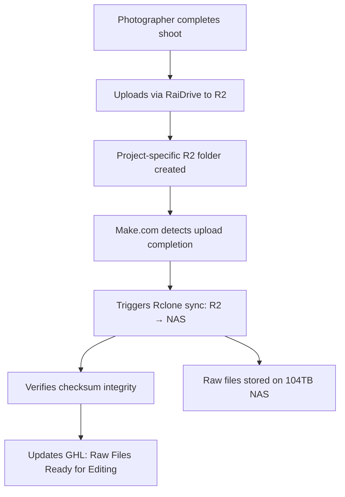
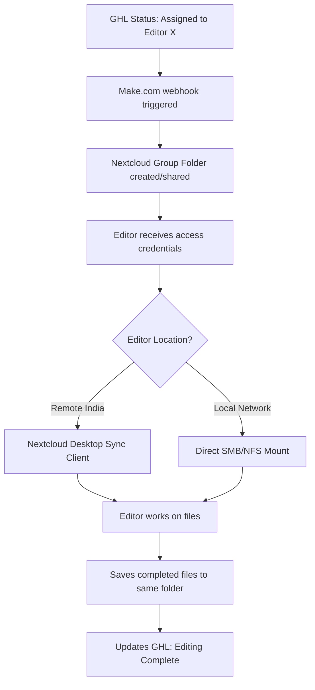
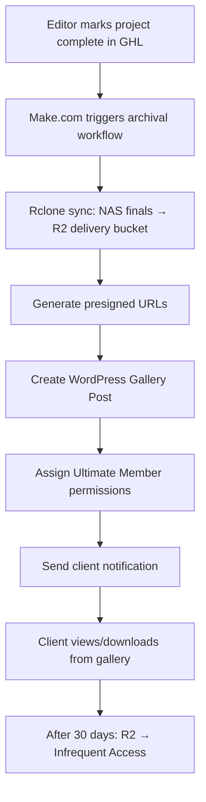

# Candid Studios Multi-Portal Media Asset Management System
## Comprehensive Implementation Plan

---

## Executive Summary

This document outlines the complete architecture and implementation plan for Candid Studios' multi-portal media asset management system. The solution addresses critical pain points in the current workflow while providing a scalable foundation for future growth.

### Current Challenges
- Manual file transfers via WeTransfer creating excessive overhead
- Photographer/Videographer → You → Editor → You → Client workflow is inefficient
- Constant manual file movement and re-downloading
- Need for handling 500GB+ project files with high-speed transfers
- Multiple user roles requiring different access levels and restrictions

### Solution Overview
A hybrid architecture combining:
- **Cloudflare R2** - Zero-egress object storage for active projects and client delivery
- **104TB Local NAS** - Primary archive and editor workspace
- **Nextcloud** - Collaboration hub with granular access control
- **Make.com** - Workflow automation orchestration
- **RaiDrive** - Seamless desktop mounting for upload/download
- **WordPress + Ultimate Member** - Client-facing portals and galleries

---

## Current Assets & Infrastructure

### Existing Systems
- **Storage**: 104TB local NAS (archival data from Dropbox migration)
- **Cloud Storage**: Cloudflare R2 (connected to WordPress)
- **Website**: WordPress with Elementor, WP Media Folder, Ultimate Member
- **CRM**: GoHighLevel for project management
- **Automation**: Make.com for workflow orchestration
- **Database**: MySQL (uem_ prefix, NOT wp_)

### Critical WordPress Plugins
- Elementor + Elementor Pro
- WP Media Folder + Addons (R2 integration)
- Ultimate Member (user portal system)
- Gravity Forms + Gravity Perks
- Advanced Custom Fields Pro
- Custom Post Type UI
- Rank Math SEO
- WPCode Premium

---

## Recommended Architecture: Three-Layer Hybrid System

```
┌─────────────────────────────────────────────────────────────────┐
│                     ORCHESTRATION LAYER                         │
│                  (Make.com + GoHighLevel)                       │
└─────────────────────────────────────────────────────────────────┘
                              ↓
┌─────────────────────────────────────────────────────────────────┐
│                   COMPUTE/STORAGE LAYER                         │
│                                                                 │
│  ┌──────────────┐    ┌──────────────┐    ┌─────────────────┐  │
│  │ Cloudflare R2│◄──►│  Local NAS   │◄──►│   Nextcloud     │  │
│  │ (Active)     │    │  (104TB)     │    │ (Collaboration) │  │
│  └──────────────┘    └──────────────┘    └─────────────────┘  │
│         ↕                   ↕                      ↕            │
│  ┌──────────────────────────────────────────────────────────┐  │
│  │         Cloudflare Worker Security Proxy                 │  │
│  │        (Path-based access control + Auth)                │  │
│  └──────────────────────────────────────────────────────────┘  │
└─────────────────────────────────────────────────────────────────┘
                              ↓
┌─────────────────────────────────────────────────────────────────┐
│                      CLIENT ACCESS LAYER                        │
│                                                                 │
│  ┌──────────┐  ┌──────────┐  ┌──────────┐  ┌───────────────┐  │
│  │Photogra- │  │  Editors │  │  Vendors │  │    Clients    │  │
│  │phers/    │  │(RaiDrive)│  │(WordPress│  │  (WordPress   │  │
│  │Videogra- │  │Nextcloud │  │ Portal)  │  │   Gallery)    │  │
│  │phers     │  │          │  │          │  │               │  │
│  └──────────┘  └──────────┘  └──────────┘  └───────────────┘  │
└─────────────────────────────────────────────────────────────────┘
```

---

## Detailed Workflow Design

### Workflow 1: Project Upload (Photographer/Videographer → R2 → Local NAS)



**Step-by-Step Process:**

1. **Project Assignment in GHL**
   - Project created with status "Awaiting Upload"
   - Custom fields: `project_uuid`, `assigned_photographer`, `r2_project_path`

2. **Photographer Receives Upload Credentials**
   - Make.com webhook triggered by GHL status change
   - Cloudflare Worker generates temporary, path-scoped S3 credentials
   - RaiDrive configuration sent to photographer
   - Access restricted to: `candid-active-projects/project-{UUID}/raw/`

3. **Upload Process**
   - Photographer mounts R2 bucket via RaiDrive as network drive
   - Drags/drops files directly to mounted drive
   - RaiDrive handles multipart uploads automatically (500GB+ files supported)
   - Progress visible in RaiDrive interface

4. **Automatic Backup to NAS**
   - Make.com polls R2 bucket for completion indicator (e.g., `.upload-complete` file)
   - Triggers local webhook to NAS server (secured with shared secret token)
   - NAS server runs Rclone script:
     ```bash
     rclone copy r2:candid-active-projects/project-{UUID}/ \
       /mnt/nas/active-projects/project-{UUID}/ \
       --checksum --verbose --fast-list
     ```
   - Rclone verifies integrity with checksums
   - Make.com updates GHL status to "Ready for Editing"

**Key Benefits:**
- ✅ Photographers get fast, direct upload to R2 (no bottleneck)
- ✅ Automatic, verified backup to local NAS
- ✅ Zero manual intervention required
- ✅ Complete audit trail in GHL

---

### Workflow 2: Editor Access (Direct from Local NAS)



**Step-by-Step Process:**

1. **Editor Assignment in GHL**
   - Project status changed to "In Editing"
   - Custom fields: `assigned_photo_editor`, `assigned_video_editor`

2. **Nextcloud Access Provisioning** (Recommended Path)
   - Make.com creates Nextcloud Group Folder: `/active-projects/project-{UUID}/`
   - Sets ACL permissions for assigned editor
   - Folder structure:
     ```
     /active-projects/project-{UUID}/
       ├── raw-photo/          (read-only for editor)
       ├── raw-video/          (read-only for editor)
       ├── edited-photo/       (read-write for photo editor)
       ├── edited-video/       (read-write for video editor)
       └── client-finals/      (read-only for editor)
     ```

3. **Editor Notification**
   - Email sent with Nextcloud credentials
   - For remote editors (India): Nextcloud Desktop Client download link
   - For local editors: Direct SMB/NFS mount instructions

4. **Editor Workflow**
   - **Remote Editors**: Nextcloud Desktop Client syncs files locally
     - Works offline after initial sync
     - Changes auto-sync when online
     - Bandwidth optimized for large files
   - **Local Editors**: Direct network share access
     - No sync delay
     - Immediate file access
   - Editor completes work, saves files to `edited-photo/` or `edited-video/`

5. **Completion Notification**
   - Editor updates GHL status to "Editing Complete"
   - OR Make.com detects `.editing-complete` marker file
   - Triggers client delivery workflow

**Key Benefits:**
- ✅ Editors work directly from NAS (fastest possible speed)
- ✅ No cloud bandwidth consumed during editing phase
- ✅ Single source of truth (your NAS)
- ✅ Automatic versioning with Nextcloud
- ✅ Optimized for remote editors (India) via Nextcloud sync

**Alternative: Direct SMB/NFS (Simpler but less features)**
- VPN required for remote editors
- Faster for local network editors
- No versioning or collaboration features
- Lower overhead

---

### Workflow 3: Client Delivery (NAS → R2 → Client Gallery)



**Step-by-Step Process:**

1. **Automated Archival Pipeline**
   - GHL status: "Ready for Client Review"
   - Make.com webhook triggers local NAS script:
     ```bash
     rclone sync /mnt/nas/active-projects/project-{UUID}/client-finals/ \
       r2:candid-client-delivery/project-{UUID}/ \
       --checksum --verbose
     ```
   - Verifies upload with `rclone check --checksum`
   - Only proceeds if integrity confirmed

2. **WordPress Gallery Creation**
   - Make.com calls WordPress REST API
   - Creates custom post type: "Client Gallery"
   - Post meta fields:
     ```
     project_uuid: {UUID}
     client_email: {email}
     r2_bucket_path: candid-client-delivery/project-{UUID}
     gallery_expiration: 30 days from now
     ```

3. **Elementor Gallery Template**
   - Pre-built template dynamically loads files from R2
   - Uses WP Media Folder to display R2 files
   - Download buttons generate presigned URLs (24-hour expiration)
   - Embedded video player for previews

4. **Ultimate Member Access Control**
   - Gallery post restricted to specific client user
   - Client receives login credentials (if new user)
   - Email notification with direct gallery link

5. **Client Experience**
   - Logs into WordPress client portal
   - Navigates to "My Projects" → Sees gallery
   - Previews photos/videos in browser
   - Downloads individual files or complete ZIP
   - Can leave comments/feedback (if enabled)

6. **Lifecycle Management**
   - After 30 days: R2 lifecycle policy moves to Infrequent Access storage
   - After 90 days: Optional deletion from R2 (retained on NAS)
   - NAS retains complete project archive indefinitely

**Key Benefits:**
- ✅ Zero egress fees for client downloads (Cloudflare R2)
- ✅ Professional, branded gallery experience
- ✅ Secure, time-limited access
- ✅ Complete download analytics
- ✅ Automatic cost optimization with lifecycle policies

---

## Technology Stack Deep Dive

### 1. Cloudflare R2 Object Storage

**Purpose**: Primary cloud storage for active projects and client delivery

**Configuration:**
- **Buckets**:
  - `candid-active-projects` - Photographer uploads, raw files
  - `candid-client-delivery` - Finalized files for client download
  - `candid-vendor-resources` - Shared assets for vendor portal

- **Location Hints**: Asia-Pacific (optimize for India editors)

- **Lifecycle Policies**:
  ```
  active-projects: 30 days → Infrequent Access → Archive to NAS
  client-delivery: 90 days → Infrequent Access → Optional deletion
  ```

- **API Tokens**:
  - Admin token (Make.com, Rclone)
  - Per-project tokens (generated by Worker, used by RaiDrive)

**Cost Structure:**
- Storage: $0.015/GB-month (~$150/month for 10TB)
- Class A Operations (writes): $4.50 per million
- Class B Operations (reads): $0.36 per million
- **Egress: $0** (key differentiator from AWS S3)

---

### 2. Cloudflare Worker Security Proxy

**Purpose**: Enforce granular, path-based access control for S3 clients

**Challenge**: Standard R2 API tokens grant bucket-wide access. If you give an editor a bucket token, they can access ALL projects. This is unacceptable.

**Solution**: Custom Cloudflare Worker acting as intelligent proxy

**Architecture:**

```javascript
// Simplified Worker Logic
addEventListener('fetch', event => {
  event.respondWith(handleRequest(event.request))
})

async function handleRequest(request) {
  // 1. Validate user identity (Cloudflare Access headers)
  const userEmail = request.headers.get('Cf-Access-Authenticated-User-Email')

  // 2. Extract requested S3 path
  const url = new URL(request.url)
  const requestedPath = url.pathname // e.g., /project-ABC123/raw/file.jpg

  // 3. Query Workers KV for authorization policy
  const authorizedProjects = await KV.get(`user:${userEmail}`)
  const projectList = JSON.parse(authorizedProjects) // ["project-ABC123", "project-XYZ789"]

  // 4. Extract project ID from path
  const projectId = requestedPath.split('/')[1] // "project-ABC123"

  // 5. Authorization check
  if (!projectList.includes(projectId)) {
    return new Response('Forbidden', { status: 403 })
  }

  // 6. Proxy request to R2 using privileged binding
  const r2Object = await R2_BUCKET.get(requestedPath)
  return new Response(r2Object.body, {
    headers: { 'Content-Type': r2Object.httpMetadata.contentType }
  })
}
```

**Workers KV Policy Store:**
```json
{
  "user:photographer1@example.com": ["project-ABC123", "project-DEF456"],
  "user:editor-photo@example.com": ["project-ABC123"],
  "user:editor-video@example.com": ["project-ABC123", "project-GHI789"]
}
```

**RaiDrive Compatibility:**
- Worker generates temporary S3-compatible credentials
- Credentials scoped to specific path prefix
- Short TTL (24-48 hours) for security
- Editor configures RaiDrive with temp credentials

**Security Features:**
- ✅ Cloudflare Access SSO integration
- ✅ Path-based authorization
- ✅ Time-limited credentials
- ✅ Audit logging
- ✅ IP whitelisting (optional)

---

### 3. Nextcloud Self-Hosted Collaboration Platform

**Purpose**: Central collaboration hub for editors, internal file sharing

**Deployment Specifications:**

**Server Requirements:**
- **OS**: Ubuntu 24.04 LTS (64-bit)
- **CPU**: 8+ cores (high frequency, modern Xeon or equivalent)
- **RAM**: 32GB base + 4GB Redis cache
- **Storage**:
  - OS/App: 256GB NVMe SSD
  - Database: Dedicated NVMe partition
  - Temp directory: 1TB+ NVMe (for concurrent large uploads)
  - Primary data: 104TB NAS (mounted via SMB/NFS)

**Software Stack:**
- **Webserver**: Nginx with PHP-FPM
- **PHP**: 8.3 (recommended) or 8.4
- **Database**: MariaDB 10.11 or PostgreSQL 16
- **Caching**:
  - **APCu**: Local in-memory cache
  - **Redis**: Distributed cache + file locking (mandatory for performance)

**Configuration Highlights:**

`config.php`:
```php
<?php
$CONFIG = array (
  // Database
  'dbtype' => 'mysql',
  'dbhost' => 'localhost',
  'dbname' => 'nextcloud',

  // Redis cache (CRITICAL for S3 performance)
  'memcache.distributed' => '\OC\Memcache\Redis',
  'memcache.locking' => '\OC\Memcache\Redis',
  'memcache.local' => '\OC\Memcache\APCu',
  'redis' => array(
    'host' => 'localhost',
    'port' => 6379,
  ),

  // Large file handling
  'max_chunk_size' => 20 * 1024 * 1024, // 20 MB chunks
  'part_file_in_storage' => false, // Don't fill up data directory with chunks

  // Performance
  'filelocking.enabled' => true,
  'maintenance_window_start' => 1, // 1 AM maintenance window
);
```

**PHP Configuration (`php.ini`):**
```ini
upload_max_filesize = 50G
post_max_size = 50G
memory_limit = 2G
max_execution_time = 3600
max_input_time = 3600
```

**Nginx Configuration:**
```nginx
client_max_body_size 50G;
client_body_timeout 3600s;
fastcgi_read_timeout 3600s;
fastcgi_send_timeout 3600s;
```

**Group Folder Structure:**
```
/active-projects/
  /project-{UUID}/
    /raw-photo/         (ACL: Photographer: RW, Photo Editor: R)
    /raw-video/         (ACL: Videographer: RW, Video Editor: R)
    /edited-photo/      (ACL: Photo Editor: RW, Admin: R)
    /edited-video/      (ACL: Video Editor: RW, Admin: R)
    /client-finals/     (ACL: Admin: RW, All: R)

/vendor-resources/      (ACL: Vendors: R, Admin: RW)
/internal-templates/    (ACL: All Staff: R, Admin: RW)
```

**Access Control Mechanisms:**
1. **Group Folders**: Project-specific shared directories with quotas
2. **File Access Control (FAC)**: Policy-based restrictions (e.g., block access outside US)
3. **External Storage**: Can mount existing network shares (SMB, NFS) with inherited ACLs

**Client Access:**
- **Desktop Sync Client**: Windows/Mac/Linux (optimized for remote editors)
- **WebDAV**: Direct file system mounting
- **Web Interface**: Browser-based file management
- **Mobile Apps**: iOS/Android

**Key Benefits:**
- ✅ Direct NAS integration (no cloud storage duplication)
- ✅ Advanced collaboration (versioning, comments, sharing)
- ✅ Optimized for remote editors (desktop sync client)
- ✅ Self-hosted (complete data control)
- ✅ S3 primary storage support (can use R2 as backend if needed)

---

### 4. Rclone - The Unsung Hero

**Purpose**: High-performance, S3-compatible sync tool for bulk operations

**Why Rclone?**
- ✅ Native S3/R2 support
- ✅ Automatic multipart uploads (handles 500GB+ files)
- ✅ Checksum verification (SHA256)
- ✅ Bandwidth limiting
- ✅ Resume on failure
- ✅ Efficient sync algorithms

**Installation (on NAS server):**
```bash
curl https://rclone.org/install.sh | sudo bash
```

**Configuration (`~/.config/rclone/rclone.conf`):**
```ini
[r2-active]
type = s3
provider = Cloudflare
access_key_id = YOUR_ACCESS_KEY_ID
secret_access_key = YOUR_SECRET_ACCESS_KEY
endpoint = https://YOUR_ACCOUNT_ID.r2.cloudflarestorage.com
acl = private

[local-nas]
type = local
```

**Critical Commands:**

**1. Sync R2 → NAS (after photographer upload):**
```bash
rclone sync r2-active:candid-active-projects/project-ABC123/ \
  /mnt/nas/active-projects/project-ABC123/ \
  --checksum \
  --verbose \
  --fast-list \
  --transfers 8 \
  --checkers 16
```

**2. Sync NAS → R2 (client delivery):**
```bash
rclone sync /mnt/nas/active-projects/project-ABC123/client-finals/ \
  r2-active:candid-client-delivery/project-ABC123/ \
  --checksum \
  --verbose \
  --fast-list
```

**3. Verify integrity:**
```bash
rclone check /mnt/nas/active-projects/project-ABC123/ \
  r2-active:candid-active-projects/project-ABC123/ \
  --checksum
```

**4. Bandwidth limiting (if needed):**
```bash
rclone sync ... --bwlimit 50M  # Limit to 50 MB/s
```

**Automation Script Example:**
```bash
#!/bin/bash
# /usr/local/bin/sync-project-to-nas.sh

PROJECT_UUID=$1
SHARED_SECRET=$2

# Validate secret token
if [ "$SHARED_SECRET" != "YOUR_SECURE_TOKEN_HERE" ]; then
  echo "ERROR: Invalid authentication"
  exit 1
fi

# Sync from R2 to NAS
rclone sync \
  r2-active:candid-active-projects/$PROJECT_UUID/ \
  /mnt/nas/active-projects/$PROJECT_UUID/ \
  --checksum \
  --verbose \
  --log-file=/var/log/rclone/sync-$PROJECT_UUID.log

# Verify integrity
rclone check \
  /mnt/nas/active-projects/$PROJECT_UUID/ \
  r2-active:candid-active-projects/$PROJECT_UUID/ \
  --checksum

if [ $? -eq 0 ]; then
  echo "SUCCESS: Project $PROJECT_UUID synced and verified"
  # Trigger Make.com webhook to update GHL
  curl -X POST https://hook.us2.make.com/YOUR_WEBHOOK_ID \
    -H "Content-Type: application/json" \
    -d "{\"project_uuid\": \"$PROJECT_UUID\", \"status\": \"ready_for_editing\"}"
else
  echo "ERROR: Verification failed for project $PROJECT_UUID"
  exit 1
fi
```

---

### 5. RaiDrive - User-Friendly S3 Mounting

**Purpose**: Mount R2 buckets as Windows/Mac network drives

**Why RaiDrive over alternatives?**
- ✅ S3-compatible (works with R2)
- ✅ Native OS integration (appears as drive letter)
- ✅ Bandwidth management
- ✅ Offline file caching
- ✅ Multipart upload support
- ✅ Affordable licensing ($4.84/user/month)

**Configuration for Photographers:**
```
Storage: Cloudflare R2
Bucket: candid-active-projects
Access Key: [Temporary key from Worker]
Secret Key: [Temporary secret from Worker]
Region: auto
Path: /project-ABC123/raw/
Drive Letter: P: (for "Projects")
```

**Benefits:**
- Photographers drag/drop files as if local drive
- Large files automatically chunked
- Resume on network interruption
- No technical knowledge required

---

### 6. Make.com Workflow Automation

**Purpose**: Orchestrate all system integrations and workflows

**Scenarios to Build:**

**Scenario 1: New Project Upload Provisioning**
```
Trigger: GHL Webhook (Project Status → "Awaiting Upload")
    ↓
Action 1: HTTP Request to Cloudflare Worker API
  - Endpoint: POST /api/generate-credentials
  - Body: { "project_uuid": "ABC123", "user_email": "photographer@example.com" }
  - Response: { "access_key": "...", "secret_key": "...", "path": "..." }
    ↓
Action 2: Send Email to Photographer
  - Template: "Project Ready for Upload"
  - Include: RaiDrive configuration instructions
    ↓
Action 3: Update GHL Custom Field
  - Field: r2_project_path
  - Value: /project-ABC123/raw/
```

**Scenario 2: Upload Completion → NAS Sync**
```
Trigger: Cloudflare R2 Event Notification (new object created)
    ↓
Filter: Object key matches pattern "*/raw/.upload-complete"
    ↓
Action 1: HTTP Webhook to Local NAS Server
  - URL: https://your-nas.local:8443/sync-project
  - Headers: { "X-Shared-Secret": "YOUR_SECRET" }
  - Body: { "project_uuid": "ABC123" }
  - IP Whitelist: Make.com static IPs only
    ↓
Action 2: Wait for Webhook Response (timeout 3600s)
    ↓
Action 3: Update GHL Status
  - Status: "Ready for Editing"
  - Custom Field: nas_sync_status = "completed"
```

**Scenario 3: Editor Assignment → Nextcloud Provisioning**
```
Trigger: GHL Webhook (Project Status → "In Editing")
    ↓
Action 1: Nextcloud API - Create Group Folder
  - Endpoint: POST /apps/groupfolders/folders
  - Body: { "mountpoint": "project-ABC123" }
    ↓
Action 2: Nextcloud API - Set ACL Permissions
  - Photo Editor: Read-write on /edited-photo/
  - Video Editor: Read-write on /edited-video/
  - Both: Read-only on /raw-photo/ and /raw-video/
    ↓
Action 3: Send Email to Editor
  - Template: "Project Assigned - Access Instructions"
  - Include: Nextcloud credentials, Desktop Client download link
    ↓
Action 4: Update GHL Timeline
  - Note: "Editor notified and granted access"
```

**Scenario 4: Editing Complete → Client Gallery Creation**
```
Trigger: GHL Webhook (Project Status → "Ready for Client Review")
    ↓
Action 1: Trigger Local NAS Webhook (Rclone sync to R2 delivery)
  - Wait for completion confirmation
    ↓
Action 2: WordPress API - Create Gallery Post
  - Endpoint: POST /wp-json/wp/v2/client-gallery
  - Post Type: client-gallery
  - Meta: { "project_uuid": "ABC123", "r2_path": "..." }
    ↓
Action 3: WordPress API - Set Featured Image
  - Use first photo from R2 bucket
    ↓
Action 4: Ultimate Member API - Assign Permissions
  - User: client@example.com
  - Post ID: [from step 2]
  - Permission: view
    ↓
Action 5: Send Email to Client
  - Template: "Your photos are ready!"
  - Include: Gallery URL, login credentials (if new user)
    ↓
Action 6: Update GHL Status
  - Status: "Delivered to Client"
```

**Scenario 5: Security Cleanup - Revoke Expired Credentials**
```
Trigger: Schedule (runs daily at 2 AM)
    ↓
Action 1: Query Workers KV for all credentials
    ↓
Filter: created_at < (now - 48 hours)
    ↓
Action 2: HTTP Request to Worker API
  - Endpoint: DELETE /api/credentials/{credential_id}
    ↓
Action 3: Log to Google Sheets (audit trail)
  - Timestamp, User Email, Project UUID, Action: "Revoked"
```

---

### 7. WordPress + Ultimate Member Portal System

**Purpose**: Client-facing galleries and multi-role portal access

**Custom Post Types:**
```php
// Client Gallery
register_post_type('client_gallery', array(
  'labels' => array('name' => 'Client Galleries'),
  'public' => true,
  'has_archive' => true,
  'supports' => array('title', 'editor', 'thumbnail'),
  'show_in_rest' => true, // Enable Gutenberg/API
));

// Vendor Resource
register_post_type('vendor_resource', array(
  'labels' => array('name' => 'Vendor Resources'),
  'public' => false,
  'show_ui' => true,
  'capability_type' => 'post',
  'supports' => array('title', 'editor', 'custom-fields'),
));
```

**Ultimate Member Roles:**
```
1. um_photographer
   - Can: Upload to assigned projects, view own assignments
   - Redirect after login: /photographer-dashboard/

2. um_videographer
   - Can: Upload to assigned projects, view own assignments
   - Redirect after login: /videographer-dashboard/

3. um_photo_editor
   - Can: Access assigned projects, upload edited files
   - Redirect after login: /editor-dashboard/

4. um_video_editor
   - Can: Access assigned projects, upload edited files
   - Redirect after login: /editor-dashboard/

5. um_vendor
   - Can: View vendor resources, download approved assets
   - Redirect after login: /vendor-portal/

6. um_affiliate
   - Can: View referral dashboard, track commissions
   - Redirect after login: /affiliate-dashboard/

7. um_client
   - Can: View own galleries, download files, leave feedback
   - Redirect after login: /my-galleries/
```

**Elementor Templates:**

**Client Gallery Template:**
```
[Header Section]
  - Project Name (dynamic: post title)
  - Event Date (ACF field)
  - Download All button (generates ZIP from R2)

[Photo Grid Section]
  - WP Media Folder Gallery Widget
  - Source: R2 bucket path (from post meta)
  - Lightbox enabled
  - Download button per image

[Video Section]
  - Cloudflare Stream embedded player
  - Download link (presigned URL, 24hr expiration)

[Feedback Section]
  - Gravity Form: Client feedback/approval
  - Conditional: Only show if status = "awaiting_approval"
```

**Photographer Dashboard Template:**
```
[Welcome Section]
  - Dynamic greeting: "Welcome, {first_name}!"
  - Quick stats: Projects this month, Total uploads

[Active Projects Widget]
  - Query: GHL API via Make.com → WordPress transient cache
  - Display: Project name, Event date, Upload deadline
  - Action: "Upload Files" button → RaiDrive instructions modal

[Upload Instructions Modal]
  - Step 1: Download RaiDrive
  - Step 2: Configure with provided credentials
  - Step 3: Upload files to P:\ drive
  - Step 4: Create .upload-complete file when done

[Past Projects Archive]
  - Filterable list of completed projects
  - Status badges (Uploaded, In Editing, Delivered)
```

**Integration with WP Media Folder + R2:**
```php
// Fetch files from R2 bucket for gallery
add_filter('wpmf_gallery_images', function($images, $gallery_id) {
  $post_id = get_the_ID();
  $r2_path = get_post_meta($post_id, 'r2_bucket_path', true);

  if ($r2_path) {
    // Make.com webhook to fetch R2 file list
    $response = wp_remote_post('https://hook.us2.make.com/list-r2-files', array(
      'body' => json_encode(array('path' => $r2_path))
    ));

    $r2_files = json_decode(wp_remote_retrieve_body($response), true);

    foreach ($r2_files as $file) {
      $images[] = array(
        'url' => $file['url'], // Presigned URL from R2
        'title' => $file['name'],
        'size' => $file['size']
      );
    }
  }

  return $images;
}, 10, 2);
```

---

## Implementation Roadmap

### Phase 1: Foundation & High-Speed Upload (Weeks 1-2)

**Goals:**
- Establish R2 infrastructure
- Enable photographers to upload directly to cloud
- Automatic backup to local NAS

**Tasks:**

**Week 1: R2 & Rclone Setup**
1. Provision Cloudflare R2 account
   - Create buckets: `candid-active-projects`, `candid-client-delivery`
   - Configure location hints: Asia-Pacific
   - Generate admin API tokens

2. Install Rclone on NAS server
   ```bash
   curl https://rclone.org/install.sh | sudo bash
   rclone config # Configure R2 remotes
   ```

3. Test large file transfer
   ```bash
   # Create 10GB test file
   dd if=/dev/urandom of=/tmp/testfile bs=1M count=10240

   # Upload to R2
   time rclone copy /tmp/testfile r2-active:candid-active-projects/test/

   # Verify checksum
   rclone check /tmp/testfile r2-active:candid-active-projects/test/
   ```

4. Create automated sync script
   - Script location: `/usr/local/bin/sync-r2-to-nas.sh`
   - Add to cron or triggered via webhook
   - Implement checksum verification
   - Error handling and logging

**Week 2: GHL Integration & RaiDrive Deployment**
5. Configure GHL custom fields
   - `project_uuid` (text)
   - `r2_project_path` (text)
   - `photographer_email` (text)
   - `upload_status` (dropdown: Not Started, In Progress, Complete)
   - `nas_sync_status` (dropdown: Pending, Syncing, Complete, Error)

6. Build Make.com Scenario: "New Project Upload Provisioning"
   - Trigger: GHL webhook (project status → "Awaiting Upload")
   - Action 1: Generate unique project UUID
   - Action 2: Create R2 path: `/project-{UUID}/raw/`
   - Action 3: (Temporary) Generate static R2 credentials
   - Action 4: Email photographer with RaiDrive setup instructions
   - Action 5: Update GHL with project UUID and R2 path

7. Deploy RaiDrive licenses
   - Purchase Team licenses (start with 5)
   - Create setup guide PDF
   - Configure template: S3 endpoint, bucket, credentials
   - Train 1-2 photographers as pilot users

8. End-to-end test
   - Photographer uploads 50GB test project
   - Verify files in R2
   - Trigger NAS sync manually
   - Verify files on NAS with matching checksums
   - Update GHL status

**Deliverables:**
✅ Photographers can upload 500GB+ files to R2 via RaiDrive
✅ Automatic verified backup to 104TB NAS
✅ GHL tracking of upload and sync status
✅ Complete documentation for photographer onboarding

---

### Phase 2: Editor Access & Collaboration (Weeks 3-4)

**Goals:**
- Enable editors to access files directly from NAS
- Optimize for remote editors (India)
- Implement secure, granular access control

**Tasks:**

**Week 3: Nextcloud Deployment**
1. Provision server (on-premise or VPS)
   - Ubuntu 24.04 LTS
   - 8 CPU cores, 32GB RAM
   - 256GB NVMe (OS/app)
   - 1TB NVMe (temp directory)
   - Mount 104TB NAS via SMB/NFS

2. Install Nextcloud stack
   ```bash
   # Install dependencies
   sudo apt update
   sudo apt install nginx mariadb-server php8.3-fpm php8.3-{mysql,gd,curl,mbstring,xml,zip,redis}

   # Install Redis
   sudo apt install redis-server

   # Download Nextcloud
   wget https://download.nextcloud.com/server/releases/latest.tar.bz2
   tar -xjf latest.tar.bz2
   sudo mv nextcloud /var/www/
   ```

3. Configure performance optimizations
   - PHP-FPM pool settings: `pm.max_children = 120`
   - Redis cache configuration in `config.php`
   - Nginx client_max_body_size: 50G
   - PHP timeouts: 3600s
   - Enable opcache + JIT

4. Create Group Folder structure
   ```
   /active-projects/
   /vendor-resources/
   /internal-templates/
   ```

5. Install and configure Nextcloud apps
   - Group Folders
   - File Access Control
   - External Storage (for NAS mount)
   - Desktop Sync Client (distribute to editors)

**Week 4: Cloudflare Worker Security Proxy**
6. Develop Cloudflare Worker
   - Path-based authorization logic
   - Workers KV policy store integration
   - Temporary S3 credential generation
   - Cloudflare Access integration (SSO)

7. Deploy Worker
   - Custom domain: `edit.candidstudios.net`
   - R2 bucket binding
   - KV namespace binding
   - Environment variables (secrets)

8. Build Make.com Scenario: "Editor Assignment"
   - Trigger: GHL webhook (project status → "In Editing")
   - Action 1: Create Nextcloud Group Folder
   - Action 2: Set ACL permissions for assigned editor
   - Action 3: Call Worker API to add editor to KV policy
   - Action 4: Email editor with access instructions
   - Action 5: Update GHL timeline

9. Test with remote editor (India)
   - Install Nextcloud Desktop Client
   - Sync 100GB test project
   - Measure bandwidth and latency
   - Verify offline editing capability
   - Confirm auto-sync of changes

**Deliverables:**
✅ Nextcloud server operational with NAS integration
✅ Remote editors can sync files via Desktop Client
✅ Local editors have direct SMB/NFS access
✅ Cloudflare Worker enforces project-level access control
✅ Automatic provisioning via Make.com + GHL

---

### Phase 3: Client Delivery & Archival (Weeks 5-6)

**Goals:**
- Automate delivery of final files to clients
- Create professional WordPress galleries
- Implement secure archival workflow

**Tasks:**

**Week 5: Archival Pipeline**
1. Set up local webhook listener
   - Install n8n.io on NAS server (or use simple Flask app)
   - Configure Execute Command node
   - Implement security: shared secret token + IP whitelist
   - Test with curl requests

2. Create archival script
   ```bash
   #!/bin/bash
   # /usr/local/bin/archive-to-r2.sh

   PROJECT_UUID=$1

   # Sync finals to R2 delivery bucket
   rclone sync \
     /mnt/nas/active-projects/$PROJECT_UUID/client-finals/ \
     r2-active:candid-client-delivery/$PROJECT_UUID/ \
     --checksum --verbose

   # Verify
   rclone check \
     /mnt/nas/active-projects/$PROJECT_UUID/client-finals/ \
     r2-active:candid-client-delivery/$PROJECT_UUID/ \
     --checksum

   if [ $? -eq 0 ]; then
     curl -X POST https://hook.us2.make.com/archival-complete \
       -d "project_uuid=$PROJECT_UUID&status=success"
   fi
   ```

3. Build Make.com Scenario: "Archival Trigger"
   - Trigger: GHL webhook (project status → "Ready for Client Review")
   - Action 1: HTTP webhook to local NAS
   - Action 2: Wait for completion response (timeout 1 hour)
   - Action 3: Update GHL status: "Archived to R2"

4. Configure R2 lifecycle policies
   - Rule 1: After 30 days → Infrequent Access storage
   - Rule 2: After 90 days → Delete (optional, based on contract)

**Week 6: WordPress Gallery System**
5. Create custom post type: "Client Gallery"
   ```php
   // In theme's functions.php or custom plugin
   register_post_type('client_gallery', array(
     'public' => true,
     'show_in_rest' => true,
     'supports' => array('title', 'editor', 'thumbnail', 'custom-fields')
   ));
   ```

6. Build Elementor gallery template
   - Header: Project name, event date, download all button
   - Photo grid: WP Media Folder widget (R2 source)
   - Video section: Embedded player
   - Feedback form: Gravity Forms

7. Configure Ultimate Member
   - Create `um_client` role
   - Set up private gallery access
   - Custom redirect: `/my-galleries/`

8. Build Make.com Scenario: "Gallery Creation"
   - Trigger: GHL webhook (project archived to R2)
   - Action 1: WordPress API - Create gallery post
     ```json
     POST /wp-json/wp/v2/client_gallery
     {
       "title": "Kara & Jim's Wedding",
       "status": "publish",
       "meta": {
         "project_uuid": "ABC123",
         "r2_bucket_path": "candid-client-delivery/ABC123",
         "client_email": "client@example.com"
       }
     }
     ```
   - Action 2: Set featured image (first photo from R2)
   - Action 3: Ultimate Member - Assign view permission
   - Action 4: Email client with login credentials + gallery link
   - Action 5: Update GHL status: "Delivered to Client"

9. End-to-end test
   - Complete mock project (raw upload → editing → finals)
   - Trigger archival workflow
   - Verify gallery creation
   - Test client login and download
   - Measure download speeds from R2

**Deliverables:**
✅ Automated archival: NAS → R2 delivery bucket
✅ WordPress client galleries auto-created
✅ Secure client access with Ultimate Member
✅ Professional download experience
✅ Complete project lifecycle automation

---

### Phase 4: Multi-Portal Expansion (Weeks 7-10)

**Goals:**
- Build dedicated portals for all user roles
- Implement vendor and affiliate systems
- Full integration with existing WordPress site

**Tasks:**

**Week 7: Portal Role Architecture**
1. Define all Ultimate Member roles (7 total)
   - Photographer, Videographer, Photo Editor, Video Editor
   - Vendor, Affiliate, Client

2. Create ACF field groups for each role
   - Photographer: Assigned projects, Equipment list
   - Editor: Skill specialties, Hourly rate
   - Vendor: Company info, Service offerings
   - Affiliate: Referral code, Commission tier

3. Configure role-based redirects
   - After login, redirect to role-specific dashboard

4. Set up Nextcloud Group Folders by role
   ```
   /photographers/
     /equipment-guides/
     /project-templates/
   /editors/
     /style-guides/
     /luts-presets/
   /vendors/
     /approved-assets/
     /brand-guidelines/
   ```

**Week 8: Photographer/Videographer Portals**
5. Build Elementor dashboard template
   - Active projects widget (GHL API integration)
   - Upload instructions section
   - Past projects archive
   - Equipment checkout system (optional)

6. Create upload tracking system
   - Display: Project name, Deadline, Upload status
   - Button: "Get Upload Credentials" → triggers Make.com scenario

7. Add RaiDrive automation
   - Make.com generates temporary credentials
   - Displays auto-filled configuration
   - Countdown timer for credential expiration

**Week 9: Editor Portals**
8. Build editor dashboard
   - Assigned projects (filterable by status)
   - Nextcloud sync status indicator
   - File download/upload interface
   - Project completion button

9. Integrate Nextcloud Desktop Client installer
   - Automatic configuration with pre-filled credentials
   - One-click setup for new editors

10. Add project communication system
    - Comments per project (stored in GHL)
    - File-specific annotations (Nextcloud Comments app)
    - Email notifications for new assignments

**Week 10: Vendor & Affiliate Portals**
11. Vendor portal
    - Resource library (filterable by category)
    - Download tracking (log to Google Sheets via Make.com)
    - Contact form for support requests

12. Affiliate portal
    - Referral link generator
    - Commission tracking dashboard (GoHighLevel Opportunities)
    - Payout history
    - Marketing materials download section

13. Final integration testing
    - Test all 7 user roles
    - Verify permission boundaries
    - Load testing (simulate 50 concurrent users)
    - Security audit (attempt unauthorized access)

**Deliverables:**
✅ 7 fully functional role-specific portals
✅ Complete integration with existing WordPress site
✅ Seamless UX across all user types
✅ Production-ready system with documentation

---

## Security Implementation

### 1. Cloudflare Worker Authentication Flow

**SSO Login (Initial Authentication):**
```
User → edit.candidstudios.net
  ↓
Cloudflare Access checks identity
  ↓
[If not authenticated]
  → Redirect to SSO login (Google Workspace, Okta, etc.)
  → User authenticates
  → Cloudflare Access sets identity cookie
  ↓
[If authenticated]
  → Request forwarded to Worker with identity headers
  → Worker logs user in, displays credential portal
```

**Temporary Credential Generation:**
```javascript
// Worker endpoint: POST /api/generate-credentials
export default {
  async fetch(request, env) {
    // 1. Verify Cloudflare Access identity
    const userEmail = request.headers.get('Cf-Access-Authenticated-User-Email')
    if (!userEmail) {
      return new Response('Unauthorized', { status: 401 })
    }

    // 2. Parse request
    const { project_uuid } = await request.json()

    // 3. Verify user authorized for this project
    const authorizedProjects = await env.KV.get(`user:${userEmail}`)
    if (!JSON.parse(authorizedProjects).includes(project_uuid)) {
      return new Response('Forbidden', { status: 403 })
    }

    // 4. Generate temporary S3 credentials (24hr TTL)
    const credentialId = crypto.randomUUID()
    const accessKey = generateAccessKey()
    const secretKey = generateSecretKey()

    const credential = {
      id: credentialId,
      user_email: userEmail,
      project_uuid: project_uuid,
      access_key: accessKey,
      secret_key: secretKey,
      created_at: Date.now(),
      expires_at: Date.now() + (24 * 60 * 60 * 1000), // 24 hours
      allowed_path: `project-${project_uuid}/`
    }

    // 5. Store in KV
    await env.KV.put(`credential:${credentialId}`, JSON.stringify(credential))

    // 6. Return to user
    return new Response(JSON.stringify({
      access_key: accessKey,
      secret_key: secretKey,
      bucket: 'candid-active-projects',
      endpoint: 'https://edit.candidstudios.net',
      path: `project-${project_uuid}/`,
      expires_at: credential.expires_at
    }), {
      headers: { 'Content-Type': 'application/json' }
    })
  }
}
```

**S3 Request Validation (RaiDrive access):**
```javascript
// Worker handles S3-compatible requests from RaiDrive
async function handleS3Request(request, env) {
  // 1. Parse S3 authorization header
  const authHeader = request.headers.get('Authorization')
  const accessKey = extractAccessKey(authHeader)

  // 2. Lookup credential in KV
  const credentialData = await findCredentialByAccessKey(env.KV, accessKey)
  if (!credentialData) {
    return new Response('Invalid credentials', { status: 403 })
  }

  const credential = JSON.parse(credentialData)

  // 3. Check expiration
  if (Date.now() > credential.expires_at) {
    return new Response('Credentials expired', { status: 403 })
  }

  // 4. Verify requested path matches allowed path
  const requestedPath = new URL(request.url).pathname
  if (!requestedPath.startsWith(`/${credential.allowed_path}`)) {
    return new Response('Path not authorized', { status: 403 })
  }

  // 5. Proxy to R2 using privileged binding
  const r2Key = requestedPath.substring(1) // Remove leading /

  if (request.method === 'GET') {
    const object = await env.R2_BUCKET.get(r2Key)
    if (!object) return new Response('Not found', { status: 404 })

    return new Response(object.body, {
      headers: {
        'Content-Type': object.httpMetadata.contentType,
        'ETag': object.httpEtag
      }
    })
  }

  if (request.method === 'PUT') {
    await env.R2_BUCKET.put(r2Key, request.body, {
      httpMetadata: {
        contentType: request.headers.get('Content-Type')
      }
    })
    return new Response('OK', { status: 200 })
  }

  // ... handle other S3 operations (DELETE, LIST, etc.)
}
```

### 2. Make.com → Local NAS Webhook Security

**Challenge**: Securely trigger scripts on private network from public internet

**Solution**: Multi-layer validation

**NAS Webhook Listener (n8n.io example):**
```
[Webhook Trigger Node]
  - Method: POST
  - Path: /sync-project
  - Authentication: Header Auth
    ↓
[Validation Node - Function]
  - Check X-Shared-Secret header
  - Verify IP address against whitelist
  - Validate project_uuid format (UUID v4)
    ↓
[If Valid]
  → [Execute Command Node]
    - Command: /usr/local/bin/sync-r2-to-nas.sh
    - Arguments: {{$json["project_uuid"]}}
    - Timeout: 3600s
    ↓
[Response Node]
  - Return: { "status": "success", "project_uuid": "..." }
```

**Security Checklist:**
✅ Shared secret token (minimum 32 characters, rotated monthly)
✅ IP whitelist (Make.com static IPs only)
✅ HTTPS only (valid SSL certificate)
✅ Rate limiting (max 10 requests/minute)
✅ Input validation (sanitize all parameters)
✅ Logging (audit trail of all executions)

### 3. WordPress API Security

**REST API Authentication:**
- Application Passwords (WordPress 5.6+)
- JWT tokens (via plugin)
- OAuth 2.0 (for third-party integrations)

**Make.com → WordPress Example:**
```
POST /wp-json/wp/v2/client_gallery
Headers:
  Authorization: Basic base64(username:application_password)
  Content-Type: application/json
Body:
{
  "title": "Project ABC123",
  "status": "publish",
  "meta": {
    "project_uuid": "ABC123",
    "r2_path": "candid-client-delivery/ABC123/"
  }
}
```

**Ultimate Member ACL Enforcement:**
```php
// Restrict gallery post to specific client
add_filter('um_can_view_post', function($can_view, $post_id, $user_id) {
  if (get_post_type($post_id) === 'client_gallery') {
    $client_email = get_post_meta($post_id, 'client_email', true);
    $user = get_userdata($user_id);

    if ($user->user_email !== $client_email && !current_user_can('administrator')) {
      return false;
    }
  }
  return $can_view;
}, 10, 3);
```

---

## Performance Optimization

### 1. Large File Transfer Benchmarks

**Target Performance:**
- 500GB upload: < 4 hours (over 1 Gbps connection)
- 100GB download (India): < 3 hours (average 75 Mbps international)

**Rclone Optimization:**
```bash
rclone copy \
  /source/path/ \
  r2-active:bucket/path/ \
  --transfers 16 \         # Parallel file transfers
  --checkers 32 \          # Parallel checksum checks
  --buffer-size 128M \     # Large buffer for big files
  --s3-chunk-size 256M \   # Multipart upload chunk size
  --s3-upload-concurrency 8 \ # Concurrent chunk uploads
  --fast-list \            # Use ListR for faster listings
  --checksum               # Verify integrity
```

**Expected Throughput:**
- Local network → NAS: 900 Mbps (limited by gigabit ethernet)
- Upload to R2: 700-900 Mbps (limited by ISP upload speed)
- Download from R2 (India): 50-100 Mbps (international link)

### 2. Nextcloud Performance Tuning

**Redis Configuration:**
```
# /etc/redis/redis.conf
maxmemory 4gb
maxmemory-policy allkeys-lru
save "" # Disable disk persistence for pure cache
```

**PHP-FPM Pool:**
```
# /etc/php/8.3/fpm/pool.d/nextcloud.conf
pm = dynamic
pm.max_children = 120
pm.start_servers = 12
pm.min_spare_servers = 6
pm.max_spare_servers = 18
pm.max_requests = 500
```

**Nginx Caching:**
```nginx
# Cache static assets
location ~* \.(?:css|js|woff2?|svg|gif|png|jpg|jpeg)$ {
  expires 1y;
  add_header Cache-Control "public, immutable";
}
```

### 3. Cloudflare Optimizations

**R2 Location Hints:**
- Set to "Asia-Pacific (APAC)" for India editors
- Positions data closer to retrieval point

**Cloudflare CDN:**
- Cache static assets (gallery images, CSS, JS)
- Page Rules: Cache everything for `/wp-content/uploads/*`
- Argo Smart Routing: Optimize global routing

**Worker Performance:**
- Keep Worker logic minimal (< 50ms CPU time)
- Cache policy lookups in Worker KV (read-heavy)
- Use Durable Objects for stateful operations (if needed)

---

## Cost Analysis

### Monthly Operating Costs (Estimated)

**Cloudflare Services:**
| Service | Usage | Cost |
|---------|-------|------|
| R2 Storage | 10 TB | $150 |
| R2 Class A Operations | 500K writes | $2.25 |
| R2 Class B Operations | 5M reads | $1.80 |
| Workers (Bundled) | 10M requests | $5 |
| Workers KV | 1GB + 10M reads | $1.50 |
| Cloudflare Access | 10 users | $36 |
| **Subtotal** | | **$196.55** |

**Software Licenses:**
| Software | Users | Cost |
|----------|-------|------|
| RaiDrive Team | 10 | $48.40 |
| Make.com Pro | - | $29 |
| Nextcloud (self-hosted) | - | $0 |
| **Subtotal** | | **$77.40** |

**Infrastructure (assuming VPS for Nextcloud):**
| Resource | Specification | Cost |
|----------|--------------|------|
| VPS (Hetzner) | 8 vCPU, 32GB RAM, 256GB NVMe | $40 |
| Backups | 500GB | $10 |
| **Subtotal** | | **$50** |

**Total Monthly Cost: ~$324/month**

**Compare to WeTransfer Pro:**
- WeTransfer Pro: $12/user/month × 10 users = $120/month
- Limitations: 200GB per transfer, no automation, no archival
- **Your system provides 50TB+ capacity with full automation**

**Cost Savings vs. AWS S3:**
- 10TB egress on S3: ~$900/month
- R2 egress: $0
- **Monthly savings: $900**

---

## Risk Mitigation & Disaster Recovery

### 1. Data Loss Prevention

**Three-Tier Backup Strategy:**
1. **Primary**: 104TB NAS (RAID 10 recommended)
2. **Cloud**: Cloudflare R2 (active projects, 30-day retention)
3. **Offsite**: Quarterly backup to external drives (stored off-site)

**Rclone Checksum Verification:**
- Always use `--checksum` flag
- Verify after every transfer
- Log all verification results

### 2. Service Availability

**Single Points of Failure:**
- ❌ **104TB NAS**: If fails, editors lose access
  - **Mitigation**: RAID configuration, hot spare drives
  - **Recovery**: Restore from R2 (recent projects) or offsite backup

- ❌ **Nextcloud Server**: If down, collaboration stops
  - **Mitigation**: Set up hot standby server
  - **Recovery**: Restore from daily database backups

- ❌ **Cloudflare R2**: If unavailable, uploads/downloads fail
  - **Mitigation**: Cloudflare has 99.99% SLA
  - **Recovery**: Use NAS as temporary fallback

**Monitoring:**
- Uptime Robot: Monitor Nextcloud, WordPress, Cloudflare Worker
- Disk space alerts: Email when NAS > 90% full
- Rclone error logs: Daily review for failed syncs

### 3. Security Incidents

**Scenario: Compromised Credentials**
- **Detection**: Unusual access patterns in Cloudflare Access logs
- **Response**:
  1. Revoke all temporary credentials (Worker KV purge)
  2. Rotate R2 API tokens
  3. Force password reset for affected users
  4. Audit access logs for unauthorized downloads

**Scenario: Malware Upload**
- **Detection**: ClamAV scan on NAS (scheduled daily)
- **Response**:
  1. Quarantine infected files
  2. Notify uploader
  3. Restore clean version from R2
  4. Update antivirus definitions

---

## Training & Documentation

### User Documentation (To Be Created)

**Photographer Quick Start Guide:**
1. Receive project assignment email
2. Download & install RaiDrive
3. Configure with provided credentials
4. Upload files to P:\ drive
5. Create `.upload-complete` file when done

**Editor Onboarding Manual:**
1. Receive assignment notification
2. Install Nextcloud Desktop Client
3. Configure sync (pre-filled credentials)
4. Wait for initial sync (progress bar)
5. Work on files locally
6. Mark complete in GHL when finished

**Client Gallery Access Guide:**
1. Check email for gallery link
2. Create account (first-time users)
3. Log in to portal
4. Navigate to "My Galleries"
5. Preview photos/videos
6. Download files or ZIP

### Admin Documentation

**Make.com Scenario Maintenance:**
- How to update GHL webhook URLs
- How to add new editors to KV policy
- How to troubleshoot failed scenarios
- Logs location and interpretation

**Nextcloud Administration:**
- Adding new Group Folders
- Managing ACL permissions
- User account creation
- Storage quota management
- Update and maintenance procedures

**Rclone Script Management:**
- Viewing sync logs
- Manual sync execution
- Checksum verification
- Bandwidth limiting

---

## Success Metrics

### Key Performance Indicators (KPIs)

**Efficiency Gains:**
- ✅ Time spent manually moving files: Reduce from 4 hours/day to < 30 min/day
- ✅ Project delivery time: Reduce from 7 days to 3 days (average)
- ✅ Client satisfaction: Increase from 4.2/5 to 4.8/5 (gallery experience)

**Technical Metrics:**
- ✅ Upload success rate: > 99%
- ✅ Average upload speed: > 500 Mbps (for gigabit connection)
- ✅ Sync verification pass rate: 100%
- ✅ System uptime: > 99.5%

**Cost Metrics:**
- ✅ Monthly cloud storage cost: < $200
- ✅ Bandwidth savings vs. S3: > $800/month
- ✅ Time savings value: ~$1000/month (based on hourly rate)

**User Adoption:**
- ✅ Photographer portal usage: 100% (replace WeTransfer entirely)
- ✅ Editor Nextcloud adoption: > 80% within 30 days
- ✅ Client gallery satisfaction: > 90% positive feedback

---

## Conclusion & Next Steps

### Summary of Solution

This comprehensive system eliminates the manual file transfer bottleneck by creating a fully automated pipeline:

1. **Photographers upload once** to Cloudflare R2 (fast, direct)
2. **System automatically backs up** to 104TB NAS (verified)
3. **Editors access directly** from NAS (no cloud bottleneck)
4. **Clients receive professional galleries** (zero-egress R2 delivery)
5. **You never touch the files** (complete automation)

### Critical Success Factors

✅ **Zero-egress R2**: Eliminates unpredictable bandwidth costs
✅ **Direct NAS access for editors**: Fastest possible editing workflow
✅ **Cloudflare Worker security**: Granular, path-based access control
✅ **Make.com orchestration**: Ties everything together seamlessly
✅ **Nextcloud collaboration**: Enterprise-grade file management

### Immediate Action Items

**This Week:**
1. ✅ Review and approve this plan
2. ✅ Provision Cloudflare R2 account
3. ✅ Order RaiDrive licenses (5 to start)
4. ✅ Schedule kickoff meeting with implementation team

**Next Week:**
1. Begin Phase 1 implementation
2. Install Rclone on NAS server
3. Create test project in GHL
4. Build first Make.com scenario

**Questions to Resolve:**
- [ ] Nextcloud self-hosted vs. VPS? (Recommend VPS for remote editor access)
- [ ] Initial photographer pilot group? (Suggest 2-3 most tech-savvy)
- [ ] Preferred SSO provider for Cloudflare Access? (Google Workspace, Okta, Azure AD?)
- [ ] Client gallery design preferences? (Can use existing Elementor branding)

---

## Appendices

### A. Technology Comparison Matrix

| Solution | Upload Speed | Editor Access | Cost (10TB/month) | Automation | Notes |
|----------|--------------|---------------|-------------------|------------|-------|
| **WeTransfer Pro** | Medium | Download only | $120 + time | None | Current system, very manual |
| **Dropbox Business** | Medium | Sync client | $240 | Limited | Previous system, expensive at scale |
| **AWS S3 + CloudFront** | Fast | Complex | $150 + $900 egress | Good | Prohibitive egress fees |
| **Proposed R2 Solution** | Fast | Direct NAS | $196 + $77 licenses | Excellent | Zero egress, full automation ✅ |

### B. Glossary of Terms

- **R2**: Cloudflare's S3-compatible object storage
- **Rclone**: Command-line tool for cloud storage sync
- **RaiDrive**: Desktop app for mounting cloud storage as drive
- **Nextcloud**: Self-hosted file sync and collaboration platform
- **Make.com**: Visual workflow automation platform (formerly Integromat)
- **Workers KV**: Cloudflare's edge key-value data store
- **Multipart Upload**: Technique for uploading large files in chunks
- **Presigned URL**: Time-limited download link with embedded credentials
- **ACL**: Access Control List (permissions system)
- **SSO**: Single Sign-On (one login for multiple systems)

### C. Reference Links

**Cloudflare Documentation:**
- R2 Docs: https://developers.cloudflare.com/r2/
- Workers Docs: https://developers.cloudflare.com/workers/
- Cloudflare Access: https://developers.cloudflare.com/cloudflare-one/

**Nextcloud Resources:**
- Admin Manual: https://docs.nextcloud.com/server/latest/admin_manual/
- Desktop Client: https://nextcloud.com/install/#install-clients

**Rclone Documentation:**
- Rclone Docs: https://rclone.org/docs/
- R2 Configuration: https://rclone.org/s3/#cloudflare-r2

**Make.com:**
- Documentation: https://www.make.com/en/help
- GoHighLevel Integration: https://www.make.com/en/integrations/highlevel

---

**Document Version:** 1.0
**Last Updated:** 2025-10-06
**Prepared For:** Candid Studios
**Prepared By:** Claude (AI Assistant)

---

**Ready to proceed? Let's build this system and eliminate the file transfer bottleneck forever!**
