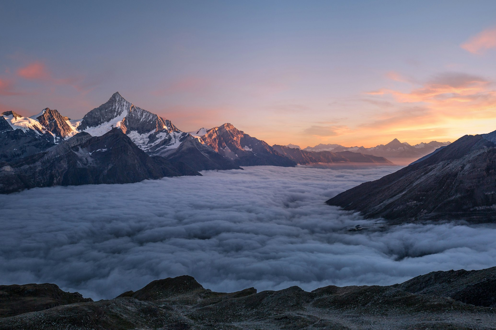

# VIDEO SCRIPT & PRODUCTION GUIDE

## Video Overview
- **Duration:** 3 minutes (2:30 - 3:00 ideal)
- **Format:** 1080p (1920x1080), MP4, H.264 codec
- **Aspect Ratio:** 16:9 (landscape)
- **Style:** Professional documentary-style with cinematic footage
- **Tone:** Inspiring, authoritative, trustworthy
- **Target:** Potential clients, investors, industry partners

---

## COMPLETE SCRIPT (3-Minute Video)

### [0:00 - 0:30] OPENING MONTAGE
**Visual:**  
Quick cuts (4-5 seconds each):
- Aerial drone shot of turquoise Caribbean waters and white sand beaches
- Time-lapse of luxury resort construction (crane, building going up)
- Completed resort with guests enjoying pool, ocean view
- Douglas Welles walking on site (professional shot)
- Close-up of blueprints with hands gesturing
- Sunset over completed resort

**Audio:**  
Upbeat, inspirational instrumental music begins  
**Text Overlays:**
- "30+ Years"
- "50+ Projects"
- "Caribbean & Beyond"

**Voiceover (or text on screen if no VO):**  
"For over three decades, Caribbean Consultants Management has been at the forefront of luxury resort development across the Caribbean and beyond."

---

### [0:30 - 1:00] DOUGLAS WELLES INTRODUCTION
**Visual:**  
Professional headshot of Douglas Welles (talking head or voiceover with B-roll):
- Doug on construction site reviewing plans with team
- Doug walking through completed resort lobby
- Doug in hard hat pointing at structure
- Archive photos if available (early career)

**Audio:**  
Music continues subtly  
**Voiceover (Doug's voice preferred, otherwise narrator):**  
"I'm Douglas Welles, Managing Partner. As a Licensed General Contractor and former Vice President of Construction for Rosewood Hotels, I've personally led more than 50 landmark hospitality projects from initial concept through final completion."

"My career spans roles as President of Welles Construction, Head of Development, and now Managing Partner of Caribbean Consultants. This unique combination of hands-on field experience and corporate leadership means I understand every perspective in hospitality development."

---

### [1:00 - 1:45] PROJECT SHOWCASE MONTAGE
**Visual:**  
8-10 fast cuts (3-4 seconds each) showcasing flagship projects:

1. **L'Ermitage Beverly Hills** - glamorous hotel exterior, lobby transformation, luxury rooms
2. **Hyatt Regency Kauai** - lush Hawaiian grounds, pool complex, resort guests enjoying
3. **St. Regis Fort Lauderdale** - towering oceanfront building, marina, beach cabanas
4. **Ritz-Carlton Reserve Dorado Beach** - stunning oceanfront estates, golf course, spa
5. **Plaza Lotus, St. Petersburg Russia** - urban luxury hotel near Red Square, grand lobby
6. **Four Seasons Turks & Caicos** - pristine beachfront, overwater villas
7. **Rosewood Little Dix Bay, BVI** - Caribbean hillside resort
8. **Mandarin Oriental, Miami** - modern luxury high-rise
9. **Caneel Bay, St. John USVI** (current/renovation)
10. **Caribbean Plantation, St. Thomas** (current development)

Each project displays text overlay:
**Project Name**  
Location  
Role (Owner's Rep / Developer / GC)

**Audio:**  
Music swells  
**Voiceover:**  
"Our portfolio spans continents and luxury segments - from transforming Beverly Hills icons to developing ultra-exclusive Caribbean estates, from managing Russia's first Ritz-Carlton to creating new benchmarks in sustainable island hospitality."

---

### [1:45 - 2:15] PHILOSOPHY & APPROACH
**Visual:**
- Doug speaking to camera (direct address, well-lit, professional)
- Team collaborating around table with blueprints
- On-site walkthrough, inspecting finishes
- Meeting with architects/designers
- Families/g guests enjoying completed property

**Audio:**  
Music softens to background  
**Voiceover (Doug's actual voice impactful here):**  
"Our approach is built on three pillars: Integrity, Expertise, and Results."

"Integrity means you work directly with me - not a sales team or junior staff. I'm personally involved in every project because your success is my reputation."

"Expertise comes from 30 years in the field, as both a Licensed General Contractor and corporate executive. We understand construction realities and business objectives."

"Results means delivering on time, on budget, to the highest quality standards. We've completed over $2 billion in projects with exceptional ROI for our clients."

---

### [2:15 - 2:35] CLIENT TESTIMONIALS
**Visual:**
- Text quotes fade in/out on screen with elegant typography
- Possibly headshots of clients if permission obtained (Mercer Reynolds, etc.)
- B-roll of successful project completions, guest check-ins

**Audio:**  
Music gentle background  
**On-Screen Text (read by voiceover or displayed):**

> "You were on the cutting edge of the development… Your knowledge and management experience was invaluable… We will be forever grateful."  
> — Mercer Reynolds, Former U.S. Ambassador & CEO, Reynolds Plantation

> "Doug's leadership was instrumental in delivering our project under budget and ahead of schedule."  
> — James Doe, CEO, Luxury Resorts International

> "The Caribbean expertise is unmatched. He navigated complex regulations and delivered a world-class property."  
> — Jane Smith, Developer

---

### [2:35 - 2:50] SERVICES SUMMARY
**Visual:**
- Clean animated graphics/icons representing each service
- B-roll of construction progress, guests enjoying resorts

**Text Overlay Banners:**
**OWNER'S REPRESENTATION**  
Advocating for your interests from concept to completion

**LUXURY RESORT DEVELOPMENT**  
Master planning, entitlement, design oversight, construction management

**CARIBBEAN HOSPITALITY EXPERTISE**  
Island logistics, regulatory navigation, sustainable development

**Audio:**  
Voiceover: "Whether you need an owner's representative to protect your investment, a development partner to build from the ground up, or Caribbean expertise that only comes from decades on the ground in the islands - we deliver comprehensive solutions tailored to your goals."

---

### [2:50 - 3:00] CALL TO ACTION / CLOSE
**Visual:**
- Final cinematic shots: Sunset over completed luxury resort, Doug on site or meeting with clients
- Company logo appears
- Contact information: doug@CaribbeanConsultants.net
- Website: CaribbeanConsultants.net

**Audio:**  
Music swells to inspirational peak then settles  
**Voiceover/Doug:**
"I'm Douglas Welles. Whether you're envisioning a new resort, renovating an existing property, or need strategic guidance on your hospitality investment, I'd welcome the opportunity to discuss your vision."

"Let's build something extraordinary together."

**Final Screen (8 seconds):**
- Caribbean Consultants Management, LLC logo
- "Building Excellence. Creating Legacy."
- doug@CaribbeanConsultants.net | CaribbeanConsultants.net

---

## PRODUCTION REQUIREMENTS

### Phase 1: Pre-Production (1-2 weeks)

#### 1. Script Finalization
- [ ] Finalize script with Doug (approve narration)
- [ ] Determine whether Doug will narrate or hire voice actor
- [ ] Script timing: adjust to fit 2:30-3:00 runtime

#### 2. Shot List (Based on Script)
**A-roll (Primary Footage):**
- [ ] 1-2 hours filming with Doug (interview-style)
  - Location options: On-site at current project (St. Thomas/St. John), office, or resort backdrop
  - Doug wearing appropriate attire (hard hat for site shots, business casual/formal for interview)
  - Lighting: Professional 3-point lighting setup
  - Camera: 4K if possible

**B-roll (Supporting Footage):**
- [ ] Drone shots (optional but highly recommended):
  - Aerial of Caribbean landscape (St. Thomas/St. John coastline)
  - Aerial of construction site (if accessible)
  - Aerial of completed resorts (if have permission)

- [ ] Site footage:
  - Doug on construction site with hard hat, reviewing blueprints with team
  - Walking through unfinished structure
  - Inspecting finished spaces
  - Meeting with architects/engineers

- [ ] Resort footage:
  - Completed property (have permission)
  - Guests enjoying amenities
  - Grounds, pool, beach, rooms
  - Aerial shots if possible

- [ ] Office/Team footage:
  - Team meetings
  - Blueprint review sessions
  - Planning sessions

#### 3. Talent & Equipment
- [ ] Hire videographer/editor (budget $3K-$5K) OR
- [ ] DIY: Professional camera (4K), lenses, lighting kit, audio (lavalier mic), drone (optional)
- [ ] Hire voiceover artist if Doug not narrating ($300-$800)
- [ ] Purchase background music license ($200-$500) - Epidemic Sound, Artlist

---

### Phase 2: Production (1-2 days filming)

#### Filming Schedule

**Day 1: Interview & Office (3-4 hours)**
- 1 hour: Set up lighting and audio in office or controlled environment
- 1-2 hours: Film Doug answering questions (record Q&A for voiceover material)
  - Questions to ask:
    * "Tell me about your journey into construction/development"
    * "What makes Caribbean hotel development unique?"
    * "Describe a challenging project and how you solved it"
    * "What does owner's representation mean to you?"
    * "What's your approach to sustainability?"
    * "What are you most proud of?"
    * "What advice for someone starting a resort project?"
  - Capture multiple takes from different angles (close-up, medium, wide)
  - Ensure clean audio (use lavalier mic)
- 1 hour: B-roll of Doug in office (reviewing plans, at desk, on phone)

**Day 2: On-Site & B-roll (4-6 hours)**
- 2-3 hours: Construction site filming (if accessible on St. Thomas/St. John)
  - Doug in hard hat walking site
  - Inspecting work
  - Pointing to structural elements
  - Talking with foremen/workers (permission needed)
- 1-2 hours: Completed resort filming (have permission from property)
  - Grounds, pool, beach, rooms
  - Doug interacting with staff or walking property
- Optional: 1 hour drone shots (sunrise/sunset golden hour best)

---

### Phase 3: Post-Production (1 week)

#### Editing Deliverables
1. **Main Video (3 min)** - `cc-main-video-1080p.mp4`
2. **Main Video (4K)** - `cc-main-video-4k.mp4` (master file)
3. **Social Media Clips**:
   - 60-second version (`cc-video-60s.mp4`)
   - 30-second teaser (`cc-video-30s.mp4`)
   - 15-second Instagram Reel (`cc-video-15s.mp4`)
4. **Thumbnail** - `video-thumbnail.jpg` (1920x1080)
5. **Subtitles/Captions** - `cc-video-subtitles.srt`

#### Editing Notes
- Use Adobe Premiere Pro, DaVinci Resolve (free), or Final Cut Pro
- Color grade to consistent warm, Caribbean luxury aesthetic (slightly warm tones, vibrant but not oversaturated)
- Add lower third text graphics for project names
- Add chapter markers (visible in YouTube/Vimeo description)
- Include company logo watermark (subtle corner placement)
- Music: Upbeat instrumental, tropical/contemporary corporate style
- Sound mix: Voiceover clear above music, ambient sound if using

#### Music Selection
- **Genre:** Uplifting corporate/inspirational tropical
- **Tempo:** Medium (90-110 BPM)
- **Mood:** Confident, forward-moving, positive
- **Sources:**
  - Epidemic Sound ($15-30/month)
  - Artlist ($99-199/year)
  - PremiumBeat ($49/track)
  - Search terms: "uplifting corporate", "tropical inspiration", "business success"

---

## HOSTING OPTIONS (Choose One)

### Option 1: Vimeo Pro (RECOMMENDED)
- No branding
- Advanced privacy controls
- Analytics
- Custom player
- Cost: $20/month (billed annually) or $25/month
- API for custom player integration

**Steps:**
1. Sign up for Vimeo Pro
2. Upload video file
3. Set privacy: "Only people with a private link" or "Hide from Vimeo.com"
4. Disable downloads if desired
5. Get embed code: `<iframe src="https://player.vimeo.com/video/VIDEO_ID" ...></iframe>`

### Option 2: YouTube Unlisted
- Free
- Good analytics
- YouTube branding present
- Set as "Unlisted" (not searchable, only via link)

**Steps:**
1. Upload to YouTube
2. Set as "Unlisted"
3. Get embed code
4. Disable YouTube ads in video manager

### Option 3: Wistia
- Professional, no branding
- Advanced analytics and heatmaps
- Customizable player
- Cost: $49-99/month (more expensive)

---

## IMPLEMENTATION TIMELINE

### Week 1: Pre-Production (2-3 days work)
- Day 1: Script approval, hire videographer
- Day 2: Location scouting, schedule filming
- Day 3: Prepare shot list, questions for Doug

### Week 2: Production (1-2 days on location)
- Film interview + B-roll
- Drone shots if used

### Week 3: Post-Production (1 week editing)
- Editor cuts first draft
- Review with Doug (2 rounds of feedback)
- Finalize music, color, audio mix
- Export final versions

### Week 4: Deployment (1 day)
- Upload to hosting (Vimeo/YouTube)
- Update `video.html` with embed code
- Update video thumbnail
- Test playback

---

## DIY ALTERNATIVE (Lower Budget)

If professional videography budget is unavailable:

### Equipment
- **Camera:** iPhone 14 Pro or newer (4K capable) OR any 4K camera
- **Audio:** Blue Yeti or Rode VideoMic Pro (lavalier preferred)
- **Lighting:** 2-3 softbox lights or natural window light + reflector
- **Tripod:** Stable tripod for interview shots

### Production (1-2 days)
- Day 1: Interview setup in well-lit office space (behind desk or with Caribbean view)
- Day 2: B-roll at any accessible luxury resort (public areas) or construction site (with permission)

### Editing (Free Tools)
- **DaVinci Resolve 18** (free, professional)
- **iMovie** (Mac, free)
- **Clipchamp** (Windows, free)
- YouTube video editor (basic)

### Voiceover
- Record Doug's voice in quiet room with good mic
- Use Audacity (free) to clean audio (noise reduction, compression)

**Total DIY Cost:** $500-1,500 (equipment) vs. $3,000-8,000 (outsourced)

---

## PLACEHOLDER SOLUTION (For Immediate Launch)

If video cannot be completed within 1-hour timeline:

**Option A: Use Placeholder Message**
```html
<div class="video-placeholder">
  
  <div class="overlay">
    <i class="fas fa-video fa-4x"></i>
    <p class="mt-4">Video Coming Soon</p>
    <p class="text-sm">Professional production in progress</p>
  </div>
</div>
```

**Option B: Use Stock Video Only**
- Download from Artgrid/Pond5 (1-2 day access)
- Compile into 3-minute montage with text only
- No interview, just voiceover over B-roll

---

## SHOT LIST CHECKLIST

**Primary Interview:**
- [ ] Doug facing camera, professional background
- [ ] Medium shot (waist up) - primary
- [ ] Close-up (head and shoulders) - for emotional moments
- [ ] Side profile (left/right) - variety
- [ ] Over-shoulder shots (looking at something)
- [ ] Walking interview (optional, more dynamic)

**B-roll:**
- [ ] Site walkthrough (construction)
- [ ] Blueprint review (close-up)
- [ ] Team meeting (2-3 angles)
- [ ] Site inspection (hands-on)
- [ ] Doug pointing/examining work
- [ ] Completed resort exterior (aerial if possible)
- [ ] Completed resort interior (lobby, rooms)
- [ ] Guests enjoying facilities
- [ ] Sunset/time-lapse of site

**Graphics:**
- [ ] Company logo animation (intro/outro)
- [ ] Project location maps (if showing worldwide)
- [ ] Text overlays (project names, stats)
- [ ] Lower thirds (name/title when Doug speaks)

---

## VIDEO DELIVERY SPECIFICATIONS

**Final File: `cc-main-video-1080p.mp4`**
- Container: MP4
- Video Codec: H.264 (AVC)
- Resolution: 1920x1080 (Full HD)
- Frame Rate: 29.97 fps (or 30)
- Bitrate: 10-15 Mbps (good quality)
- Audio: AAC, 44.1kHz, stereo, 320kbps
- Duration: 2:45 ± 15 seconds

**Web-optimized (for faster loading):**
- Codec: H.264
- Resolution: 1920x1080
- Bitrate: 5-8 Mbps
- File size target: <50MB

**Alternative: H.265/HEVC** (smaller file but less browser support)
- Only use if serving via HLS streaming

---

## SUBTITLES / CAPTIONS

For accessibility and social media autoplay:

**Create .srt file:**
```
1
00:00:00,000 --> 00:00:05,000
For over three decades, Caribbean Consultants...

2
00:00:05,000 --> 00:00:10,000
Management has been at the forefront of luxury resort development...
```

**Tools to create subtitles:**
- YouTube auto-captions (edit for accuracy)
- Rev.com ($1-2/min professional)
- Descript (AI-assisted)
- Otter.ai transcription

---

## BUDGET SUMMARY

| Item | Cost |
|------|------|
| Professional videographer (2 days) | $3,000 - $5,000 |
| Video editor (1 week) | $1,500 - $3,000 |
| Voiceover artist (optional) | $300 - $800 |
| Music license (annual) | $200 - $500 |
| Drone operator (optional) | $500 - $1,000 |
| **Total (outsourced)** | **$4,000 - $9,000** |

**DIY version total:** $0-500 (if you have equipment)

---

## NEXT STEPS

1. **Approve script** with Doug (permissions, accuracy)
2. **Set budget** - decide DIY vs professional
3. **Hire videographer** if outsourcing
4. **Schedule filming** (book dates)
5. **Shoot B-roll** at project sites if accessible
6. **Edit video** (1-2 week turnaround)
7. **Review & approve** final cut
8. **Upload to hosting** (Vimeo Pro recommended)
9. **Update video.html** with embed code
10. **Launch!**

---

## Contact for Video Production

If hiring external vendor, provide them with:
- This document
- Doug's availability for filming
- Property access permissions
- Brand guidelines (colors: emerald #10b981)
- Examples of preferred style (luxury resort promotional videos)

---

**Video Status:** PLANNED  
**Priority:** HIGH (essential for site credibility)  
**Target Completion:** Within 1 month of site launch
