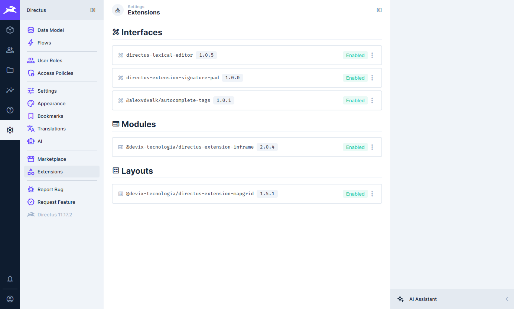
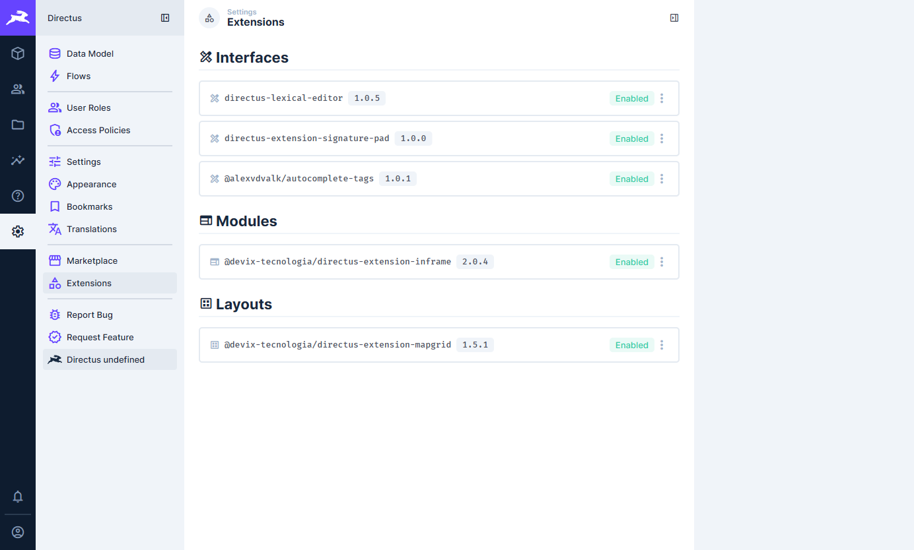
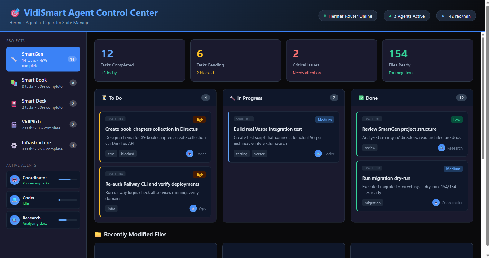
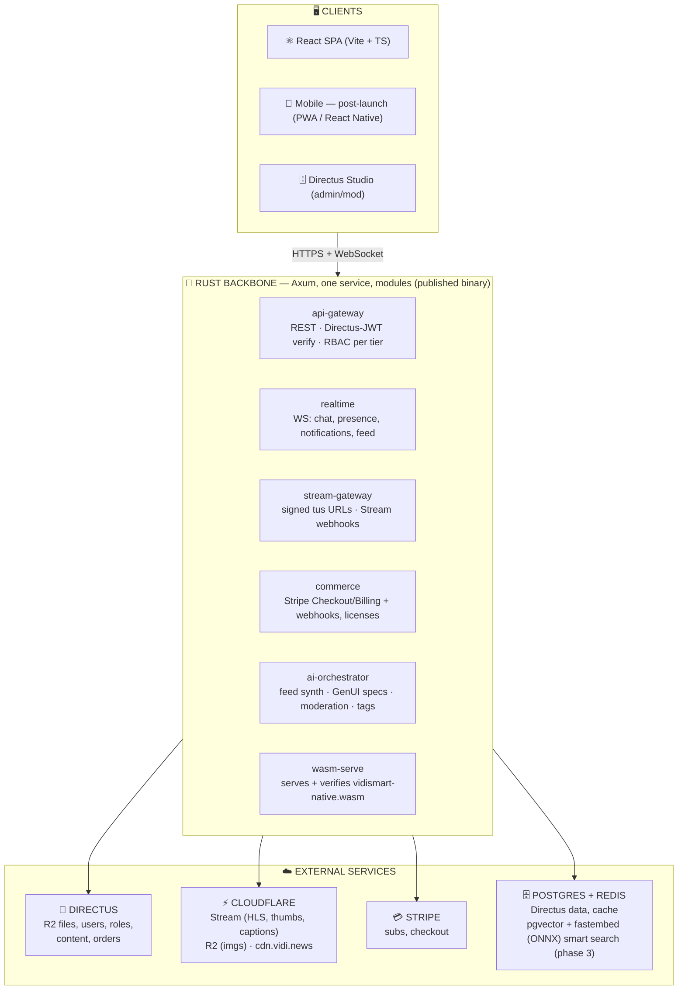
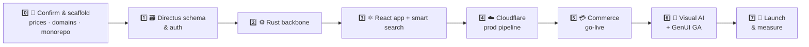

# VidiSmart Launch Plan — Smart Channel Community Platform

| Backbone | Frontend | CMS | Media & CDN | Commerce | Deploy | Data |
|---|---|---|---|---|---|---|
|  |  |  |  |  |  |  |

**Date:** 2026-08-26
**Owner:** James May, VidiSmart
**Status:** Implementation-ready
**Superseded in part by:** `vidismart-master-plan.html` (2026-08-26) — Ubuntu-native deploy pivot (no Docker on the launch box), 32-agent fleet, 9-stage / 84-task ledger. This file remains the narrative source of decisions.
**2026-08-29 pivot:** frontend is **React 18 + Vite + TypeScript** (not Flutter — the untracked Flutter scaffold was discarded), and smart search ships on **pgvector + fastembed-rs (ONNX) in the existing Postgres/backbone** (not Neo4j/Vespa). Details: `plans/1787776265074-phase3-flutter-completion-plan.md`.
**Topic anchor:** "The Speed of Agentic Visual AI" — the community IS visual AI + GenUI, video-first.

---

## 🎯 1. Goal

Launch VidiSmart as a **video-first community** where the dominant content object is *member-published video*, running a **Visual AI / GenUI surface** across the entire product, monetized through VidiShop (subscriptions + marketplace), 100% open-source and self-hosted.

A message board is a *subsection*, not the community. The home feed of member videos ("Smart Channel") is the community.

---

## ✅ 2. Confirmed decisions (with evidence)

| Decision | Choice | Why / evidence |
|---|---|---|
| Community shape | **Custom "Smart Channel" app** — video feed first, threads secondary | User confirmed; `plans/SMART_CHANNEL_CX_ARCHITECTURE_PLAN.html` already sketches this; goal "Smart Channel is everything" |
| Site management/CMS | **Directus** (adopted, self-hosted, BSL-1.1) | Live on Railway + local Docker (`DIRECTUS-COMPLETE-STATUS.md`), 40+ collections, `directus/schema.yaml`. BSL grant permits self-hosted commercial use; do **not** resell Directus as a service |
| Video + media | **Cloudflare Stream** (transcode/HLS/thumbnails/captions) + **Cloudflare R2** + `cdn.vidi.news` | Media "continues on Cloudflare"; R2 keys and bucket already wired into Directus (`DIRECTUS-COMPLETE-STATUS.md:26-33`) |
| Agent fleet media | **SeaweedFS** S3 `:9000`, bucket `buzz-media` | `VIDIFLOW-MASTER-PLAN.md:20` — confirmed, **not** the community store; do NOT pull minio |
| Backbone app server | **Rust (Axum/Tokio)** | User: "rust, go or c__". Rust compiles to native binary (Ubuntu/Railway) **and** to WebAssembly (matches "native web assembly also good"); memory-safe for public network service; Smart Channel plan already specified `Rust/Gateway` |
| Frontend | **React 18 + Vite + TypeScript** SPA (`apps/web`, served by nginx) | User pivot 2026-08-29: React, not Flutter; self-hosted, no Vercel/SSR; mobile post-launch (PWA/React Native) |
| Client-side native compute | **Rust → WASM** packages (wasm-pack, JS bindings, lazy-loaded) | User: "native web assembly also good"; on-device thumbnails, hashing, cache keys, AV metadata, local ONNX ops |
| E-commerce | **Stripe** (Checkout + Billing + webhooks) driven by the Rust backbone; products/orders/entitlements in Directus | Recommended; `SMART_CHANNEL_CX_ARCHITECTURE_PLAN.html` already lists Stripe; no contradictory decision |
| PeerTube "tools" | **Feature-parity reimplementation only** | PeerTube is Node/TypeScript + AGPL-3.0 (NOT PHP). Copy the *feature list* (uploads, HLS, channels, playlists, comments, subs, tags); never copy its code, or AGPL strikes our whole product |
| Deploy | **Ubuntu 26 @ 192.168.4.40, fully native (no Docker)** behind Cloudflare Tunnel; local `converge` stack untouched. **No Vercel** | User pivot 2026-08-25; master plan §08; fresh Directus + `vidismart_community` DB on the box |
| Licensing of our code | **MIT/Apache-2.0** for platform code; AI/agent "secret sauce" layer may stay closed | 100% ours, open-source, no AGPL/GPL contamination (peer-reviewed against PeerTube/NodeBB adoption) |

---

## 📦 3. Current-state inventory (what we build on)

| Asset | Location / status | Action |
|---|---|---|
| Marketing site, $500 offer page, 53 static HTML apps, Smart Book, agent-ui | live on SiteGround (`vidismart.com`, `smart-book/`, `agent-ui.html`) | Keep as-is for now; link INTO community |
| Directus CMS | Railway `vidicrm.com/admin` + local `:8055`, R2, Redis, Postgres | Add community collections; enable public registration, SMTP, CORS |
| `waitlist_leads` collection | exists | Extend into full member onboarding |
| `supabase-member-profiles-schema.sql` | exists | Port to Directus `member_profiles` |
| `monetization/plan-02-vidishop.html` (+ 11 product pages) | exists | Reduce to **3 ship-lines** at launch; extract final prices |
| `smartgen/`, `agent-backend` (:3007), VidiFlow frontend (:3002), SeaweedFS (:9333/:9000), Port assignments (`.PORT_ASSIGNMENTS.md`) | running local | Keep; VidiFlow stays self-hosted (Ubuntu/Railway) |

**Live systems we build on:**

  
  &nbsp;&nbsp;
  
  &nbsp;&nbsp;
  

---

## 🏗️ 4. Target architecture

Deploy: **Ubuntu 26 native** (apt Postgres + Redis, Node 22 Directus, rustup backbone, nginx, cloudflared) — see master plan §08; local `converge` Docker stack stays for dev only; all public traffic behind **Cloudflare**.

---

## 🗃️ 5. Data model — Directus collections to add

Create in one consolidated Postgres DB (pick one name: `vidismart_community`); all schema as migration SQL under `database/`.

- `member_profiles` (per Directus user: display_name, bio, avatar(file), skills[], role_tier, portfolio_stats json)
- `channels` (owner, slug, title, banner, privacy, subscriber_count)
- `videos` (channel→, stream_uid, status=pending/processing/ready/error, title, desc, tags[], thumb_url, duration, quality, visibility=public/unlisted/members/paid, likes, views)
- `video_reactions` (user→, video→, kind like/dislike)
- `comments` (user→, video→, parent→, body, timecode_ms nullable — Frame.io-style pinning)
- `follows` (follower→, channel→)
- `subscriptions` (plan, status, stripe_customer_id, stripe_subscription_id, period, entitlements json)
- `playlists`, `playlist_items`
- `tags`
- `notifications`
- `products` (title, desc, type=software/membership/digital, price_info json, stripe_price_id, fee_rate)
- `orders` (user→, stripe_session_id, total, currency, status)
- `order_items`
- `licenses` (key, product→, owner→, activations[])
- `marketplace_listings` (seller channel→, product→, fee_rate 5–8%)
- `genui_specs` (version, spec json: {theme, layout, cards[]}, audience_filters, active)
- `moderation_reports`, `moderation_actions`
- keep existing: `waitlist_leads`, `site_pages`, `posts`, `news`, `navigation`, `apps`, `tech_stacks`

Directus setup tasks: enable **public user registration** (email unique, default role=member), configure **SMTP**, set **CORS** for `*.vidismart.com`, create roles/perms so members mutate only their own rows (Directus `@$CURRENT_USER` filters).

---

## ⚙️ 6. Rust backbone — build order

One crate workspace `apps/backend`, modules:

1. `config`, `telemetry` (tracing + Razor/Railway logs), `error` — boilerplate.
2. `auth`: verify Directus JWT via JWKS/`/server` public key; role→tier mapping; signed playback tokens.
3. `api-gateway`: REST routes (`/api/v1/*`), openapi docs, rate limits.
4. `realtime`: Axum WebSockets — room=video|channel|global; events: new_comment, like, follow, notification, *genui_spec v{+1}*, presence.
5. `stream-gateway`:
   - `POST /stream/upload-url` → Cloudflare **direct creator upload** (tus) signed URL; creates Directus `videos` row (status=pending).
   - `POST /webhooks/cloudflare/stream` → on `state.ready` update status, pull captions/thumb, fire ai-orchestrator; on `state.error` mark error; verify HMAC.
   - playback signed URL issuance (members/paid gating).
6. `commerce`:
   - `POST /commerce/checkout` → Stripe Checkout Session (products/plans from Directus `products`/`subscriptions`).
   - `POST /webhooks/stripe` → verify signature; on `checkout.session.completed`/`invoice.paid` → write `orders`, upsert `subscriptions`, mint `licenses`; on `customer.subscription.updated/deleted` → adjust entitlements (cache bust + WS notify).
7. `ai-orchestrator`:
   - feed synthesis: query Directus videos → rank by follows/tags/trend → cache 60s in Redis → return card list.
   - GenUI: emit `genui_spec` deltas (theme/layout/cards) per member context + role tier; versioned in Directus.
   - moderation: LLM first-pass (free models per `VIDISMART_COMMUNITY_REFINED_PLAN.md` §2: Qwen3-Max/GLM-5 via OpenRouter) → human queue in Directus.
   - enrichment: auto-tags, 1-line summaries, recommendations; push to Redis; mark done.
8. `wasm-serve`: serves compiled `vidismart-native.wasm` + `.js` glue (immutable, content-hash URL, long cache).
9. `healthz`, `readyz`; Dockerfile (multi-stage `rust:1` → `debian:bookworm-slim`), static binary.

Cross-cutting: all writes to Directus through its REST API; heavy/private reads via direct Postgres `sqlx` (read model); Redis for all caches.

---

## ⚛️ 7. React Smart Channel app — build order

Scaffold `apps/web` with Vite + React 18 + TypeScript, feature-first dirs (`src/features/<name>/`), `react-router-dom`, `tus-js-client`. SPA served by nginx (`infra/nginx/vidismart.conf`, SPA fallback + `/api` proxy + `/ws` upgrade); no SSR.

| Page | Notes |
|---|---|
| Auth | Directus email+password; token persistence; SSO (Google/GitHub/Discord) post-launch |
| Feed (Home) | Smart Channel: infinite scroll of member videos (thumbs animate), recomposition via GenUI spec; WS live badge |
| Watch | Stream iframe player (`https://iframe.videodelivery.net/{uid}`) behind `playerBackend` flag; signed gate for members/paid; timecode comments; reactions; related by feed synth |
| Search | debounced input + results page over hybrid `GET /api/v1/search` (FTS + trigram + pgvector cosine, RRF fusion) |
| Channel | member channel page: banner, video grid, follow, subscribe |
| Profile edit | bio, avatar→R2, skills, portfolio stats, role tier |
| Upload | tus resumable direct-to-Stream; status timeline; AI auto-title/captions preview |
| Threads | per-video + forum-lite sections (comment model, not dominant UI) |
| Marketplace (VidiShop) | product cards, listing prices, fee display, Stripe checkout handoff |
| Pricing | Free / Creator / Pro / Agency + $500 onboarding product |
| Admin/Mod (web-only) | Directus Studio + mod queue app |

**GenUI engine:** `ThemeProvider` takes `genui_spec {theme, layout, cards}` (from ai-orchestrator) → CSS custom properties over the app tree; subscribes to `genui_spec v{+1}` over WS and re-skins live. V1 scope: palette (midnight/void/dusk/carbon from `agent-ui.html`), hero card, section order, spotlight cards. Not pixel-generation — declarative self-writing UI.

**WASM (`vidismart-native`, Rust → wasm-pack):** thumbnail preflight, cache-key hashing, AV metadata parse, local image transforms (privacy-first). Bound from JS via wasm-pack output, lazy-loaded, optional in v1 (JS fallbacks for hashing/AV sniff ship first).

---

## ☁️ 8. Cloudflare media + caching strategy (explicit requirement)

- **Uploads:** React browser (mobile post-launch) → tus direct to Stream (signed, no secret exposure). Images (avatar/banner) → R2 presigned from backbone.
- **Transcode:** Stream → HLS adaptive (1080p cap at launch), thumbnails, auto captions, `state.ready` webhook → backbone.
- **Playback caching:** Stream edge cache (HLS delivered from Cloudflare edge by default); custom player lazy-loads + preloads first segment; CSP allows `*.videodelivery.net`, `*.cloudflarestream.com`, `*.r2.cloudflarestorage.com`.
- **Image caching:** all R2 assets served via `cdn.vidi.news`; backbone returns content-hash CDN URLs; Cache Rule: `Cache Everything, Edge TTL 1 year, immutable` for hashed assets.
- **API caching:** Directus Redis cache ON (already configured); backbone feed cache 60s; realtime events bust only affected keys.
- **SeaweedFS** remains exclusively agent-fleet media (`buzz-media`); community media never routes through it.

---

## 💳 9. Monetization — what we charge at launch (ship 3 lines)

1. **Memberships (Stripe Billing):**
   - Free `Member` — watch, follow, comment, like, 1 profile, no uploads.
   - `Creator` (proposed $19/mo) — uploads (quota, e.g. 50 GB/yr), channel page, analytics, basic editor.
   - `Pro` (proposed $49/mo) — near-unlimited uploads, sell on marketplace, white-label embeds, priority processing.
   - `Agency/Navigator` (proposed $149/mo+ or custom) — multi-seat, client workspaces, white-label, VidiShop SaaS lines.
   - *Confirm final prices against `monetization/plan-02-vidishop.html` and the $500 page during Phase 0.*
2. **VidiShop SaaS** — existing tiers ($99 → $10K/mo) exposed via `products`; only the ready product lines ship (from `smartgen/`, `VidiShop.Gen2.UI.html`).
3. **Marketplace fees** — 5–8% per successful sale (stored on `marketplace_listings.fee_rate`; Stripe application_fee).
4. **$500 offer** — paid onboarding/builder product; every buyer granted at least `Creator` for launch cycle + directed into community.

Entitlements enforced in backbone (JWT `tier` claim + Redis) AND at the Signing/region of playback (Stream signed tokens) for paid/member-only videos.

---

## 🚀 10. Launch phases (ordered tasks)

### Phase 0 — Confirm & scaffold (gate: prices + domains final)
- [x] Read `monetization/plan-02-vidishop.html` + the $500 page; finalize the 4 tier prices + 3 product lines; write to `monetization/launch-pricing.md`.
- [x] Create monorepo `vidismart-community` (workspace: `apps/backend` Rust, `apps/web`, `packages/vidismart-native`, `database/`, `infra/`). Do not put in `.kilo/`.
- [x] Domain: run app at `community.vidismart.com` (SPA + backbone) behind Cloudflare; marketing stays at `vidismart.com`; wire CORS, CSP. *(infra-as-code done: `infra/nginx/vidismart.conf` + `cloudflared.service`; DNS cutover lands with Phase 4)*
- [x] Ubuntu staging = clone `converge/` compose + add `backbone` + `wasm` services; Railway same compose (projection) for prod. *(local staging compose live: PG 5434 / Redis 6390 / Directus 8056 / backbone 8060 / wasm 8061; launch box runs native via `scripts/provision.sh`)*

### Phase 1 — Directus schema & auth
- [x] Migration SQL for §5 collections; seed roles/perms; enable registration + SMTP + CORS. *(migrations 0001–0006 applied + validated on staging Directus 11.17.3; SMTP still pending an actual provider)*
- [x] Port `supabase-member-profiles-schema.sql` → `member_profiles`. *(migration 0002)*
- [ ] Import `waitlist_leads` → first members (alpha list). *(`scripts/import_waitlist_leads.sh` ready; local DBs are empty — source is Railway prod, run at Phase 7)*

### Phase 2 — Rust backbone
- [x] Build §6 modules 1–4 (gateway, realtime, upload URLs, webhooks) with integration tests.
- [x] Module 5 commerce (Stripe keys in staging mode; webhook verified).
- [x] Module 6 ai-orchestrator v1 (feed synth + genui_spec + moderation) using free OpenRouter models from `VIDISMART_COMMUNITY_REFINED_PLAN.md` §2. *(feed rank + 60s Redis cache, GenUI personalize/publish + WS `genui_spec` broadcast, moderation → `moderation_reports`, enrichment auto-fired on Stream `state.ready`; heuristic fallbacks when no `VSC_OPENROUTER_API_KEY`)*
- [x] `vidismart-native` wasm crate + serve; `cargo test` green. *(49 tests green, clippy clean)*

### Phase 3 — React app + smart search
- [ ] Smart search: migration 0007 (pgvector + pg_trgm), fastembed embeddings in enrichment, hybrid `GET /api/v1/search` (FTS + trigram + cosine, RRF k=60, visibility-aware), backfill binary.
- [ ] Scaffold `apps/web` + theming (GenUI palettes); auth; Home feed + Watch (Stream iframe) + Search + Upload (tus) end-to-end on staging.
- [ ] Channel, Profile, Threads, Marketplace, Pricing pages.
- [ ] GenUI ThemeProvider + live spec subscription; WASM lazy-loaded with JS fallbacks.
- [ ] E2E (Playwright on the web build).

### Phase 4 — Cloudflare production pipeline
- [ ] Stream account: upload token, webhook URL (backbone), signed-URL token, captions; gate playback per tier.
- [ ] R2 `cdn.vidi.news` cache rules (immutable hashed assets), CSP, DNS.
- [ ] Image handling for avatars/banners/thumbnails via R2 + Stream thumbs.

### Phase 5 — Commerce go-live (Stripe live keys)
- [ ] Products/prices for 4 tiers + 3 product lines; checkout + billing portal; webhooks → orders/licenses/entitlements; test free→Creator conversion path end-to-end.

### Phase 6 — Visual AI + GenUI GA
- [ ] Upload enrichment pipeline live (auto-tags, captions, summary, "Smart Channel" spotlight).
- [ ] Search/recs v2: personalize the Phase 3 hybrid search (pgvector + FTS + trigram), typeahead, query analytics; recommendation hooks into feed synth.
- [ ] GenUI progressive surfaces (per-tier layout deltas, HITL modals reuse `today.md` HITL spec).

### Phase 7 — Launch & measure
- [ ] Seed: Smart Book excerpts + agent-ui demos + 10 creator accounts; 50-user alpha → 250 beta → public.
- [ ] Dashboards: views/uploads/conversion; error tracking (Railway logs + optional Sentry); HLS start-time + Lighthouse gates.
- [ ] Post-launch only: decide whether marketing site migrates off SiteGround (out of scope here).

---

## 🧪 11. Validation plan

- **Rust:** `cargo test` (auth, RBAC, webhooks HMAC, entitlements), contract tests on Directus calls.
- **React:** `vitest` + @testing-library, `npm run build` clean, Playwright on the web build.
- **WASM:** `wasm-pack test` node/wasm32 nodes.
- **Deploy smoke:** compose `healthz`/`readyz` on Ubuntu staging == Railway prod parity; all back to `docker-compose ps` conventions in `VIDISMART_COMMUNITY_REFINED_PLAN.md` §7.
- **Media:** upload→ready→play under 2 min target; failed transcodes land in `moderation_reports`.
- **Commerce:** Stripe test-mode checkout → webhook → Directus order + entitlement unlock in <5s; refund/cancel path updates entitlements.

---

## 🛡️ 12. Risks & guardrails

- **Scope creep (biggest):** do NOT build all 11 products / 30 tasks. Ship 3 product lines + 4 tiers. Everything else stays in `vidismart.todo.md` as GLPI queue.
- **Directus BSL-1.1:** allowed self-hosted; never offer Directus as a paid service to third parties.
- **PeerTube AGPL:** feature-parity only; no AGPL code enters the repo.
- **Web player:** v1 ships the Stream iframe player; `hls.js` custom player is the upgrade path. Keep both behind a `playerBackend` flag.
- **DB name drift** (`directus_db` vs `vidismart_community` vs `converge` in docs): consolidate to ONE database name; update `.PORT_ASSIGNMENTS.md` + `DIRECTUS-COMPLETE-STATUS.md`.
- **Secrets:** never commit R2/Stripe/Directus keys; use compose env + Railway variables only (existing `.env` files already leak keys — rotate before prod).
- **WASM/Firewalls:** keep `vidismart-native` small (<~3 MB) for mobile web payload; lazy-load.

---

## ❓ 13. Open items (resolve during Phase 0/3, do not block backbone)

1. Final tier/product prices (read the $500 page + VidiShop spec).
2. Web player: Stream iframe vs `hls.js` custom (decision flag `playerBackend`).
3. Marketing-site migration off SiteGround (post-launch).
4. Mobile post-launch: PWA vs React Native (the Rust backbone covers all app services; no Dart layer).