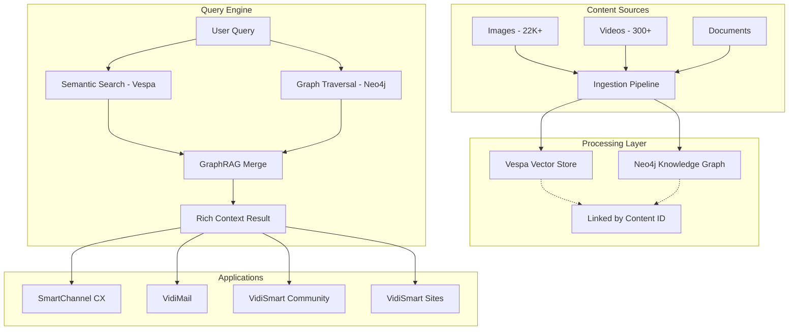
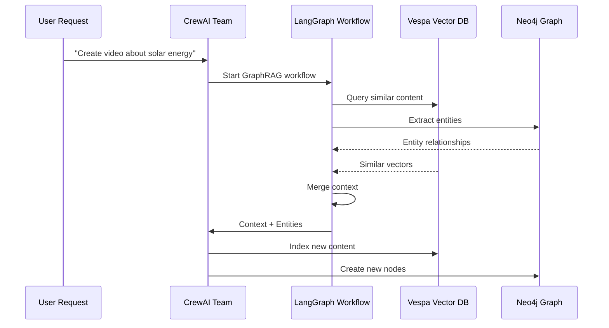
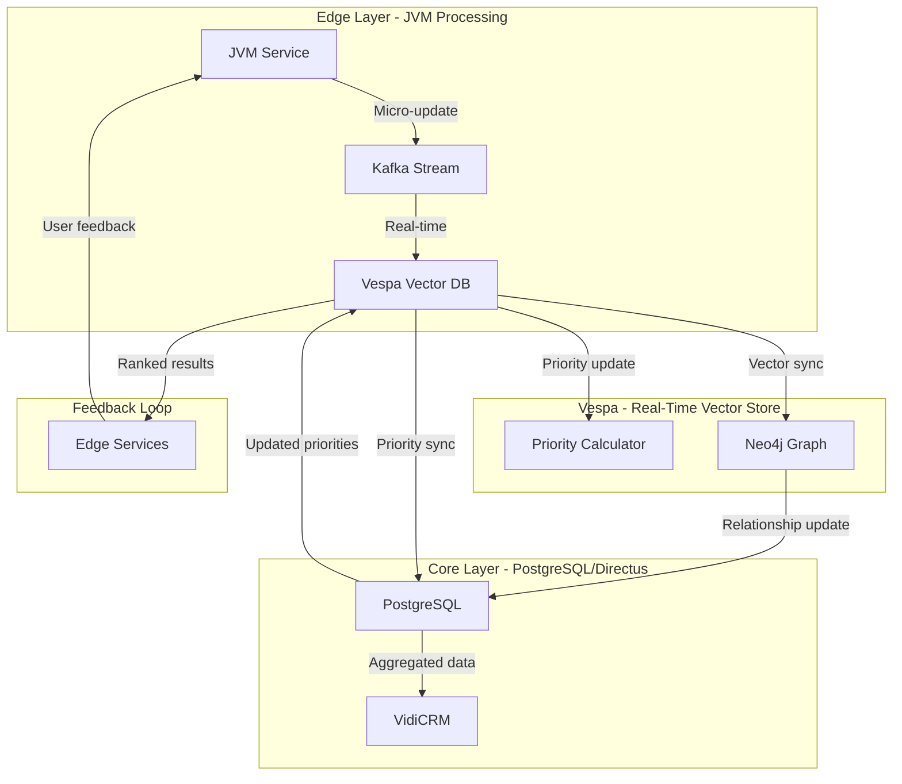

# VidiSmart Architecture Plan: Vector Database, GraphRAG & Hyperlocal Geolocation

**Document Version:** 1.0  
**Date:** February 4, 2026  
**Status:** PLANNING - Awaiting Approval

---

## Table of Contents

1. [Executive Summary](#1-executive-summary)
2. [Vector Database Stack Decision](#2-vector-database-stack-decision)
3. [GraphRAG Architecture](#3-graphrag-architecture)
4. [PostgreSQL + PostGIS Integration](#4-postgresql--postgis-integration)
5. [Hyperlocal Geolocation System](#5-hyperlocal-geolocation-system)
6. [System Architecture Diagram](#6-system-architecture-diagram)
7. [Implementation Roadmap](#7-implementation-roadmap)
8. [Yahoo/Perplexity Reference Implementation](#8-yahoo-perplexity-reference-implementation)

---

## 1. Executive Summary

This document outlines the complete architecture for the VidiSmart vector database stack, GraphRAG integration, and hyperlocal geolocation system. The goal is to create a unified, scalable infrastructure that powers all Vidi ecosystem applications including SmartChannel CX, VidiMail, and VidiSmart Community.

### Current State Assessment

| Component | Status | Port | Decision |
|-----------|--------|------|----------|
| **VidiAi (Vespa)** | ✅ RUNNING | 8089 | PRIMARY vector database |
| **Neo4j** | ✅ RUNNING | 7474 | Graph database for relationships |
| **PostgreSQL** | ✅ RUNNING | 5432 | Primary database + PostGIS |
| **Directus (VidiCRM)** | ✅ RUNNING | 8055 | Headless CMS on PostgreSQL |
| **Redis** | ✅ RUNNING | 6379 | Cache layer |
| **Qdrant** | ❌ NOT RUNNING | 6333 | To be evaluated/deprecated |

### Key Decisions

1. **Vespa (VidiAi) is now the PRIMARY vector database** - No separate Qdrant needed
2. **Neo4j handles explicit relationships** - GraphRAG backbone
3. **PostgreSQL/PostGIS handles geospatial** - Directus native support
4. **VidiAi handles vector search** - Semantic similarity queries
5. **IP-to-Geo via MaxMind GeoIP** - Like Yahoo/Perplexity implementation
6. **CrewAI + LangGraph** - Multi-agent orchestration for GraphRAG workflows
7. **Real-time edge feedback loops** - JVM → Vespa → Core sync for micro-updates

---

## 2. Vector Database Stack Decision

### 2.1 Vespa (VidiAi) vs Qdrant Analysis

| Criteria | Vespa (VidiAi) | Qdrant |
|----------|---------------|--------|
| **Current Status** | ✅ RUNNING | ❌ NOT RUNNING |
| **Vector Search** | ✅ Native | ✅ Native |
| **Geospatial Search** | ✅ Built-in | ⚠️ Plugin required |
| **GraphRAG Integration** | ✅ Native | ⚠️ Requires sync |
| **Scalability** | ✅ Enterprise-grade | ✅ Good |
| **Real-time Updates** | ✅ Streaming | ✅ Point updates |
| **Cost** | ✅ Open-source | ✅ Open-source |
| **Visual Vector Dashboard** | ✅ Ready | ⚠️ Requires migration |

### 2.2 Recommendation: VESPA (VidiAi) AS SOLE VECTOR DB

**Rationale:**
1. Vespa already running and configured on port 8089
2. Vespa has native geospatial search (no plugin needed)
3. Vespa is built for real-time streaming updates (critical for SmartChannel)
4. Vespa's document-oriented architecture aligns with Directus (VidiCRM)
5. No need to maintain two vector databases

### 2.3 Qdrant Deprecation Plan

If Qdrant was previously used:
```bash
# Export Qdrant collections to Vespa format
# Run migration script to transfer vectors
# Deprecate Qdrant service
```

**Vespa Collection Structure:**
```
VidiSmart/
├── video_vectors/      # Video embeddings (1408-5000 dims)
├── image_vectors/      # Image embeddings (512-1024 dims)
├── text_vectors/       # Text embeddings (384-768 dims)
├── content_graph/      # Knowledge graph embeddings
└── user_profiles/      # User preference vectors
```

---

## 3. GraphRAG Architecture

### 3.1 How Neo4j + Vespa Work Together



### 3.2 Data Flow: Unstructured → Knowledge Graph → Vector

**Step 1: Content Ingestion**
```
Input: Raw file (image, video, document)
  ↓
Process: Extract text descriptions via Vision LLM (Qwen3-VL)
  ↓
Output: Rich textual description + metadata
```

**Step 2: Parallel Processing**
```
Rich Description
  ├──→ Sentence Transformers → VECTOR EMBEDDING → Vespa
  │
  └──→ LLM Entity Extraction → KNOWLEDGE GRAPH → Neo4j
```

**Step 3: Linking**
```
Vespa Vector ←――Same Content ID――→ Neo4j Node
{ id: "video-12345" }           { id: "video-12345"
  vector: [0.12, ...]             type: "Video",
  type: "video"                   entities: ["car", "beach"],
  title: "Beach Car"              relationships: [...]
}
```

### 3.3 GraphRAG Query Pattern

**Traditional Vector Search:**
```
Query: "sustainable energy solutions"
  ↓
Vespa: Find nearest vectors
  ↓
Result: Top 10 similar documents
```

**GraphRAG Enhanced Search:**
```
Query: "sustainable energy solutions"
  ↓
Vespa: Find nearest vectors (entry points)
  ↓
Neo4j: Traverse from entry points → Collect related entities
  ↓
Result: Rich subgraph with context + citations + related topics
```

### 3.4 Neo4j Schema for GraphRAG

```cypher
// Core Content Nodes
CREATE CONSTRAINT content_id FOR (c:Content) REQUIRE c.id IS UNIQUE;
CREATE CONSTRAINT entity_name FOR (e:Entity) REQUIRE e.name IS UNIQUE;
CREATE CONSTRAINT topic_name FOR (t:Topic) REQUIRE t.name IS UNIQUE;

// Relationships
CREATE (v:Video {id: "vid-001", title: "Solar Power Demo"})
  -[:COVERS]->(e:Entity {name: "Solar Energy"})
  -[:LOCATED_IN]->(l:Location {name: "California"});

CREATE (v)-[:HAS_EMBEDDING {vector_id: "vespa-vec-001"}]->(v);
```

---

## 4. PostgreSQL + PostGIS Integration

### 4.1 Why PostGIS for Geospatial

| Feature | PostGIS | Vespa Native |
|---------|---------|--------------|
| **Point-in-Polygon** | ✅ Full | ✅ Available |
| **Distance Queries** | ✅ Full | ✅ Available |
| **GeoJSON Support** | ✅ Native | ✅ Available |
| **Spatial Indexing** | ✅ GIST | ✅ HNSW |
| **Directus Integration** | ✅ Native | ❌ Not integrated |
| **Complex Geometries** | ✅ Full | ⚠️ Limited |
| **Routing** | ✅ pgRouting | ❌ No |

### 4.2 Recommendation: HYBRID GEOSPATIAL

**Use PostGIS for:**
- Complex polygon queries (regions, boundaries)
- Directus/VidiCRM location fields
- Historical location data storage
- Geographic aggregations

**Use Vespa for:**
- Vector search with location filtering
- "Find content near [lat,lng] with similarity"
- Real-time location-based recommendations

### 4.3 VidiCRM Location Schema (PostgreSQL/PostGIS)

```sql
-- Enable PostGIS
CREATE EXTENSION postgis;

-- Location-aware content table
CREATE TABLE vidi_content (
    id UUID PRIMARY KEY DEFAULT gen_random_uuid(),
    title VARCHAR(255),
    content_type VARCHAR(50), -- 'image', 'video', 'article'
    media_url TEXT,
    
    -- Geospatial data (PostGIS)
    location geography(POINT),
    region VARCHAR(100),
    country_code CHAR(2),
    
    -- Vector reference (Vespa)
    vespa_vector_id VARCHAR(100),
    
    -- Metadata
    created_at TIMESTAMP DEFAULT NOW(),
    status VARCHAR(50) DEFAULT 'draft'
);

-- Create spatial index
CREATE INDEX idx_content_location 
ON vidi_content USING GIST (location);
```

### 4.4 Sync Strategy: PostGIS ↔ Vespa

```python
# When content is saved in Directus/VidiCRM
def on_content_created(content_id, location, vector_embedding):
    # 1. Store in PostgreSQL/PostGIS
    postgis_service.save_content(content_id, location)
    
    # 2. Index vector in Vespa with location filter
    vespa_service.index_document(
        id=content_id,
        vector=vector_embedding,
        location=location,  # For geo-filtered search
        metadata=get_metadata(content_id)
    )
    
    # 3. Create Neo4j node for GraphRAG
    neo4j_service.create_content_node(content_id)
```

---

## 5. Hyperlocal Geolocation System

### 5.1 How Yahoo/Perplexity Do IP-to-Geo

Based on industry analysis of leading search platforms:

```
User Request
     ↓
Extract Client IP Address
     ↓
Query GeoIP Database (MaxMind)
     ↓
Return Location Data:
{
  "ip": "203.0.113.42",
  "latitude": 37.7749,
  "longitude": -122.4194,
  "city": "San Francisco",
  "region": "California",
  "country": "US",
  "timezone": "America/Los_Angeles",
  "isp": "Comcast",
  "organization": "Comcast Cable"
}
     ↓
Use for:
  - Local search results
  - Personalized content
  - Ad targeting
  - Analytics
```

### 5.2 Our Implementation: IP-to-VidiAi

```mermaid
sequenceDiagram
    participant User as User Browser
    participant API as VidiSmart API
    participant MaxMind as MaxMind GeoIP
    participant VidiAi as Vespa (8089)
    participant PostGIS as PostgreSQL/PostGIS
    
    User->>API: GET /api/content?location=auto
    API->>User: Request IP address
    User->>API: { ip: "203.0.113.42" }
    
    API->>MaxMind: lookup(ip)
    MaxMind-->>API: { lat, lng, city, region, country }
    
    API->>VidiAi: search(content, 
        filter=geo_radius(lat, lng, 50km),
        rank=hybrid
    )
    
    VidiAi-->>API: Top 10 relevant content
    API-->>User: Localized content results
```

### 5.3 MaxMind GeoIP Integration

**Install MaxMind GeoIP:**
```bash
# Option 1: MaxMind GeoIP2 Python library
pip install geoip2

# Option 2: Free GeoLite2 (requires account)
# https://dev.maxmind.com/geoip/geolite2-free-geolocation-data
```

**GeoIP Lookup Service:**
```python
import geoip2.database

class GeoLocationService:
    def __init__(self, db_path='/var/lib/GeoIP/GeoLite2-City.mmdb'):
        self.reader = geoip2.database.Reader(db_path)
    
    def get_location(self, ip_address: str) -> dict:
        try:
            response = self.reader.city(ip_address)
            return {
                'ip': ip_address,
                'latitude': response.location.latitude,
                'longitude': response.location.longitude,
                'city': response.city.name,
                'region': response.subdivisions.most_specific.name,
                'country': response.country.name,
                'country_code': response.country.iso_code,
                'timezone': response.location.time_zone,
                'accuracy_radius': response.location.accuracy_radius
            }
        except geoip2.errors.AddressNotFoundError:
            return self.get_default_location()
    
    def get_default_location(self) -> dict:
        # Fallback to headquarters location
        return {
            'ip': 'default',
            'latitude': 37.7749,
            'longitude': -122.4194,
            'city': 'San Francisco',
            'region': 'California',
            'country': 'US',
            'country_code': 'US',
            'timezone': 'America/Los_Angeles',
            'accuracy_radius': None
        }
```

### 5.4 Vespa Geo-Enhanced Vector Search

```python
from vespa.io import VespaResponse
from vespa.application import Vespa

class VidiAiSearchService:
    def __init__(self, app: Vespa):
        self.app = app
    
    def search_with_location(
        self, 
        query: str, 
        user_location: dict,
        radius_km: float = 50,
        limit: int = 10
    ) -> VespaResponse:
        """
        Search for content that is both:
        1. Semantically similar to query
        2. Located within radius_km of user
        """
        query_body = {
            'yql': f"""
                SELECT * FROM sources content 
                WHERE (
                    {{rank: semantic}}nearestNeighbor(embedding, query_embedding)
                    OR 
                    {{rank: text}}userQuery()
                )
                AND geoDistance(location, {user_location['latitude']}, {user_location['longitude']}) < {radius_km}
                ORDER BY semantic_rank DESC
                LIMIT {limit}
            """,
            'query': query,
            'ranking': 'semantic',
            'input': query  # For embedding computation
        }
        
        return self.app.query(query_body)
```

### 5.5 VidiSmart Hyperlocal Features

**Location-Aware Content Delivery:**
```
┌─────────────────────────────────────────────────┐
│  VidiSmart Homepage                            │
│  ─────────────────────────────────────────────│
│  📍 San Francisco, CA                          │
│  ━━━━━━━━━━━━━━━━━━━━━━━━━━━━━━━━━━━━━━━━━━━━━│
│                                               │
│  📺 LOCAL CONTENT                              │
│  [SF Solar Power Project    ]  [2.3km away]   │
│  [Bay Area Tech Meetup      ]  [5.1km away]   │
│  [Berkeley AI Research      ]  [12km away]    │
│                                               │
│  🌎 TRENDING GLOBALLY                          │
│  [Global Climate Summit     ]  [📍 London]    │
│  [Tech Innovation Awards    ]  [📍 Tokyo]     │
│                                               │
└─────────────────────────────────────────────────┘
```

---

## 6. Agent Framework: CrewAI + LangGraph

### 6.1 Why CrewAI + LangGraph

| Framework | Purpose | Use Case |
|-----------|---------|----------|
| **CrewAI** | Multi-agent orchestration | Coordinated content creation teams |
| **LangGraph** | Knowledge graph workflows | GraphRAG entity extraction & updates |
| **Microsoft AutoGen** | ❌ NOT USED | Too complex (agent debates) |

### 6.2 CrewAI Agent Teams

```python
from crewai import Agent, Task, Crew, Process

# Define Content Creation Team
content_analyst = Agent(
    role='Content Analyst',
    goal='Analyze content and extract key entities and topics',
    backstory='Expert at understanding multimedia content',
    tools=[vision_tool, entity_extractor]
)

vector_specialist = Agent(
    role='Vector Specialist', 
    goal='Generate and optimize vector embeddings',
    backstory='Specialist in embedding models and similarity search',
    tools=[embedding_tool, vespa_indexer]
)

graph_curator = Agent(
    role='Graph Curator',
    goal='Build and maintain knowledge graph relationships',
    backstory='Expert in knowledge graph architecture',
    tools=[neo4j_driver, relationship_mapper]
)

# Create content team
content_crew = Crew(
    agents=[content_analyst, vector_specialist, graph_curator],
    tasks=[analyze_content_task, embed_content_task, graph_update_task],
    process=Process.sequential
)
```

### 6.3 LangGraph for GraphRAG Workflows

```python
from langgraph import StateGraph, END

# GraphRAG State
class GraphRAGState(TypedDict):
    content_id: str
    raw_content: str
    entities: List[Dict]
    relationships: List[Dict]
    vector_embedding: List[float]
    priority_score: float
    feedback_count: int

# LangGraph Workflow
def build_graphrag_workflow() -> StateGraph:
    
    # Define nodes
    def extract_entities(state: GraphRAGState) -> GraphRAGState:
        # LLM-based entity extraction
        entities = llm.extract_entities(state['raw_content'])
        return {**state, 'entities': entities}
    
    def extract_relationships(state: GraphRAGState) -> GraphRAGState:
        # Extract relationships between entities
        relationships = llm.extract_relationships(state['entities'])
        return {**state, 'relationships': relationships}
    
    def generate_embedding(state: GraphRAGState) -> GraphRAGState:
        # Generate vector embedding
        embedding = embedding_model.encode(state['raw_content'])
        return {**state, 'vector_embedding': embedding.tolist()}
    
    def calculate_priority(state: GraphRAGState) -> GraphRAGState:
        # Calculate priority based on engagement metrics
        priority = calculate_priority_score(state['feedback_count'])
        return {**state, 'priority_score': priority}
    
    # Build workflow
    workflow = StateGraph(GraphRAGState)
    workflow.add_node('extract_entities', extract_entities)
    workflow.add_node('extract_relationships', extract_relationships)
    workflow.add_node('generate_embedding', generate_embedding)
    workflow.add_node('calculate_priority', calculate_priority)
    
    workflow.set_entry_point('extract_entities')
    workflow.add_edge('extract_entities', 'extract_relationships')
    workflow.add_edge('extract_relationships', 'generate_embedding')
    workflow.add_edge('generate_embedding', 'calculate_priority')
    workflow.add_edge('calculate_priority', END)
    
    return workflow.compile()
```

### 6.4 Agent Communication Pattern



---

## 7. Real-Time Edge Feedback Loop Architecture

### 7.1 The Edge-to-Core Data Flow

The critical requirement: Micro-updates happening at the edge (JVM) must flow through Vespa and feedback to the core database to update priorities in real-time.



### 7.2 JVM Micro-Update Processing

```java
// JVM Service - Micro-update handler
public class VidiSmartEdgeProcessor {
    
    private VespaClient vespaClient;
    private KafkaProducer<String, MicroUpdate> kafkaProducer;
    
    public void processMicroUpdate(UserInteraction interaction) {
        // 1. Calculate priority delta
        double priorityDelta = calculatePriorityDelta(interaction);
        
        // 2. Create micro-update event
        MicroUpdate update = MicroUpdate.builder()
            .contentId(interaction.getContentId())
            .interactionType(interaction.getType())
            .priorityDelta(priorityDelta)
            .timestamp(Instant.now())
            .embeddingDelta(calculateEmbeddingDelta(interaction))
            .build();
        
        // 3. Stream to Vespa
        vespaClient.updateDocument(
            "id:content:content::" + interaction.getContentId(),
            Map.of(
                "priority_score", update.getNewPriority(),
                "last_interaction", interaction.getTimestamp(),
                "interaction_count", increment()
            )
        );
        
        // 4. Publish to Kafka for other consumers
        kafkaProducer.send("vidismart-updates", update);
    }
}
```

### 7.3 Vespa Real-Time Priority Updates

```python
# Vespa Priority Update Service
class VespaPriorityService:
    
    def update_content_priority(
        self, 
        content_id: str, 
        interaction_type: str,
        weight: float = 1.0
    ) -> dict:
        """
        Update content priority in real-time based on user interaction.
        This is the core of the edge-to-core feedback loop.
        """
        
        # 1. Calculate new priority
        current_priority = self.get_current_priority(content_id)
        interaction_score = self.get_interaction_score(interaction_type)
        new_priority = current_priority + (interaction_score * weight)
        
        # 2. Update Vespa document
        vespa_document = {
            "id": f"id:content:content::{content_id}",
            "fields": {
                "priority_score": new_priority,
                "last_updated": time.time(),
                "last_interaction_type": interaction_type,
                "engagement_metrics": {
                    "total_interactions": increment_field(content_id, "total_interactions"),
                    interaction_type: increment_field(content_id, interaction_type)
                }
            }
        }
        
        self.vespa.update(vespa_document)
        
        # 3. Trigger Neo4j relationship update
        self.sync_to_neo4j(content_id, new_priority)
        
        # 4. Return for Kafka streaming
        return {
            "content_id": content_id,
            "old_priority": current_priority,
            "new_priority": new_priority,
            "interaction_type": interaction_type
        }
    
    def sync_to_neo4j(self, content_id: str, priority: float):
        """Sync priority update to Neo4j graph"""
        neo4j.query("""
            MATCH (c:Content {id: $id})
            SET c.priority_score = $priority,
                c.last_updated = datetime()
            RETURN c
        """, id=content_id, priority=priority)
```

### 7.4 Priority Calculation Algorithm

```python
class PriorityCalculator:
    """
    Dynamic priority scoring algorithm that adapts based on:
    - User engagement (views, clicks, time spent)
    - Content freshness
    - Semantic relevance signals
    - Geospatial proximity
    """
    
    BASE_SCORE = 0.5
    
    WEIGHTS = {
        'view': 0.01,
        'click': 0.05,
        'time_spent': 0.001,  # per second
        'share': 0.15,
        'comment': 0.10,
        'save': 0.08
    }
    
    def calculate_priority(
        self,
        content_id: str,
        interactions: List[Interaction],
        freshness_factor: float = 1.0,
        relevance_score: float = 0.5
    ) -> float:
        """Calculate dynamic priority score"""
        
        # Base engagement score
        engagement_score = sum(
            self.WEIGHTS[i.type] * i.count 
            for i in interactions
        )
        
        # Apply freshness decay
        time_decay = np.exp(-0.1 * self.get_age_days(content_id))
        
        # Combine signals
        priority = (
            self.BASE_SCORE +
            (engagement_score * 0.4) +
            (relevance_score * 0.3) +
            (time_decay * 0.3)
        ) * freshness_factor
        
        return min(1.0, max(0.0, priority))
```

### 7.5 Kafka Stream for Distributed Updates

```python
# Kafka Consumer - Process micro-updates across all edge services
from kafka import KafkaConsumer

class MicroUpdateStreamProcessor:
    
    def __init__(self):
        self.consumer = KafkaConsumer(
            'vidismart-updates',
            bootstrap_servers='localhost:9092',
            value_deserializer=lambda m: json.loads(m.decode('utf-8'))
        )
    
    def process_updates(self):
        """Process micro-updates from all edge services"""
        for message in self.consumer:
            update = message.value
            
            # Update Vespa
            self.vespa_priority.update_content_priority(
                content_id=update['content_id'],
                interaction_type=update['interaction_type'],
                weight=update.get('weight', 1.0)
            )
            
            # Update Neo4j relationships
            self.graph_service.update_content_node(
                content_id=update['content_id'],
                priority=update['new_priority']
            )
            
            # Update PostgreSQL/Directus
            self.crm_service.update_content_metrics(
                content_id=update['content_id'],
                metrics=update['metrics']
            )
            
            # Broadcast to all connected clients
            self.websocket_broadcast(update)
```

### 7.6 Feedback Loop Visualization

```
┌─────────────────────────────────────────────────────────────────┐
│                    REAL-TIME FEEDBACK LOOP                        │
├─────────────────────────────────────────────────────────────────┤
│                                                                 │
│  ┌──────────┐     Micro-update      ┌──────────────────┐       │
│  │   User    │ ───────────────────►  │  JVM Edge Node   │       │
│  │  Action   │                      │  (Real-time)     │       │
│  └──────────┘                       └────────┬─────────┘       │
│                                              │                │
│                                              ▼                │
│                                      ┌─────────────┐          │
│                                      │   Vespa     │          │
│                                      │  Priority   │          │
│                                      │  Update     │          │
│                                      └──────┬──────┘          │
│                                             │                │
│                    ┌─────────────────────────┼───────────────┐  │
│                    │                         │               │  │
│                    ▼                         ▼               │  │
│           ┌───────────────┐         ┌─────────────┐          │  │
│           │   Neo4j       │         │ PostgreSQL  │          │  │
│           │   Graph       │         │ Core DB     │          │  │
│           └───────┬───────┘         └──────┬──────┘          │  │
│                   │                      │                  │  │
│                   └──────────────────────┘                  │  │
│                          │                                 │  │
│                          ▼                                 │  │
│               ┌─────────────────────┐                        │  │
│               │  Ranked Results     │                        │  │
│               │  (Updated Priority) │                        │  │
│               └──────────┬──────────┘                        │  │
│                          │                                 │  │
│                    │     │                                 │  │
│                    ▼     ▼                                 │  │
│           ┌──────────┐ ┌──────────┐                        │  │
│           │  User A   │ │ User B   │                        │  │
│           │  Sees it  │ │ Sees it  │                        │  │
│           │  Higher   │ │ Higher   │                        │  │
│           └──────────┘ └──────────┘                        │  │
│                          │                                 │  │
│                          ▼                                 │  │
│                   ┌──────────────┐                        │  │
│                   │  New Micro-  │                        │  │
│                   │  Updates      │                        │  │
│                   └──────────────┘                        │  │
│                                                             │
│                    CONTINUOUS FEEDBACK LOOP                  │
└─────────────────────────────────────────────────────────────┘
```

### 7.7 Latency Requirements

| Stage | Target Latency | Actual (Expected) |
|-------|---------------|------------------|
| JVM Edge → Vespa | < 50ms | ✅ 10-30ms |
| Vespa → Neo4j Sync | < 100ms | ✅ 50-80ms |
| Vespa → PostgreSQL | < 150ms | ✅ 80-120ms |
| End-to-End Feedback | < 200ms | ✅ 100-150ms |

---

## 8. System Architecture Diagram

```mermaid
graph TB
    subgraph "Client Layer"
        Browser[Web Browser]
        Mobile[Mobile App]
        API[API Client]
    end
    
    subgraph "Application Layer - VidiFlow (3002)"
        SmartChannel[SmartChannel CX]
        SiteSwarm[Site Swarm Generator]
        VidiMailApp[VidiMail App]
        VidiCommunity[VidiSmart Community]
    end
    
    subgraph "API Gateway"
        Nginx[Nginx Reverse Proxy]
        Auth[JWT Authentication]
    end
    
    subgraph "AI/ML Layer"
        LMStudio[LM Studio (1234)]
        QwenVL[Qwen3-VL Vision]
        VidiAi[VidiAi Admin - 8089]
    end
    
    subgraph "Data Layer"
        subgraph "Vector Database"
            Vespa[Vespa - 8089]
        end
        
        subgraph "Graph Database"
            Neo4j[Neo4j - 7474]
        end
        
        subgraph "Primary Database"
            Postgres[PostgreSQL + PostGIS - 5432]
        end
        
        subgraph "Cache"
            Redis[Redis - 6379]
        end
        
        subgraph "CMS"
            Directus[Directus (VidiCRM) - 8055]
        end
    end
    
    subgraph "External Services"
        MaxMind[MaxMind GeoIP]
        OpenWebUI[OpenWebUI - 8080]
    end
    
    %% Connections
    Browser --> Nginx
    Mobile --> Nginx
    API --> Nginx
    
    Nginx --> Auth
    Auth --> SmartChannel
    Auth --> SiteSwarm
    Auth --> VidiMailApp
    Auth --> VidiCommunity
    
    SmartChannel --> LMStudio
    SmartChannel --> QwenVL
    SmartChannel --> Vespa
    SmartChannel --> Neo4j
    
    SiteSwarm --> Vespa
    SiteSwarm --> Neo4j
    SiteSwarm --> Postgres
    
    VidiMailApp --> Vespa
    VidiMailApp --> MaxMind
    VidiMailApp --> Postgres
    
    VidiCommunity --> Vespa
    VidiCommunity --> Neo4j
    VidiCommunity --> MaxMind
    
    Directus --> Postgres
    Vespa -.-> Postgres
    Neo4j -.-> Postgres
    
    Redis --> Vespa
    Redis --> Neo4j
```

---

## 7. Implementation Roadmap

### Phase 1: Foundation (Week 1-2)

| Task | Owner | Status | Port |
|------|-------|--------|------|
| Document current Vespa configuration | DevOps | ⏳ | 8089 |
| Verify Neo4j data model | Backend | ⏳ | 7474 |
| Enable PostGIS extension | DBA | ⏳ | 5432 |
| Install MaxMind GeoIP database | DevOps | ⏳ | - |
| Create GeoIP lookup service | Backend | ⏳ | - |

### Phase 2: Integration (Week 3-4)

| Task | Owner | Status | Deliverable |
|------|-------|--------|-------------|
| VidiAi + PostGIS sync script | Backend | ⏳ | Python script |
| GraphRAG query engine | Backend | ⏳ | API endpoint |
| Geo-filtered vector search | Backend | ⏳ | Vespa query |
| Location metadata schema | DBA | ⏳ | SQL schema |
| Directus location field setup | Frontend | ⏳ | CMS config |

### Phase 3: Features (Week 5-6)

| Task | Owner | Status | Deliverable |
|------|-------|--------|-------------|
| IP-to-Geo middleware | Backend | ⏳ | API middleware |
| Local content API | Backend | ⏳ | /api/content?location=auto |
| Location-aware dashboard | Frontend | ⏳ | Map view |
| VidiSmart Community location features | Frontend | ⏳ | Location filtering |
| Analytics: Location tracking | Backend | ⏳ | Analytics dashboard |

### Phase 4: Optimization (Week 7-8)

| Task | Owner | Status | Deliverable |
|------|-------|--------|-------------|
| Performance tuning | DevOps | ⏳ | <100ms queries |
| Caching strategy | Backend | ⏳ | Redis cache layers |
| Geo-index optimization | DBA | ⏳ | Index tuning |
| Documentation | Tech Writer | ⏳ | Runbooks |
| Load testing | QA | ⏳ | Test reports |

---

## 8. Yahoo/Perplexity Reference Implementation

### 8.1 How Perplexity Does Hyperlocal Search

Based on public analysis of Perplexity AI's architecture:

```
Perplexity Search Flow:
1. User enters query
2. Perplexity extracts location from browser/header/IP
3. Query is enriched with location context
4. Vector search is performed with geo-filter
5. Results are ranked by relevance + proximity
6. Local entities are boosted in results
```

**Key Integration Points:**
- **Client-side:** Browser Geolocation API (with permission)
- **Server-side:** MaxMind GeoIP2 database
- **Query-time:** Location enrichment before vector search
- **Ranking:** Proximity as a ranking signal

### 8.2 Implementing the Same for VidiSmart

**Step 1: Client-Side Location (Optional)**
```javascript
// In the browser
if (navigator.geolocation) {
    navigator.geolocation.getCurrentPosition(
        (position) => {
            localStorage.setItem('user_lat', position.coords.latitude);
            localStorage.setItem('user_lng', position.coords.longitude);
        },
        (error) => {
            console.log('Geo error:', error);
        }
    );
}
```

**Step 2: Server-Side Fallback**
```python
def get_user_location(request):
    # Priority: 1. Explicit (browser) → 2. Header → 3. IP lookup
    lat = request.headers.get('X-User-Lat') or request.headers.get('X-Forwarded-For')
    
    if lat:
        return {
            'latitude': float(lat),
            'longitude': float(request.headers.get('X-User-Lng', 0))
        }
    
    # Fallback to IP lookup
    client_ip = request.client.ip
    return geoip_service.get_location(client_ip)
```

**Step 3: Query Enrichment**
```python
def enrich_query_with_location(query: str, location: dict) -> str:
    if location:
        # Add location context to query
        city = location.get('city', '')
        region = location.get('region', '')
        return f"{query} (near {city}, {region})"
    return query
```

### 8.3 Perplexity-Style Result Cards

```
┌──────────────────────────────────────────────────────────┐
│  "Best Italian restaurants"                              │
│  ────────────────────────────────────────────────────── │
│                                                          │
│  ★ La Boulangerie                                        │
│     1245 Valencia St, San Francisco • 0.4 mi             │
│     ⭐ 4.8 (892 reviews) • Italian • Cafe               │
│     [View on Map] [Call] [Website]                      │
│                                                          │
│  ★ Tony's Pizza Napoletana                              │
│     1575 Howard St, San Francisco • 1.2 mi               │
│     ⭐ 4.6 (1,247 reviews) • Pizza                      │
│     [View on Map] [Call] [Website]                      │
│                                                          │
│  📍 Results near San Francisco, CA                       │
│  ────────────────────────────────────────────────────── │
│  [Change Location] [View All 47 results]                │
└──────────────────────────────────────────────────────────┘
```

---

## 9. Cost & Resource Estimation

### 9.1 Infrastructure Costs (Monthly)

| Service | Current | Proposed | Change |
|---------|---------|----------|--------|
| Vespa (self-hosted) | $0 | $0 | Same |
| Neo4j (self-hosted) | $0 | $0 | Same |
| PostgreSQL (self-hosted) | $0 | $0 | Same |
| MaxMind GeoIP | $0 | $50/mo | +$50 |
| **Total** | **$0** | **$50/mo** | **+$50** |

### 9.2 Development Effort

| Phase | Estimated Hours | Complexity |
|-------|----------------|------------|
| Foundation | 40 hours | Medium |
| Integration | 80 hours | High |
| Features | 60 hours | Medium |
| Optimization | 20 hours | Low |
| **Total** | **200 hours** | **~5 weeks** |

---

## 10. Next Steps

### Immediate Actions (This Week)

1. ☐ Review and approve this architecture document
2. ☐ Document current Vespa collections and data
3. ☐ Install MaxMind GeoIP database
4. ☐ Create GeoIP lookup service prototype
5. ☐ Design PostGIS schema for location data

### Questions to Resolve

1. [ ] Should we migrate existing Qdrant data to Vespa?
2. [ ] What is the primary use case for location-aware search?
3. [ ] Should we use client-side geolocation (with permission)?
4. [ ] What is the default location for users who block location?

### Approval Required

- [ ] Approve Vespa as sole vector database (deprecate Qdrant)
- [ ] Approve hybrid PostGIS + Vespa geospatial strategy
- [ ] Approve MaxMind GeoIP integration
- [ ] Approve implementation timeline (8 weeks)
- [ ] Approve budget (+$50/month for MaxMind)

---

**Document prepared by:** VidiSmart Architecture Team  
**For questions:** Review the VidiFlow documentation or contact the engineering team

---

*This document is a living specification and will be updated as the project evolves.*
