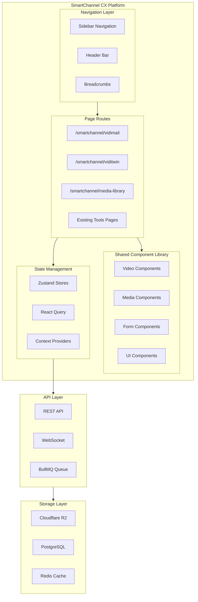
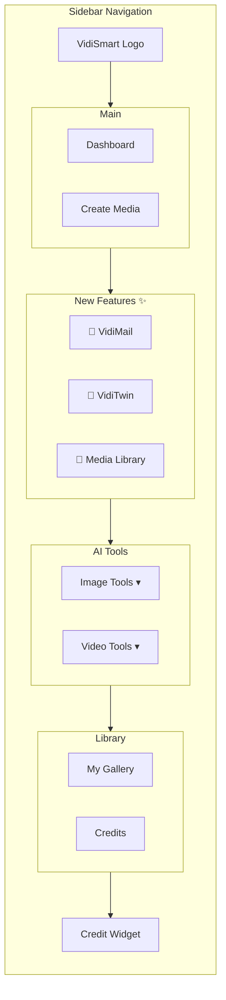
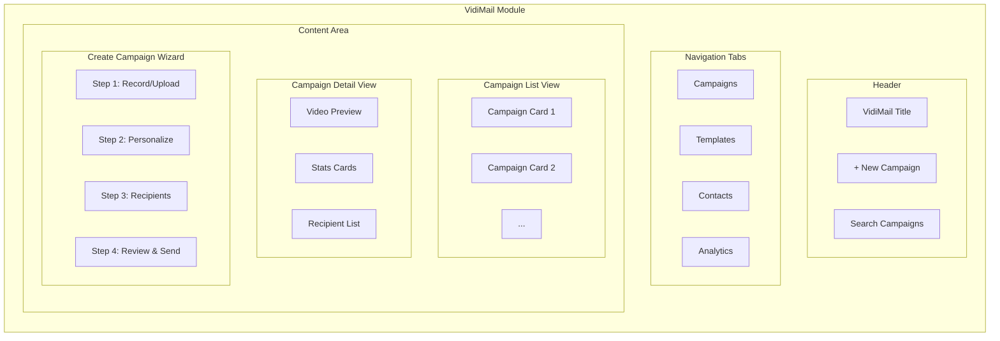
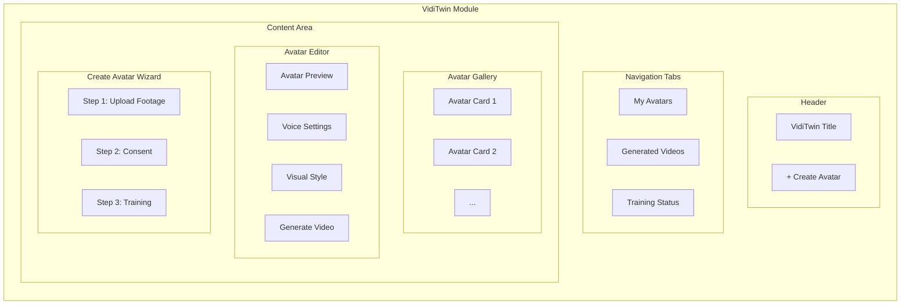
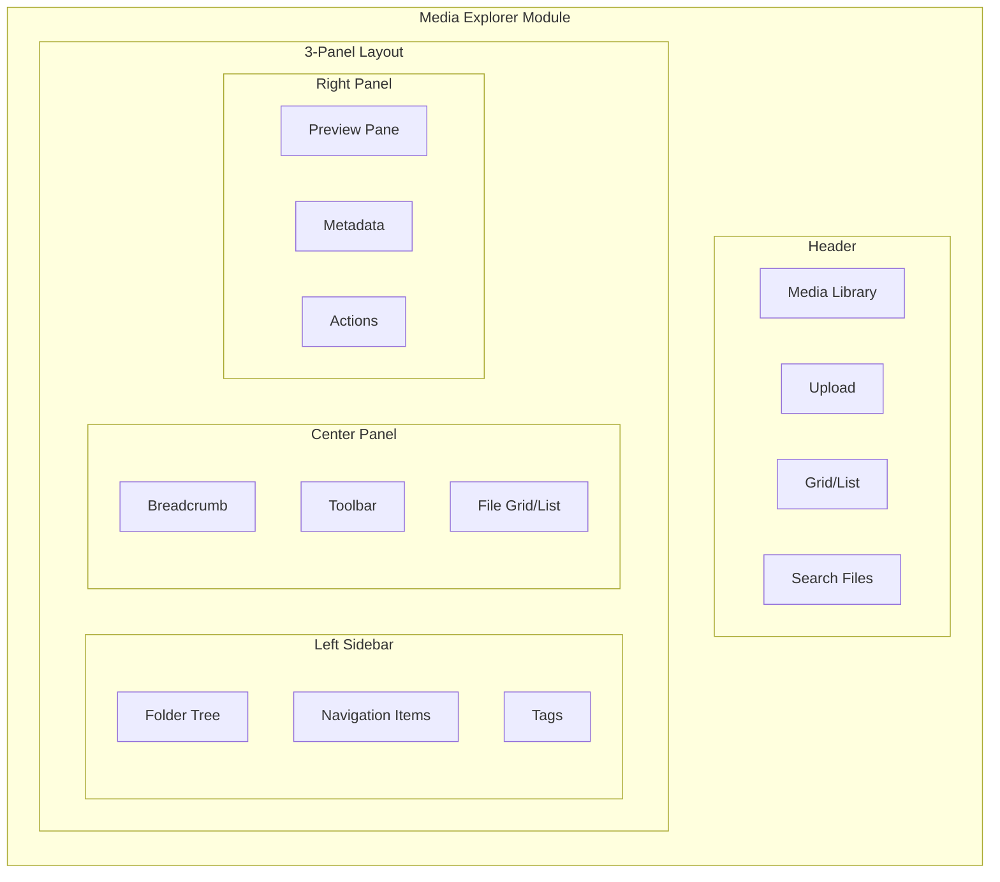

# SmartChannel CX - New Pages Architecture Design

## Executive Summary

This document outlines the architectural design for three new major features to be added to the VidiFlow SmartChannel CX interface:

1. **VidiMail** - Video email platform for sending personalized video messages
2. **VidiTwin** - Digital twin / AI avatar creation and management
3. **Media Explorer** - Directus-style file manager for media assets

---

## 1. System Architecture Overview



---

## 2. Route Structure

### 2.1 URL Hierarchy

```
/smartchannel                    # Dashboard (existing)
├── /vidimail                    # VidiMail Home
│   ├── /campaigns               # Campaign list
│   ├── /campaigns/[id]          # Campaign detail
│   ├── /templates               # Email templates
│   ├── /contacts                # Contact management
│   ├── /analytics               # Campaign analytics
│   └── /create                  # Create new campaign
├── /viditwin                    # VidiTwin Home
│   ├── /avatars                 # Avatar gallery
│   ├── /avatars/[id]            # Avatar detail/editor
│   ├── /create                  # Create new avatar
│   ├── /training                # Training status
│   └── /videos                  # Generated videos
└── /media-library               # Media Explorer
    ├── /browse                  # File browser (default)
    ├── /browse/[folderId]       # Folder view
    ├── /recent                  # Recently accessed
    ├── /favorites               # Starred items
    ├── /shared                  # Shared with me
    └── /trash                   # Deleted items
```

### 2.2 Next.js App Router Structure

```
app/
└── smartchannel/
    ├── page.tsx                   # Dashboard (existing)
    ├── layout.tsx                 # Shared layout
    ├── vidimail/
    │   ├── page.tsx               # VidiMail dashboard
    │   ├── campaigns/
    │   │   ├── page.tsx           # Campaign list
    │   │   └── [id]/
    │   │       └── page.tsx       # Campaign detail
    │   ├── templates/
    │   │   └── page.tsx           # Template gallery
    │   ├── contacts/
    │   │   └── page.tsx           # Contact management
    │   ├── analytics/
    │   │   └── page.tsx           # Analytics dashboard
    │   └── create/
    │       └── page.tsx           # Campaign creation wizard
    ├── viditwin/
    │   ├── page.tsx               # VidiTwin dashboard
    │   ├── avatars/
    │   │   ├── page.tsx           # Avatar gallery
    │   │   └── [id]/
    │   │       └── page.tsx       # Avatar editor
    │   ├── create/
    │   │   └── page.tsx           # Avatar creation
    │   └── videos/
    │       └── page.tsx           # Generated videos
    └── media-library/
        ├── page.tsx               # Redirect to /browse
        ├── layout.tsx             # Media library layout (3-panel)
        ├── browse/
        │   ├── page.tsx           # Root browse
        │   └── [[...folderId]]/
        │       └── page.tsx       # Folder view
        ├── recent/
        │   └── page.tsx           # Recent files
        ├── favorites/
        │   └── page.tsx           # Favorites
        └── shared/
            └── page.tsx           # Shared files
```

---

## 3. Navigation Integration

### 3.1 Updated Sidebar Structure

```typescript
const SIDEBAR_NAVIGATION = {
  main: [
    { id: "dashboard", label: "Dashboard", icon: "Sparkles", path: "/smartchannel" },
    { id: "create", label: "Create Media", icon: "Upload", path: "/smartchannel?tab=create" },
  ],
  
  newFeatures: [
    { 
      id: "vidimail", 
      label: "VidiMail", 
      icon: "MailVideo", 
      path: "/smartchannel/vidimail",
      badge: "New",
      description: "Personalized video emails"
    },
    { 
      id: "viditwin", 
      label: "VidiTwin", 
      icon: "UserCircle", 
      path: "/smartchannel/viditwin",
      badge: "New",
      description: "AI avatar creation"
    },
    { 
      id: "media-library", 
      label: "Media Library", 
      icon: "FolderOpen", 
      path: "/smartchannel/media-library",
      badge: "New",
      description: "File manager"
    },
  ],
  
  tools: [
    { id: "image-tools", label: "Image Tools", icon: "Image", children: [
      { id: "smartgen", label: "SmartGen Image", path: "/smartchannel?tool=smartgen" },
      { id: "image-generator", label: "AI Image Gen", path: "/smartchannel/image-generator" },
      { id: "background-remover", label: "Background Remover", path: "/smartchannel?tool=bg-remove" },
    ]},
    { id: "video-tools", label: "Video Tools", icon: "Video", children: [
      { id: "text-to-video", label: "Text to Video", path: "/smartchannel/text-to-video" },
      { id: "video-upscaler", label: "Video Upscaler", path: "/smartchannel/upscale" },
    ]},
  ],
  
  library: [
    { id: "gallery", label: "My Gallery", icon: "Image", path: "/smartchannel?tab=gallery" },
    { id: "credits", label: "Credits", icon: "CreditCard", path: "/smartchannel?tab=credits" },
  ],
};
```

### 3.2 Sidebar Visual Design



---

## 4. VidiMail Page Architecture

### 4.1 Page Structure



### 4.2 Component Hierarchy

```
VidiMailPage
├── VidiMailHeader
│   ├── PageTitle
│   ├── SearchBar
│   └── NewCampaignButton
├── VidiMailTabs
│   ├── TabList
│   └── TabPanels
├── CampaignsView
│   ├── CampaignGrid
│   │   └── CampaignCard
│   │       ├── VideoThumbnail
│   │       ├── CampaignInfo
│   │       ├── StatusBadge
│   │       └── ActionMenu
│   └── EmptyState
├── CampaignDetailView
│   ├── CampaignHeader
│   ├── VideoPreview
│   ├── StatsDashboard
│   │   ├── StatCard (opens, plays, clicks)
│   │   └── EngagementChart
│   └── RecipientTable
├── TemplatesView
│   ├── TemplateGrid
│   │   └── TemplateCard
│   └── TemplateEditor
├── ContactsView
│   ├── ContactToolbar
│   │   ├── ImportButton
│   │   ├── AddContactButton
│   │   └── FilterDropdown
│   └── ContactTable
│       └── ContactRow
└── CreateCampaignWizard
    ├── WizardProgress
    ├── StepContent
    │   ├── RecordStep
    │   ├── PersonalizeStep
    │   ├── RecipientsStep
    │   └── ReviewStep
    └── WizardNavigation
```

### 4.3 Key Components Specification

#### CampaignCard Component
```typescript
interface CampaignCardProps {
  campaign: {
    id: string;
    name: string;
    thumbnailUrl: string;
    status: 'draft' | 'sending' | 'sent' | 'scheduled';
    recipientCount: number;
    sentCount: number;
    openRate: number;
    playRate: number;
    createdAt: Date;
  };
  onClick: () => void;
  onEdit: () => void;
  onDelete: () => void;
  onDuplicate: () => void;
}
```

#### VideoRecorder Component
```typescript
interface VideoRecorderProps {
  onRecordingComplete: (blob: Blob) => void;
  maxDuration?: number; // seconds
  allowUpload?: boolean;
  quality?: '720p' | '1080p';
}
```

#### PersonalizationPanel Component
```typescript
interface PersonalizationPanelProps {
  variables: Array<{
    key: string;
    label: string;
    type: 'text' | 'image' | 'website';
    preview: string;
  }>;
  onVariableChange: (key: string, value: string) => void;
  previewContact?: Contact;
}
```

#### ContactImporter Component
```typescript
interface ContactImporterProps {
  onImport: (contacts: Contact[]) => void;
  supportedFormats: ['csv', 'xlsx', 'vcf'];
  maxFileSize: number; // MB
}
```

### 4.4 State Management

```typescript
// stores/vidimailStore.ts
interface VidiMailState {
  // Campaigns
  campaigns: Campaign[];
  selectedCampaign: Campaign | null;
  campaignFilter: string;
  campaignSort: 'date' | 'name' | 'performance';
  
  // Creation Wizard
  wizardStep: number;
  wizardData: {
    video: Blob | null;
    thumbnail: string;
    personalization: PersonalizationConfig;
    recipients: Contact[];
    template: Template | null;
  };
  
  // Templates
  templates: Template[];
  selectedTemplate: Template | null;
  
  // Contacts
  contacts: Contact[];
  contactFilter: string;
  contactGroups: ContactGroup[];
  
  // Analytics
  analyticsDateRange: DateRange;
  analyticsData: AnalyticsData | null;
}
```

---

## 5. VidiTwin Page Architecture

### 5.1 Page Structure



### 5.2 Component Hierarchy

```
VidiTwinPage
├── VidiTwinHeader
├── VidiTwinTabs
├── AvatarGalleryView
│   ├── AvatarGrid
│   │   └── AvatarCard
│   │       ├── AvatarPreview
│   │       ├── AvatarInfo
│   │       ├── StatusIndicator
│   │       └── QuickActions
│   └── EmptyState
├── AvatarDetailView
│   ├── AvatarHeader
│   ├── AvatarPreviewPanel
│   │   ├── LivePreview
│   │   └── PreviewControls
│   ├── VoiceSettingsPanel
│   │   ├── VoiceSelector
│   │   ├── SpeechSample
│   │   └── VoiceCloning
│   ├── VisualSettingsPanel
│   │   ├── BackgroundSelector
│   │   ├── OutfitSelector
│   │   └── ExpressionControls
│   └── VideoGeneratorPanel
│       ├── ScriptInput
│       ├── GenerationSettings
│       └── GenerateButton
├── GeneratedVideosView
│   ├── VideoGrid
│   │   └── GeneratedVideoCard
│   └── VideoPlayerModal
└── CreateAvatarWizard
    ├── UploadStep
    │   ├── VideoUploader
    │   ├── GuidelinesChecklist
    │   └── PreviewPlayer
    ├── ConsentStep
    │   ├── TermsDisplay
    │   └── ConsentCheckbox
    └── TrainingStep
        ├── ProgressIndicator
        └── TrainingStatus
```

### 5.3 Key Components Specification

#### AvatarCard Component
```typescript
interface AvatarCardProps {
  avatar: {
    id: string;
    name: string;
    thumbnailUrl: string;
    status: 'training' | 'ready' | 'error';
    trainingProgress?: number;
    createdAt: Date;
    videoCount: number;
    voiceCloned: boolean;
  };
  onClick: () => void;
  onEdit: () => void;
  onDelete: () => void;
}
```

#### AvatarPreview Component
```typescript
interface AvatarPreviewProps {
  avatarId: string;
  script?: string;
  voiceId?: string;
  background?: string;
  autoPlay?: boolean;
  onLoad?: () => void;
}
```

#### VideoUploader Component
```typescript
interface VideoUploaderProps {
  onUpload: (files: File[]) => void;
  guidelines: {
    minDuration: number;
    maxDuration: number;
    minResolution: string;
    maxFileSize: number;
    requiredAngles: string[];
  };
  validationErrors: string[];
}
```

#### TrainingProgress Component
```typescript
interface TrainingProgressProps {
  status: 'queued' | 'processing' | 'completed' | 'error';
  progress: number;
  stage: string;
  estimatedTimeRemaining?: number;
  errorMessage?: string;
  onRetry?: () => void;
}
```

### 5.4 State Management

```typescript
// stores/viditwinStore.ts
interface VidiTwinState {
  // Avatars
  avatars: Avatar[];
  selectedAvatar: Avatar | null;
  avatarFilter: string;
  
  // Avatar Creation
  creationStep: number;
  uploadData: {
    videos: File[];
    consentGiven: boolean;
  };
  
  // Avatar Editor
  editorSettings: {
    selectedVoice: string;
    selectedBackground: string;
    selectedOutfit: string;
    script: string;
  };
  
  // Generated Videos
  generatedVideos: GeneratedVideo[];
  videoFilter: string;
  
  // Training Queue
  trainingJobs: TrainingJob[];
}
```

---

## 6. Media Explorer (File Manager) Architecture

### 6.1 Page Structure (3-Panel Layout)



### 6.2 Component Hierarchy

```
MediaLibraryLayout
├── MediaLibraryHeader
│   ├── Title
│   ├── UploadButton
│   ├── ViewToggle (Grid/List)
│   ├── SearchBar
│   └── FilterDropdown
├── ThreePanelLayout
│   ├── LeftSidebar
│   │   ├── FolderTree
│   │   │   └── FolderNode (recursive)
│   │   ├── NavigationSection
│   │   │   ├── NavItem (Browse)
│   │   │   ├── NavItem (Recent)
│   │   │   ├── NavItem (Favorites)
│   │   │   ├── NavItem (Shared)
│   │   │   └── NavItem (Trash)
│   │   └── TagsSection
│   │       └── TagList
│   ├── CenterPanel
│   │   ├── BreadcrumbNav
│   │   ├── Toolbar
│   │   │   ├── SelectionInfo
│   │   │   ├── BatchActions
│   │   │   ├── SortDropdown
│   │   │   └── NewFolderButton
│   │   ├── FileGrid (or FileList)
│   │   │   └── FileCard (or FileRow)
│   │   │       ├── Thumbnail
│   │   │       ├── FileInfo
│   │   │       ├── SelectionCheckbox
│   │   │       └── ContextMenu
│   │   └── EmptyState
│   └── RightPanel (Collapsible)
│       ├── PreviewPane
│       │   ├── ImagePreview
│       │   ├── VideoPreview
│       │   ├── AudioPreview
│       │   └── DocumentPreview
│       ├── MetadataPanel
│       │   ├── FileDetails
│       │   ├── EXIFData
│       │   └── CustomFields
│       └── ActionsPanel
│           ├── DownloadButton
│           ├── ShareButton
│           ├── RenameButton
│           ├── MoveButton
│           ├── CopyButton
│           └── DeleteButton
├── UploadModal
│   ├── DropZone
│   ├── FileList
│   ├── UploadProgress
│   └── FolderSelector
├── PreviewModal
│   └── FullScreenPreview
└── ContextMenus
    ├── FileContextMenu
    ├── FolderContextMenu
    └── BatchContextMenu
```

### 6.3 Key Components Specification

#### FileCard Component
```typescript
interface FileCardProps {
  file: {
    id: string;
    name: string;
    type: 'image' | 'video' | 'audio' | 'document';
    size: number;
    thumbnailUrl?: string;
    duration?: number; // for video/audio
    resolution?: string; // for image/video
    createdAt: Date;
    modifiedAt: Date;
    folderId: string;
    tags: string[];
    isFavorite: boolean;
  };
  viewMode: 'grid' | 'list';
  isSelected: boolean;
  onSelect: () => void;
  onDoubleClick: () => void;
  onContextMenu: (e: React.MouseEvent) => void;
}
```

#### FolderTree Component
```typescript
interface FolderTreeProps {
  folders: Folder[];
  selectedFolderId: string;
  expandedFolders: string[];
  onFolderSelect: (id: string) => void;
  onFolderToggle: (id: string) => void;
  onFolderCreate: (parentId: string, name: string) => void;
  onFolderRename: (id: string, name: string) => void;
  onFolderDelete: (id: string) => void;
}

interface Folder {
  id: string;
  name: string;
  parentId: string | null;
  children: Folder[];
  fileCount: number;
}
```

#### UploadZone Component
```typescript
interface UploadZoneProps {
  onFilesDrop: (files: File[]) => void;
  currentFolderId: string;
  allowedTypes?: string[];
  maxFileSize?: number;
  maxTotalSize?: number;
  parallelUploads?: number;
}
```

#### MetadataPanel Component
```typescript
interface MetadataPanelProps {
  file: {
    id: string;
    name: string;
    type: string;
    size: number;
    createdAt: Date;
    modifiedAt: Date;
    dimensions?: { width: number; height: number };
    duration?: number;
    codec?: string;
    exif?: Record<string, any>;
    customFields: CustomField[];
  };
  onMetadataUpdate: (field: string, value: any) => void;
  onTagAdd: (tag: string) => void;
  onTagRemove: (tag: string) => void;
}
```

### 6.4 State Management

```typescript
// stores/mediaLibraryStore.ts
interface MediaLibraryState {
  // Navigation
  currentFolderId: string;
  folderTree: Folder[];
  expandedFolders: string[];
  
  // Files
  files: File[];
  selectedFileIds: string[];
  fileFilter: {
    search: string;
    types: string[];
    tags: string[];
    dateRange: DateRange | null;
  };
  fileSort: {
    field: 'name' | 'date' | 'size' | 'type';
    direction: 'asc' | 'desc';
  };
  viewMode: 'grid' | 'list';
  
  // Uploads
  activeUploads: UploadJob[];
  uploadQueue: File[];
  
  // Preview
  previewFileId: string | null;
  isPreviewOpen: boolean;
  
  // Selection
  lastSelectedId: string | null;
}
```

---

## 7. Shared Components Library

### 7.1 Video Components

```typescript
// components/shared/video/

interface VideoPlayerProps {
  src: string;
  poster?: string;
  autoplay?: boolean;
  controls?: boolean;
  loop?: boolean;
  muted?: boolean;
  onTimeUpdate?: (time: number) => void;
  onEnded?: () => void;
}

interface VideoThumbnailProps {
  videoUrl: string;
  timestamp?: number;
  width?: number;
  height?: number;
  className?: string;
}

interface VideoRecorderProps {
  onRecordingComplete: (blob: Blob) => void;
  onError?: (error: Error) => void;
  maxDuration?: number;
  countdown?: boolean;
}

interface VideoUploaderProps {
  onUpload: (files: File[]) => void;
  accept?: string;
  multiple?: boolean;
  maxSize?: number;
  preview?: boolean;
}
```

### 7.2 Media Components

```typescript
// components/shared/media/

interface ThumbnailProps {
  src: string;
  alt: string;
  type: 'image' | 'video' | 'audio' | 'document';
  size?: 'sm' | 'md' | 'lg' | 'xl';
  aspectRatio?: 'square' | 'video' | 'wide';
  overlay?: React.ReactNode;
}

interface FileIconProps {
  type: string;
  extension?: string;
  size?: 'sm' | 'md' | 'lg';
}

interface MediaGridProps {
  items: MediaItem[];
  viewMode: 'grid' | 'list';
  selectedIds: string[];
  onSelect: (id: string, multi: boolean) => void;
  onDoubleClick: (item: MediaItem) => void;
  renderItem: (item: MediaItem) => React.ReactNode;
}

interface DropZoneProps {
  onDrop: (files: File[]) => void;
  isActive?: boolean;
  children: React.ReactNode;
}
```

### 7.3 Form Components

```typescript
// components/shared/forms/

interface ContactPickerProps {
  contacts: Contact[];
  selectedIds: string[];
  onSelectionChange: (ids: string[]) => void;
  onImport: () => void;
  onCreate: () => void;
}

interface TemplateSelectorProps {
  templates: Template[];
  selectedId: string | null;
  onSelect: (id: string) => void;
  onCreate: () => void;
  onEdit: (id: string) => void;
}

interface VariableInputProps {
  variable: Variable;
  value: string;
  onChange: (value: string) => void;
  preview?: string;
}

interface ProgressBarProps {
  progress: number;
  status: string;
  showPercentage?: boolean;
  size?: 'sm' | 'md' | 'lg';
}
```

### 7.4 UI Components

```typescript
// components/shared/ui/

interface EmptyStateProps {
  icon: React.ReactNode;
  title: string;
  description: string;
  action?: {
    label: string;
    onClick: () => void;
  };
}

interface StatCardProps {
  label: string;
  value: string | number;
  change?: number;
  icon?: React.ReactNode;
  trend?: 'up' | 'down' | 'neutral';
}

interface WizardProps {
  steps: WizardStep[];
  currentStep: number;
  onStepChange: (step: number) => void;
  onComplete: () => void;
  onCancel: () => void;
}

interface DataTableProps {
  columns: Column[];
  data: any[];
  selection?: 'single' | 'multiple';
  selectedIds?: string[];
  onSelectionChange?: (ids: string[]) => void;
  onRowClick?: (row: any) => void;
  sortable?: boolean;
  pagination?: boolean;
}
```

---

## 8. API Integration

### 8.1 VidiMail API Endpoints

```typescript
// API Routes

// Campaigns
GET    /api/vidimail/campaigns              // List campaigns
POST   /api/vidimail/campaigns              // Create campaign
GET    /api/vidimail/campaigns/:id          // Get campaign
PUT    /api/vidimail/campaigns/:id          // Update campaign
DELETE /api/vidimail/campaigns/:id          // Delete campaign
POST   /api/vidimail/campaigns/:id/send     // Send campaign
POST   /api/vidimail/campaigns/:id/duplicate // Duplicate campaign

// Templates
GET    /api/vidimail/templates              // List templates
POST   /api/vidimail/templates              // Create template
PUT    /api/vidimail/templates/:id          // Update template
DELETE /api/vidimail/templates/:id          // Delete template

// Contacts
GET    /api/vidimail/contacts               // List contacts
POST   /api/vidimail/contacts               // Create contact
POST   /api/vidimail/contacts/import        // Import contacts
PUT    /api/vidimail/contacts/:id           // Update contact
DELETE /api/vidimail/contacts/:id           // Delete contact

// Analytics
GET    /api/vidimail/analytics/campaign/:id // Campaign analytics
GET    /api/vidimail/analytics/overview     // Overview stats

// Video Processing
POST   /api/vidimail/videos/upload          // Upload video
POST   /api/vidimail/videos/personalize     // Generate personalized videos
GET    /api/vidimail/videos/:id/status      // Check processing status
```

### 8.2 VidiTwin API Endpoints

```typescript
// Avatars
GET    /api/viditwin/avatars                // List avatars
POST   /api/viditwin/avatars                // Create avatar
GET    /api/viditwin/avatars/:id            // Get avatar
PUT    /api/viditwin/avatars/:id            // Update avatar
DELETE /api/viditwin/avatars/:id            // Delete avatar
POST   /api/viditwin/avatars/:id/train      // Start training
GET    /api/viditwin/avatars/:id/status     // Training status

// Videos
POST   /api/viditwin/videos/generate        // Generate video
GET    /api/viditwin/videos                 // List generated videos
GET    /api/viditwin/videos/:id             // Get video
DELETE /api/viditwin/videos/:id             // Delete video

// Voices
GET    /api/viditwin/voices                 // List available voices
POST   /api/viditwin/voices/clone           // Clone voice
```

### 8.3 Media Library API Endpoints

```typescript
// Files
GET    /api/media/files                     // List files
POST   /api/media/files/upload              // Upload file
GET    /api/media/files/:id                 // Get file
PUT    /api/media/files/:id                 // Update file
DELETE /api/media/files/:id                 // Delete file
POST   /api/media/files/:id/move            // Move file
POST   /api/media/files/:id/copy            // Copy file
POST   /api/media/files/batch               // Batch operations

// Folders
GET    /api/media/folders                   // List folders
POST   /api/media/folders                   // Create folder
PUT    /api/media/folders/:id               // Rename folder
DELETE /api/media/folders/:id               // Delete folder

// Search
GET    /api/media/search                    // Search files
GET    /api/media/tags                      // List tags

// Sharing
POST   /api/media/share                     // Create share link
GET    /api/media/share/:token              // Access shared file
```

---

## 9. Data Models

### 9.1 VidiMail Models

```typescript
interface Campaign {
  id: string;
  name: string;
  description?: string;
  status: 'draft' | 'scheduled' | 'sending' | 'sent' | 'paused';
  
  // Video
  videoUrl: string;
  thumbnailUrl: string;
  duration: number;
  
  // Personalization
  personalization: {
    variables: Variable[];
    templateId?: string;
  };
  
  // Recipients
  recipients: Contact[];
  recipientCount: number;
  
  // Schedule
  scheduledAt?: Date;
  sentAt?: Date;
  
  // Tracking
  tracking: {
    opens: number;
    uniqueOpens: number;
    plays: number;
    uniquePlays: number;
    clicks: number;
    uniqueClicks: number;
    replies: number;
  };
  
  // Metadata
  createdAt: Date;
  updatedAt: Date;
  createdBy: string;
}

interface Contact {
  id: string;
  email: string;
  firstName?: string;
  lastName?: string;
  company?: string;
  role?: string;
  website?: string;
  linkedInUrl?: string;
  customFields: Record<string, string>;
  tags: string[];
  lists: string[];
  createdAt: Date;
  updatedAt: Date;
}

interface Template {
  id: string;
  name: string;
  description?: string;
  thumbnailUrl: string;
  htmlContent: string;
  variables: Variable[];
  isDefault: boolean;
  createdAt: Date;
  updatedAt: Date;
}

interface Variable {
  key: string;
  label: string;
  type: 'text' | 'image' | 'website' | 'video';
  defaultValue?: string;
  required: boolean;
}
```

### 9.2 VidiTwin Models

```typescript
interface Avatar {
  id: string;
  name: string;
  description?: string;
  thumbnailUrl: string;
  
  // Training
  status: 'training' | 'ready' | 'error';
  trainingProgress: number;
  trainingError?: string;
  
  // Source videos
  sourceVideos: {
    url: string;
    duration: number;
    resolution: string;
  }[];
  
  // Voice
  voice: {
    id: string;
    name: string;
    isCloned: boolean;
    sampleUrl?: string;
  };
  
  // Settings
  settings: {
    defaultBackground: string;
    defaultOutfit: string;
    gestures: boolean;
    expressions: boolean;
  };
  
  // Stats
  videoCount: number;
  
  // Metadata
  createdAt: Date;
  updatedAt: Date;
}

interface GeneratedVideo {
  id: string;
  avatarId: string;
  script: string;
  videoUrl: string;
  thumbnailUrl: string;
  duration: number;
  status: 'generating' | 'completed' | 'error';
  settings: {
    voiceId: string;
    background: string;
    outfit: string;
  };
  createdAt: Date;
}
```

### 9.3 Media Library Models

```typescript
interface MediaFile {
  id: string;
  name: string;
  type: 'image' | 'video' | 'audio' | 'document';
  extension: string;
  
  // Storage
  url: string;
  thumbnailUrl?: string;
  folderId: string;
  
  // Size
  size: number;
  
  // Media-specific
  dimensions?: {
    width: number;
    height: number;
  };
  duration?: number;
  codec?: string;
  
  // Metadata
  exif?: Record<string, any>;
  customFields: CustomField[];
  tags: string[];
  
  // Status
  isFavorite: boolean;
  isShared: boolean;
  
  // Timestamps
  createdAt: Date;
  modifiedAt: Date;
  uploadedBy: string;
}

interface Folder {
  id: string;
  name: string;
  parentId: string | null;
  path: string;
  fileCount: number;
  createdAt: Date;
  updatedAt: Date;
}

interface CustomField {
  id: string;
  name: string;
  type: 'text' | 'number' | 'date' | 'boolean' | 'select';
  value: any;
}
```

---

## 10. Implementation Phases

### Phase 1: Foundation (Week 1)
- [ ] Set up route structure and navigation
- [ ] Create shared component library
- [ ] Implement base layouts for each module
- [ ] Set up state management stores

### Phase 2: Media Library (Weeks 2-3)
- [ ] Implement 3-panel layout
- [ ] Build file browser with folder tree
- [ ] Create upload system with drag & drop
- [ ] Implement preview panel
- [ ] Add batch operations

### Phase 3: VidiMail Core (Weeks 4-6)
- [ ] Campaign list and detail views
- [ ] Video recorder/uploader
- [ ] Contact management
- [ ] Template system
- [ ] Basic analytics

### Phase 4: VidiTwin Core (Weeks 7-9)
- [ ] Avatar gallery
- [ ] Avatar creation wizard
- [ ] Training status tracking
- [ ] Video generation interface
- [ ] Voice cloning integration

### Phase 5: Integration & Polish (Week 10)
- [ ] Cross-module integration
- [ ] Performance optimization
- [ ] Error handling
- [ ] Testing and bug fixes

---

## 11. Technical Considerations

### 11.1 Performance
- Implement virtual scrolling for large lists
- Use lazy loading for images and videos
- Debounce search inputs
- Cache API responses with React Query
- Optimize re-renders with React.memo

### 11.2 Accessibility
- Keyboard navigation support
- ARIA labels for all interactive elements
- Focus management in modals
- Screen reader compatibility
- Color contrast compliance

### 11.3 Security
- File type validation on upload
- File size limits
- Secure URL generation for previews
- Permission-based access control
- CSRF protection

### 11.4 Responsive Design
- Mobile-optimized layouts
- Touch-friendly interactions
- Collapsible panels on small screens
- Adaptive grid layouts

---

## Appendix: Component Directory Structure

```
components/
├── vidimail/
│   ├── campaigns/
│   │   ├── CampaignCard.tsx
│   │   ├── CampaignGrid.tsx
│   │   ├── CampaignDetail.tsx
│   │   └── CampaignStats.tsx
│   ├── wizard/
│   │   ├── CreateCampaignWizard.tsx
│   │   ├── RecordStep.tsx
│   │   ├── PersonalizeStep.tsx
│   │   ├── RecipientsStep.tsx
│   │   └── ReviewStep.tsx
│   ├── contacts/
│   │   ├── ContactTable.tsx
│   │   ├── ContactImporter.tsx
│   │   └── ContactPicker.tsx
│   └── shared/
│       ├── VideoRecorder.tsx
│       ├── PersonalizationPanel.tsx
│       └── TemplateSelector.tsx
├── viditwin/
│   ├── avatars/
│   │   ├── AvatarCard.tsx
│   │   ├── AvatarGrid.tsx
│   │   ├── AvatarEditor.tsx
│   │   └── AvatarPreview.tsx
│   ├── wizard/
│   │   ├── CreateAvatarWizard.tsx
│   │   ├── UploadStep.tsx
│   │   ├── ConsentStep.tsx
│   │   └── TrainingStep.tsx
│   ├── videos/
│   │   ├── GeneratedVideoCard.tsx
│   │   └── VideoGenerator.tsx
│   └── shared/
│       ├── TrainingProgress.tsx
│       └── VoiceSelector.tsx
├── media-library/
│   ├── layout/
│   │   ├── ThreePanelLayout.tsx
│   │   ├── LeftSidebar.tsx
│   │   ├── CenterPanel.tsx
│   │   └── RightPanel.tsx
│   ├── browser/
│   │   ├── FileGrid.tsx
│   │   ├── FileList.tsx
│   │   ├── FileCard.tsx
│   │   └── FileRow.tsx
│   ├── folders/
│   │   ├── FolderTree.tsx
│   │   └── FolderNode.tsx
│   ├── upload/
│   │   ├── UploadModal.tsx
│   │   ├── DropZone.tsx
│   │   └── UploadProgress.tsx
│   ├── preview/
│   │   ├── PreviewPanel.tsx
│   │   ├── ImagePreview.tsx
│   │   ├── VideoPreview.tsx
│   │   └── MetadataPanel.tsx
│   └── shared/
│       ├── BreadcrumbNav.tsx
│       ├── Toolbar.tsx
│       └── ContextMenu.tsx
└── shared/
    ├── video/
    │   ├── VideoPlayer.tsx
    │   ├── VideoThumbnail.tsx
    │   └── VideoUploader.tsx
    ├── media/
    │   ├── Thumbnail.tsx
    │   ├── FileIcon.tsx
    │   └── MediaGrid.tsx
    ├── forms/
    │   ├── SearchInput.tsx
    │   ├── FilterDropdown.tsx
    │   └── SortDropdown.tsx
    └── ui/
        ├── EmptyState.tsx
        ├── StatCard.tsx
        ├── Wizard.tsx
        └── DataTable.tsx
```
