# VidiCity.net Full Site Upgrade - Architecture Plan
## AI-Powered Community with Hyperlocal Visual Vector Search

**Version:** 1.0  
**Date:** February 2026  
**Scope:** 10 Cities MVP with 100 Creators (10 per city)

---

## Executive Summary

This document outlines the complete architectural blueprint for upgrading VidiCity.net from a static hyperlocal video directory into an AI-powered community platform with visual vector search capabilities. The platform will support tiered user profiles (Viewers → Creators → Premium Businesses), each with video landing pages and AI-enhanced discoverability.

### Core Value Propositions
1. **Visual Vector Search** - Find businesses/videos by uploading an image or describing visual content
2. **AI-Powered Discovery** - Smart recommendations based on visual similarity + location
3. **Video-First Profiles** - Every company gets a dedicated video landing page
4. **Hyperlocal Community** - City-focused content with 10-cities MVP expanding to 33,000

---

## System Architecture Overview

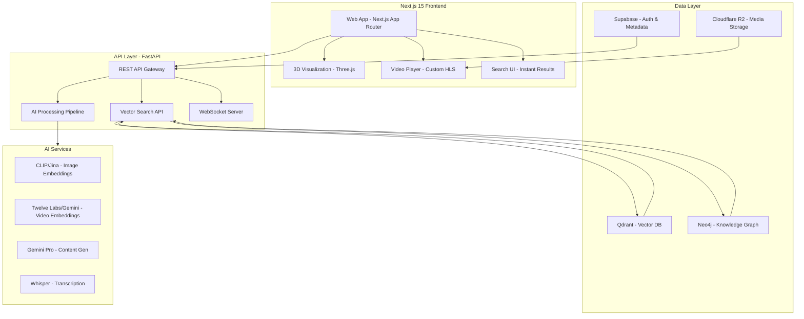

---

## Detailed Component Design

### 1. Keycloak SSO Architecture (NEW)

**Why Keycloak:**
- Enterprise-grade identity management
- Self-hosted (data sovereignty)
- Flexible federation (SAML, OIDC, LDAP)
- Role-based access control (RBAC)
- Session management & centralized logout

**Keycloak Architecture:**

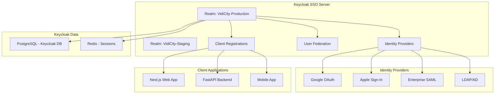

**Keycloak Configuration:**

| Setting | Value |
|---------|-------|
| Realms | VidiCity-Production, VidiCity-Staging |
| Protocol | OpenID Connect (OIDC) |
| Flow | Authorization Code + PKCE |
| Tokens | JWT (RS256), 15-min access, 30-day refresh |
| MFA | TOTP (optional), WebAuthn (future) |
| Custom Attributes | tier, city_id, onboarding_status |

**User Profile Data Flow (Keycloak + PostgreSQL):**

```typescript
// Keycloak stores: identity, auth tokens, roles
interface KeycloakUser {
  id: string;           // UUID from Keycloak
  username: string;
  email: string;
  email_verified: boolean;
  realm_roles: ['viewer', 'creator', 'business'];
  client_roles: ['premium', 'verified'];
  attributes: {
    tier: 'viewer' | 'creator' | 'business';
    city_id: string;
    onboarding_status: 'incomplete' | 'complete';
  };
}

// PostgreSQL stores: profile data, preferences, analytics
interface UserProfile {
  keycloak_id: string;  // Foreign key to Keycloak
  display_name: string;
  avatar_url: string;
  bio: string;
  social_links: SocialLinks;
  preferences: UserPreferences;
  analytics: UserAnalytics;
  created_at: Date;
  updated_at: Date;
}
```

**SSO Integration Flow:**

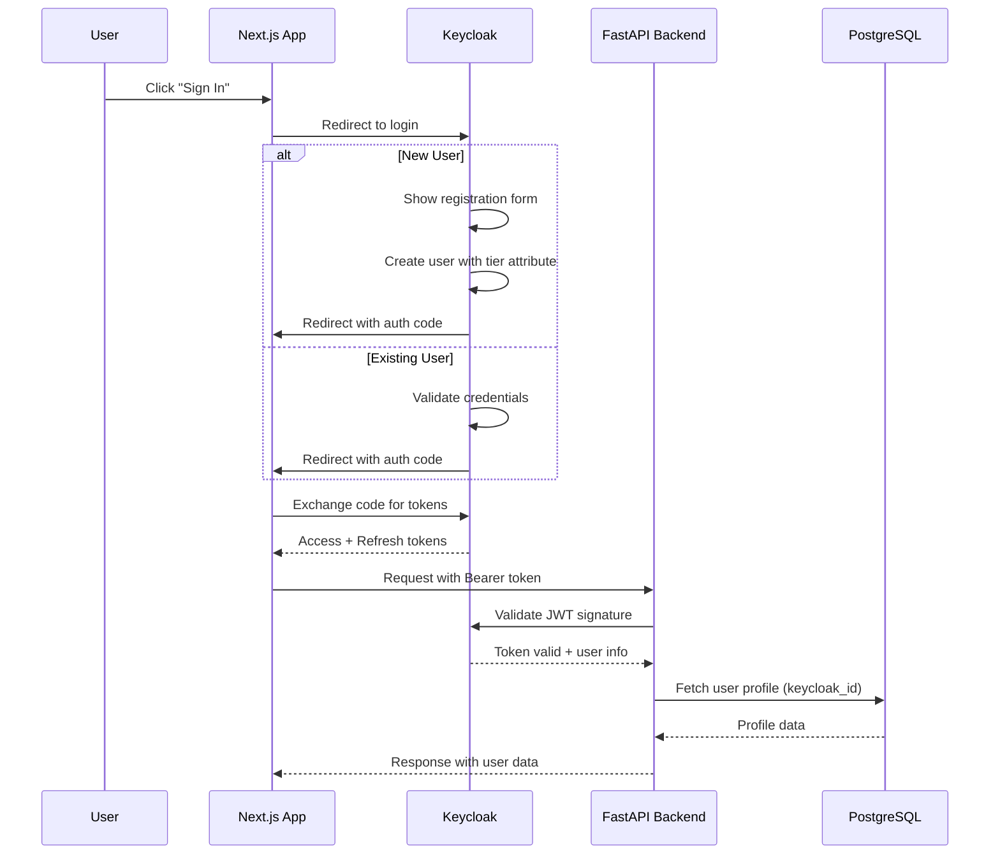

---

### 2. User Profile System (Tiered)

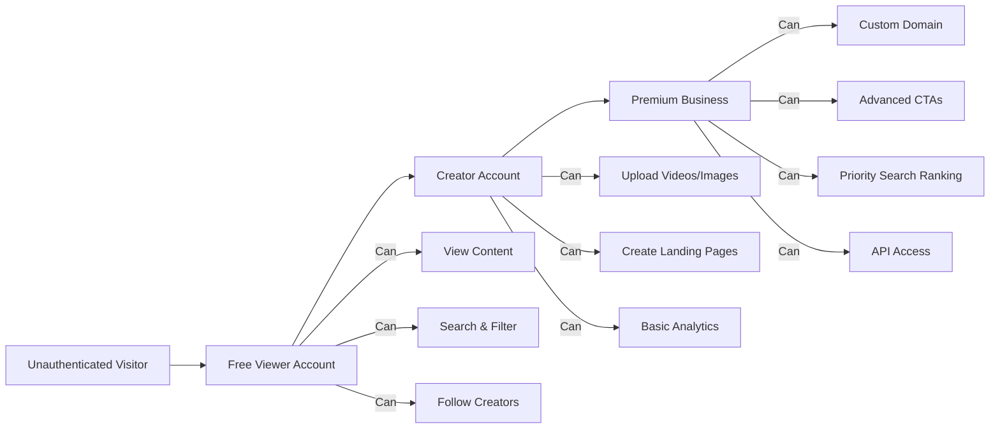

**Profile Data Schema (PostgreSQL, synced with Keycloak):**
```typescript
interface UserProfile {
  id: string;                    // UUID
  tier: 'viewer' | 'creator' | 'business';
  display_name: string;
  avatar_url: string;
  bio: string;
  city_id: string;              // Foreign key to cities
  location: { lat: number; lng: number };
  social_links: SocialLinks;
  analytics: {
    views: number;
    followers: number;
    engagement_rate: number;
  };
  created_at: Date;
  updated_at: Date;
}
```

---

### 2. Video Landing Pages

**Page Structure:**
```
/company/[slug]
├── Hero Section
│   ├── Auto-playing background video (muted)
│   ├── Company logo + name
│   ├── Primary CTA (Contact/Book/Visit)
│   └── City badge with location
├── Video Gallery
│   ├── Featured video (large)
│   ├── Video grid (thumbnails)
│   └── Chapter navigation
├── About Section
│   ├── Rich text description
│   ├── Business hours
│   └── Services/tags
├── Contact/CTA Section
│   ├── Contact form
│   ├── Map embed
│   └── Social links
└── Related Content
    ├── Similar businesses (vector match)
    └── More from this city
```

**Video Upload Pipeline:**
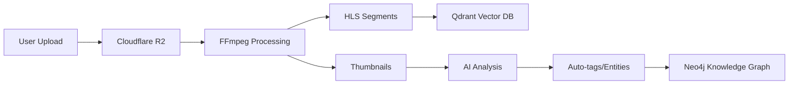

---

### 3. Video Reviews System (NEW - Native Feature)

**Overview:**
Video reviews are a first-class citizen in VidiCity - not an add-on. Users record video testimonials, demonstrations, or feedback about businesses, creating an authentic, visual review ecosystem.

**Review Architecture:**

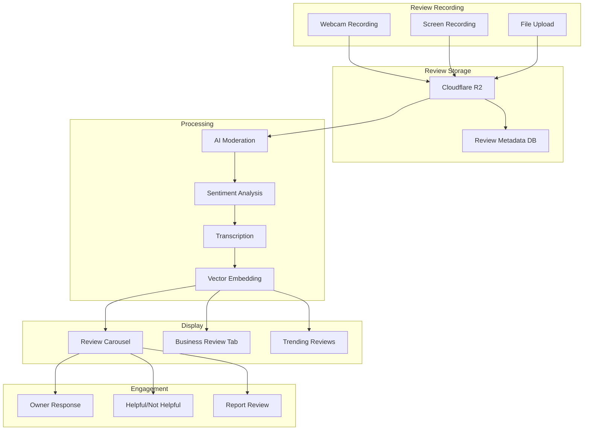

**Review Types:**

| Type | Description | Example |
|------|-------------|---------|
| **Testimonial** | Customer experience story | "I loved the service at Joe's Pizza..." |
| **Demo** | Product/service demonstration | Showing how a bike repair was done |
| **Walkthrough** | Venue/business tour | Walking through a restaurant space |
| **Comparison** | Side-by-side comparison | "This salon vs. that salon" |
| **Response** | Owner responding to feedback | Addressing a customer concern |

**Review Data Model (PostgreSQL):**

```typescript
interface VideoReview {
  id: string;                    // UUID
  business_id: string;           // Foreign key to business
  reviewer_id: string;           // Foreign key to user (Keycloak ID)
  
  // Review Content
  title: string;                 // Review headline
  video_url: string;             // R2 URL to HLS playlist
  thumbnail_url: string;         // AI-generated thumbnail
  duration: number;              // Video length in seconds
  transcript: string;            // Auto-generated transcript
  
  // Metadata
  review_type: 'testimonial' | 'demo' | 'walkthrough' | 'comparison' | 'response';
  rating: number;                // 1-5 stars (optional for video)
  visit_date?: Date;             // When they visited
  verified_purchase: boolean;    // Did they actually buy/service?
  
  // AI Processing Results
  sentiment_score: number;       // -1 to 1 (negative to positive)
  keywords: string[];            // Extracted topics/entities
  moderation_status: 'pending' | 'approved' | 'rejected' | 'flagged';
  moderation_reason?: string;    // If rejected/flagged
  
  // Vector search (Qdrant)
  vector_id: string;             // Reference to Qdrant vector
  
  // Engagement
  views: number;
  helpful_count: number;
  not_helpful_count: number;
  owner_response?: {
    text: string;
    responded_at: Date;
    video_url?: string;          // Owner can respond with video too
  };
  
  // Timestamps
  created_at: Date;
  updated_at: Date;
  published_at?: Date;           // When it went live
}
```

**Review Recording Flow:**

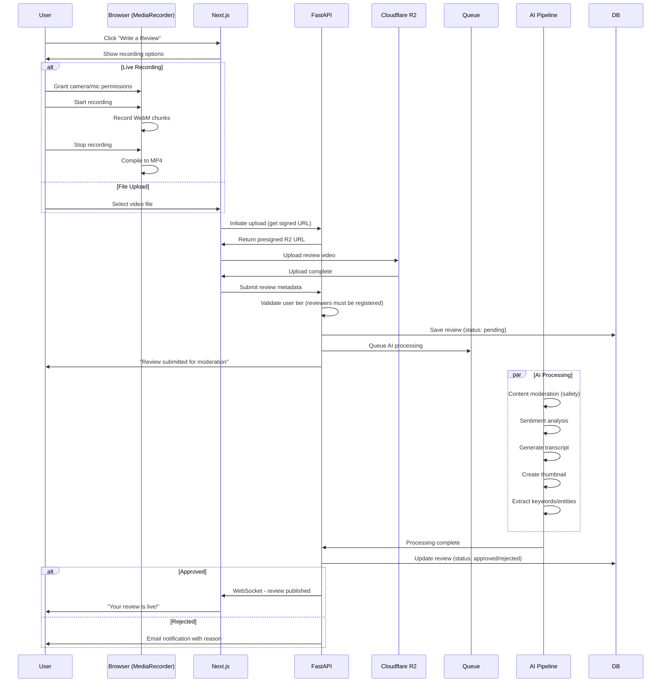

**Review Display Components:**

```
Business Landing Page - Reviews Tab
├── Review Summary Card
│   ├── Average rating (if text reviews)
│   ├── Total review count
│   ├── Sentiment distribution chart
│   └── "Write a Review" CTA
│
├── Featured Video Review (pinned by owner)
│   └── Large player with business response
│
├── Review Filters
│   ├── Type: All | Testimonials | Demos | Walkthroughs
│   ├── Rating: 5★ | 4★ | 3★ | 2★ | 1★
│   ├── Verified only toggle
│   └── Sort: Recent | Helpful | Positive | Critical
│
└── Review Grid/Carousel
    └── Review Card:
        ├── Reviewer avatar + name
        ├── Video thumbnail (plays on hover)
        ├── Title + excerpt
        ├── Rating stars
        ├── "Verified" badge
        ├── Engagement: Helpful / Not Helpful
        ├── Owner response (if exists)
        └── Report button
```

**Owner Response System:**

```typescript
interface OwnerResponse {
  review_id: string;
  owner_id: string;
  
  // Response can be text OR video
  response_type: 'text' | 'video';
  text_content?: string;
  video_url?: string;
  video_duration?: number;
  
  // Metadata
  responded_at: Date;
  is_public: boolean;
  
  // Engagement
  helpful_count: number;
}
```

**Review Moderation Dashboard (Admin):**

```
/admin/reviews
├── Queue Overview
│   ├── Pending: 23
│   ├── Approved Today: 156
│   ├── Flagged: 8
│   └── Rejected (This Week): 12
│
├── Review Queue
│   ├── Review card with video player
│   ├── AI confidence scores (safety, sentiment)
│   ├── Auto-transcript
│   ├── Quick actions: Approve / Reject / Flag / Escalate
│   └── Bulk actions
│
└── Moderation Settings
    ├── Auto-approve threshold (AI confidence > 0.9)
    ├── Prohibited content rules
    ├── Reviewer reputation scores
    └── Appeal process
```

**Review Vector Search (Unique Feature):**

Users can search within reviews:
- "Show me reviews mentioning 'outdoor seating'"
- "Find reviews about 'birthday celebrations'"
- Visual search: "Reviews with similar vibes to this"

Qdrant vectors include:
- Video embedding (Twelve Labs)
- Transcript text embedding (BGE-M3)
- Combined multimodal embedding

---

### 4. Visual Vector Search Engine

**Architecture:**

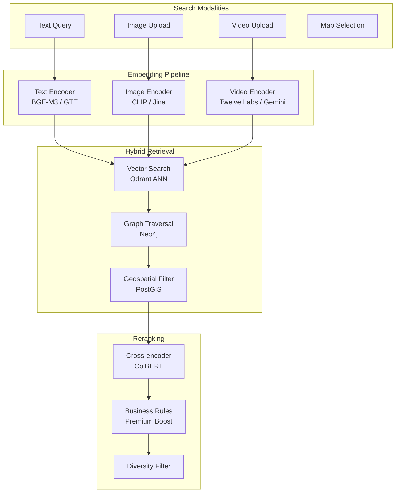

**Vector Dimensions by Content Type:**
- **Text:** 768-1024 dimensions (BGE-M3)
- **Images:** 512-768 dimensions (CLIP)
- **Videos:** 1408-3072 dimensions (Twelve Labs)
- **Combined multimodal:** 1536-2048 dimensions (late fusion)

**Query Flow:**
1. User inputs query (text/image/location)
2. Convert to embedding vector
3. ANN search in Qdrant (top 100 candidates)
4. Filter by geospatial radius (if location provided)
5. Expand via Neo4j graph (related entities)
6. Rerank with cross-encoder
7. Return top 20 results with metadata

---

### 4. 3D Vector Visualization Dashboard

**Purpose:** Allow users to "see" the content universe of a city in 3D space

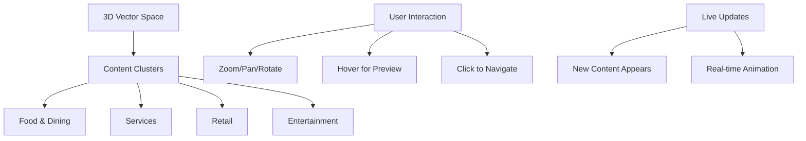

**Tech Stack:**
- **Three.js** for WebGL rendering
- **UMAP** for dimensionality reduction (project to 3D)
- **Force-directed graph** for relationship visualization
- **WebSockets** for live updates

**Features:**
- Each video/image is a point in 3D space
- Similar content clusters together
- Color-coded by category/business type
- Hover shows thumbnail preview
- Click navigates to landing page
- New uploads animate in real-time

---

### 5. AI-Powered Features

#### 5.1 Smart Video Thumbnails
```
Input: Video file
Process: 
  1. Extract keyframes every 5 seconds
  2. Run quality scoring (blur, lighting, composition)
  3. Detect faces/products (if applicable)
  4. Generate AI-enhanced thumbnail
  5. A/B test variants
Output: 3 thumbnail options + auto-selected default
```

#### 5.2 Auto-Tagging & Entity Extraction
```
Input: Video frames + audio transcript
Process:
  1. Vision model analyzes frames (objects, scenes, actions)
  2. NLP extracts entities from transcript
  3. Gemini generates descriptive tags
  4. Confidence scoring per tag
Output: 
  - Visual tags: ["restaurant", "outdoor seating", "dinner"]
  - Entity tags: ["Italian cuisine", "date night", "patio"]
  - Sentiment: Positive
```

#### 5.3 Visual Similarity Recommendations
```
User views: "Joe's Pizza" video
System:
  1. Get vector embedding of viewed video
  2. Find nearest neighbors in same city
  3. Filter by business type similarity
  4. Boost if premium subscriber
  5. Diverse results (not all pizza)
Output: "You might also like: [Italian places], [casual dining], [family restaurants]"
```

---

## City-Based Architecture

### City Entity Model (Neo4j)

```cypher
// City node
CREATE (c:City {
  id: 'nyc',
  name: 'New York City',
  state: 'NY',
  country: 'USA',
  center: point({latitude: 40.7128, longitude: -74.0060}),
  population: 8400000,
  timezone: 'America/New_York'
})

// Business profile in city
CREATE (b:Business {
  id: 'joes-pizza-nyc',
  name: "Joe's Pizza",
  slug: 'joes-pizza-nyc',
  tier: 'premium',
  location: point({latitude: 40.7580, longitude: -73.9855})
})

// Relationships
CREATE (b)-[:LOCATED_IN]->(c)
CREATE (b)-[:SERVES]->(:Category {name: 'Italian Restaurant'})
CREATE (b)-[:HAS_VIDEO]->(:Video {id: 'vid-123', title: 'Best Slice in NYC'})
```

### City Landing Page

**URL Structure:**
```
/city/[city-slug]
├── Hero: City skyline image + tagline
├── Featured Creators (10 per city)
├── Trending Content (this week)
├── Categories Grid (Food, Services, Retail, etc.)
├── Map View (all businesses pinned)
├── Recent Uploads (live feed)
└── Join CTA (for new creators)
```

---

## Technical Stack Summary

| Layer | Technology | Purpose |
|-------|-----------|---------|
| **Frontend** | Next.js 15 + React 19 | SSR, App Router, React Server Components |
| **Styling** | Tailwind CSS + shadcn/ui | Rapid UI development |
| **3D/Viz** | Three.js + React Three Fiber | Vector space visualization |
| **Video** | hls.js + custom player | HLS streaming, chapters |
| **Backend** | FastAPI (Python) | High-performance API |
| **Vector DB** | Qdrant | Visual similarity search |
| **Graph DB** | Neo4j AuraDB | Relationships, knowledge graph |
| **Auth/SSO** | Keycloak | Single sign-on, identity management |
| **Auth DB** | PostgreSQL | User accounts, profiles (synced with Keycloak) |
| **Media Storage** | Cloudflare R2 | Video/image CDN |
| **Caching** | Cloudflare Workers | Edge caching, rate limiting |
| **AI Models** | Gemini Pro, CLIP, Whisper | Embeddings, generation |
| **Queue** | Redis + Celery | Async video processing |

---

## Data Flow Architecture

### Video Upload Flow
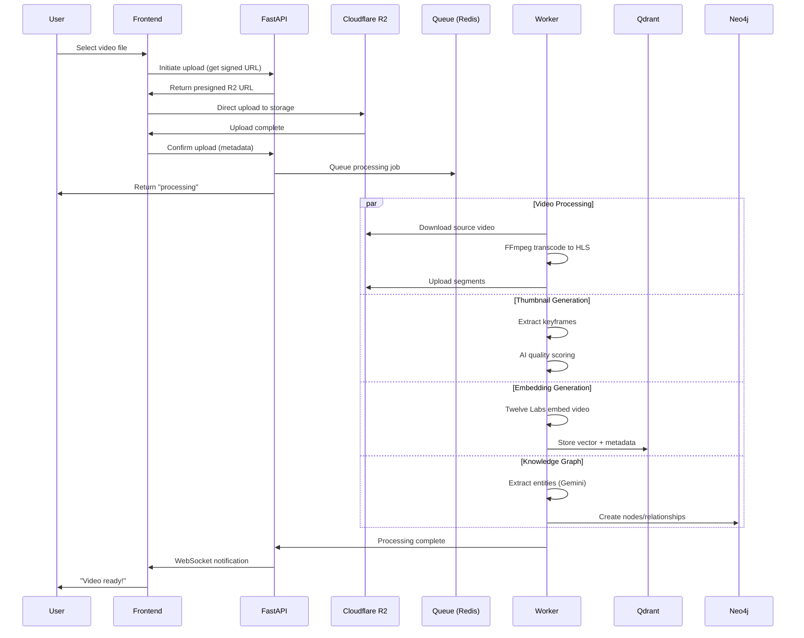

### Search Flow
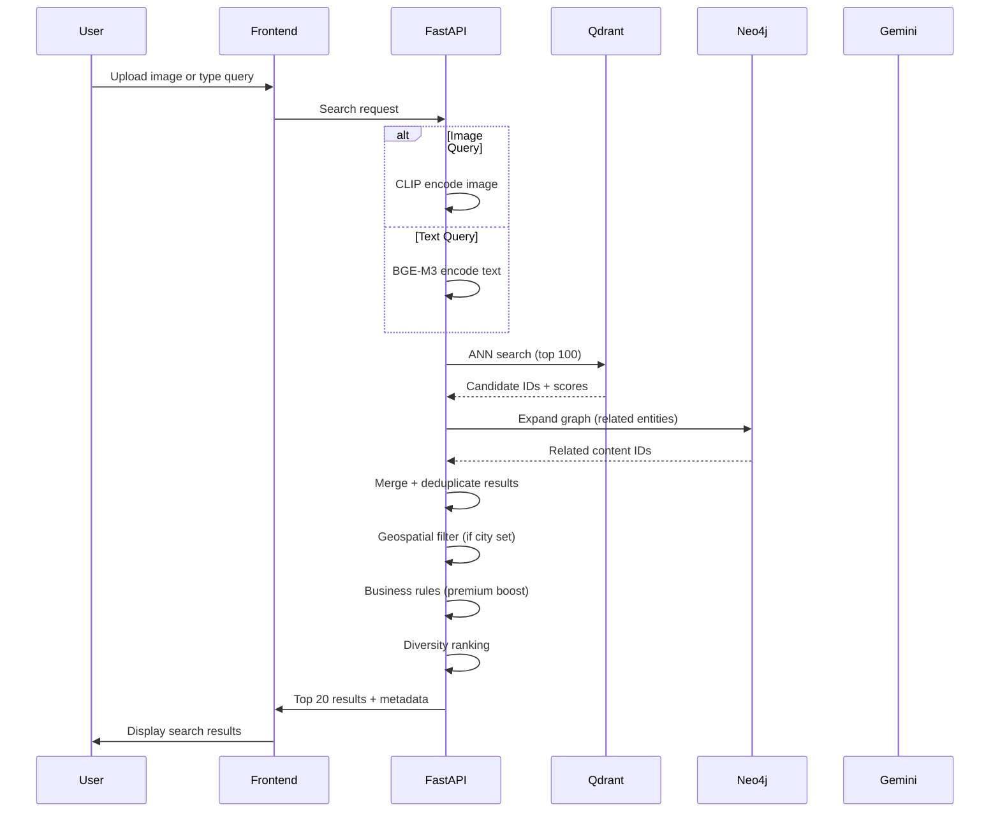

---

## Security Considerations

### Authentication & Authorization (Keycloak)
- **Keycloak** as central SSO identity provider
- Self-hosted for data sovereignty
- JWT tokens (RS256) with 15-min access, 30-day refresh
- Role-based access control (RBAC) via Keycloak realm + client roles
- Identity federation: Google, Apple, Enterprise SAML, LDAP/AD
- Session management with Redis caching
- Centralized logout (all sessions terminated on password change)
- Account linking (merge Google + email accounts)

**Keycloak Security Hardening:**
- Brute force protection (temp lock after 5 failed attempts)
- SSL/TLS enforced for all endpoints
- Confidential clients for backend services
- PKCE for public clients (mobile, SPA)
- Regular security audits of Keycloak configuration
- Backup realm configurations to Git

**FastAPI Token Validation:**
```python
# Keycloak JWT validation middleware
from keycloak import KeycloakOpenID

keycloak_openid = KeycloakOpenID(
    server_url="https://auth.vidicity.com",
    client_id="vidicity-api",
    realm_name="VidiCity-Production",
    client_secret_key="..."
)

# Verify token on each request
token_info = keycloak_openid.introspect(token)
if not token_info['active']:
    raise HTTPException(status_code=401)
```

### Video Content Safety
- AWS Rekognition or Google Vision for content moderation
- Automated scanning: nudity, violence, hate symbols
- User reporting system
- Admin review queue for flagged content
- Rate limiting on uploads (prevent spam)

### API Security
- Cloudflare WAF for DDoS protection
- Rate limiting per user/IP
- Input validation (Pydantic schemas)
- CORS configuration
- API key management for business tier

---

## Performance Targets

| Metric | Target | Notes |
|--------|--------|-------|
| Page Load (First Contentful Paint) | < 1.5s | With 3D hero disabled on mobile |
| Video Start Time | < 2s | From click to first frame |
| Search Response | < 300ms | Vector search + reranking |
| Upload Processing | < 3 min | For 5-minute 1080p video |
| 3D Viz Frame Rate | 60fps | Desktop, 30fps minimum |
| Concurrent Users | 1000+ | Per city during peak |

---

## Cost Estimation (Monthly - 10 Cities)

| Service | Estimated Cost | Notes |
|---------|---------------|-------|
| Cloudflare R2 | $50-100 | 1TB storage, 5TB egress |
| Qdrant Cloud | $50-150 | 10K vectors, light queries |
| Neo4j AuraDB | $65 | 1GB RAM, production tier |
| PostgreSQL (Keycloak + App) | $50 | Managed DB for Keycloak + app data |
| Keycloak Hosting | $50 | Docker on Railway/ECS or self-hosted |
| Redis (Sessions) | $15 | Keycloak session cache |
| Railway/Render | $100 | FastAPI + workers |
| Gemini API | $100-200 | 10K video analyses |
| Twelve Labs | $100 | Video embeddings |
| **Video Reviews** | $75 | Review processing, storage, AI moderation |
| **Total** | **$670-950/month** | Scales with usage |

*Note: Video reviews add ~$75/month for processing (AI moderation, transcription, thumbnails) and additional storage.*

---

## Implementation Phases

### Phase 1: Foundation (Weeks 1-2)
- Infrastructure setup (DBs, storage, API)
- Authentication system
- Basic profile pages

### Phase 2: Video Platform (Weeks 3-4)
- Upload pipeline
- Video landing pages
- Basic search (text only)

### Phase 3: Visual Search (Weeks 5-6)
- Vector database integration
- Image similarity search
- 3D visualization prototype

### Phase 4: AI Features (Weeks 7-8)
- Auto-tagging
- Smart thumbnails
- Recommendations

### Phase 5: City Expansion (Weeks 9-10)
- City landing pages
- Geospatial features
- Creator onboarding flow

### Phase 6: Polish & Launch (Weeks 11-12)
- Performance optimization
- Security audit
- Beta testing with 100 creators

---

## Future Expansion Path

### Phase 2: Scale to 100 Cities
- Multi-region deployment
- Sharded vector database
- Edge caching optimization

### Phase 3: Advanced AI
- Real-time video editing
- AI-generated video summaries
- Automated highlight reels
- Voice cloning for accessibility

### Phase 4: Ecosystem
- Mobile apps (iOS/Android)
- API marketplace
- Third-party integrations
- White-label solution

---

## Appendix: Existing VidiSmart Integration Points

The following existing infrastructure will be leveraged:

1. **ai-proxy.php** - Extend for video analysis APIs
2. **SmartChannel CX** - Customer experience foundation
3. **Vector Database docs** - Implementation patterns
4. **3D Visual Knowledge Graph** - Visualization techniques
5. **VidiTwin** - Digital avatar integration potential

---

## Conclusion

This architecture provides a scalable, AI-native foundation for the VidiCity community platform. The visual vector search differentiates it from traditional business directories, while the tiered profile system enables sustainable monetization. Starting with 10 cities allows for rapid iteration before scaling to the full 33,000-city vision.

**Next Steps:**
1. Review and approve architecture
2. Begin Phase 1 implementation
3. Recruit first 100 creators (10 per city)
4. Set up staging environment for testing
