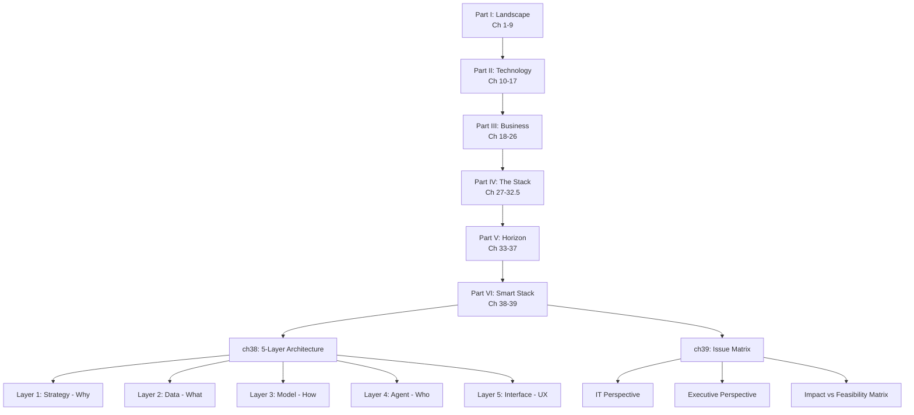
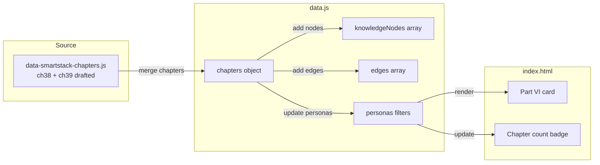

# Smart Stack Enhancement Plan — VidiSmart Book

## Overview
Add Chapters 38 (5-Layer Architecture Framework) and 39 (Issue Matrix) to the Smart Book based on Qwen 3.6 review recommendations.

## Current State
- **data.js**: Contains foreword → ch37 (37 chapters, 5 parts)
- **data-smartstack-chapters.js**: Has ch38 + ch39 drafted but NOT merged
- **index.html**: Shows "37 Chapters · 5 Parts", 5 part cards (no Part VI)

## Implementation Steps

### Step 1: Merge ch38 + ch39 into data.js
**File**: `smart-book/data.js`
**Location**: After line 793 (end of ch37), before line 794 (closing `}` of chapters object)

Insert both chapter objects from `data-smartstack-chapters.js`:
- **ch38**: "Smart Stack — The 5-Layer Architecture Framework" (part: 6, order: 38)
  - Covers: Strategic Layer, Data Layer, Model Layer, Agent Layer, Interface Layer
  - Reading time: 12 min
- **ch39**: "Smart Stack Issue Matrix — IT & Executive Alignment" (part: 6, order: 39)
  - Covers: IT questions, executive questions, impact vs feasibility matrix
  - Reading time: 10 min

### Step 2: Add Knowledge Nodes
**File**: `smart-book/data.js`
**Location**: knowledgeNodes array (after line 822)

Add nodes:
```javascript
{ id: "smart_stack", label: "Smart Stack", type: "strategy", color: "#8B5CF6" },
{ id: "five_layer_model", label: "5-Layer Model", type: "concept", color: "#FF6B35" },
{ id: "issue_matrix", label: "Issue Matrix", type: "strategy", color: "#F59E0B" },
{ id: "vendor_lockin", label: "Vendor Lock-in", type: "concept", color: "#EF4444" },
{ id: "integration_patterns", label: "Integration Patterns", type: "technology", color: "#10B981" }
```

### Step 3: Add Edges
**File**: `smart-book/data.js`
**Location**: edges array (after line 864)

Add edges:
```javascript
{ source: "ch32", target: "ch38", type: "sequence", label: "stack framework" },
{ source: "ch28", target: "ch38", type: "conceptual", label: "architecture" },
{ source: "ch30", target: "ch38", type: "conceptual", label: "local deployment" },
{ source: "ch38", target: "ch39", type: "sequence" },
{ source: "ch17", target: "ch39", type: "conceptual", label: "compliance" },
{ source: "ch24", target: "ch39", type: "conceptual", label: "ROI" }
```

### Step 4: Update Persona Filters
**File**: `smart-book/data.js`

**IT Professional** (line ~41-43):
- Add `"ch38"` to `critical` array
- Add `"ch39"` to `high` array

**Executive / Entrepreneur** (line ~67-69):
- Add `"ch38"` to `critical` array  
- Add `"ch39"` to `critical` array

**Consumer** (line ~16-19):
- Add `"ch38", "ch39"` to `hide` array (not relevant for consumers)

### Step 5: Add Part VI Card to index.html
**File**: `smart-book/index.html`
**Location**: After line 653 (end of Part V card), inside `.parts-grid` div

```html
<div class="part-card">
    <div class="part-num">Part VI</div>
    <h4>The Smart Stack</h4>
    <p>The 5-layer architecture framework, issue matrix, and IT-executive alignment for production AI systems.</p>
</div>
```

### Step 6: Update Chapter/Part Count
**File**: `smart-book/index.html`
**Location**: Line 625

Change:
```
"37 Chapters · 5 Parts" → "39 Chapters · 6 Parts"
```

### Step 7: Browser Verification
- Open `http://localhost:8080/smart-book/index.html`
- Verify Part VI card appears in Whats Inside section
- Verify count shows "39 Chapters · 6 Parts"
- Open print-book.html with each persona and confirm ch38/ch39 appear correctly

## Architecture Diagram



## Data Flow Diagram


