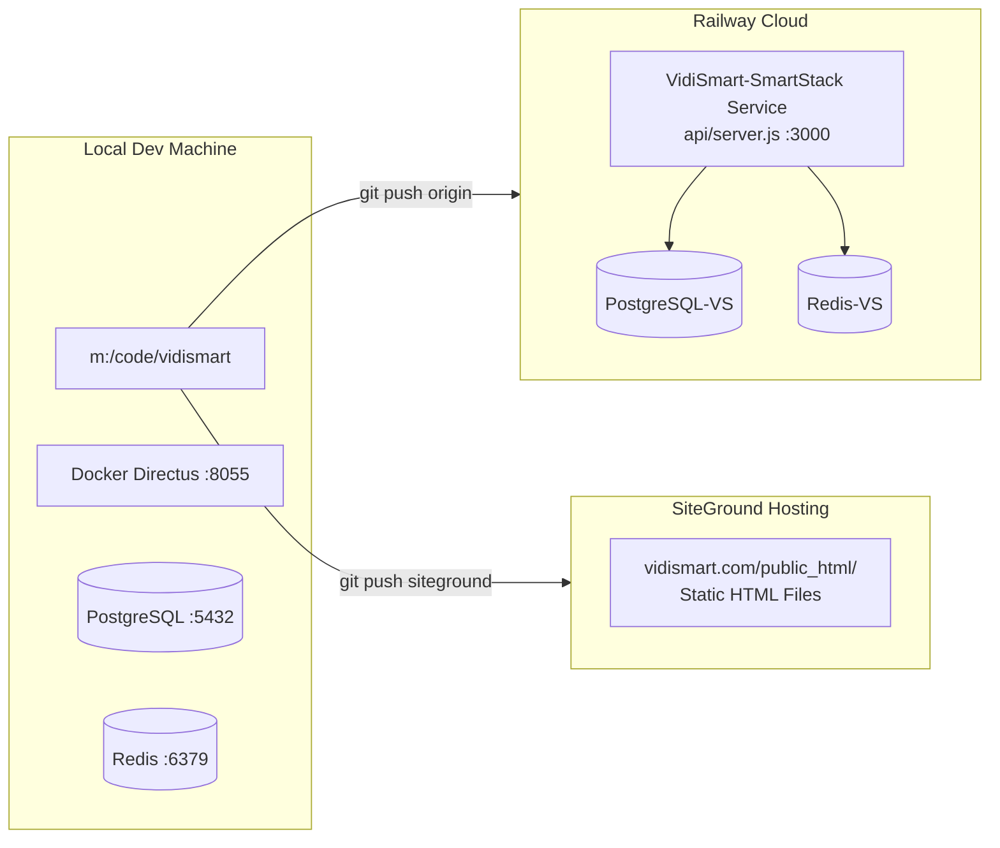
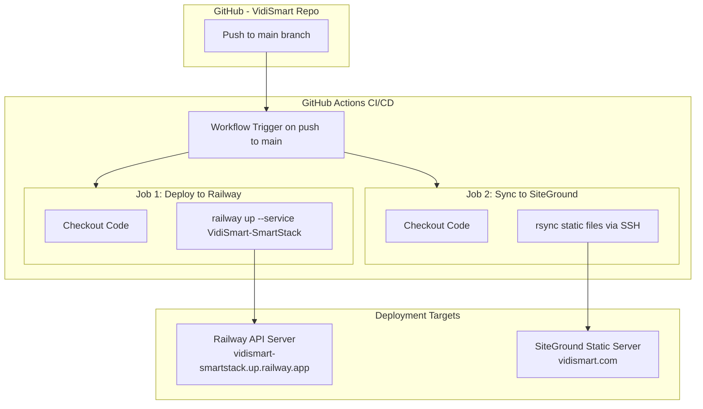

# VidiSmart Dual Deployment Pipeline Plan

## Overview

This plan defines how VidiSmart deploys code to **two targets simultaneously** from a single Git repository:

| Target | Purpose | Technology | URL |
|--------|---------|------------|-----|
| **Railway** | API Server + Dynamic Content | Node.js / Express | `vidismart-smartstack.up.railway.app` |
| **SiteGround** | Static HTML Pages | Apache / cPanel | `vidismart.com` |

---

## Current Architecture



### What Goes Where

| File/Folder | Railway | SiteGround | Notes |
|-------------|---------|------------|-------|
| `api/server.js` | ✅ Deployed | ❌ Skipped | Main API entry point |
| `api/package.json` | ✅ Deployed | ❌ Skipped | Dependencies for Nixpacks build |
| `*.html` (root) | ✅ Served as static by Express | ✅ Served directly | Landing pages, masterlist, etc. |
| `images/` | ✅ Served as static | ✅ Served directly | All images/assets |
| `assets/` | ✅ Served as static | ✅ Served directly | SVGs, webp files |
| `frontend/` | ⚠️ Not deployed yet | ⚠️ Not deployed | Directus-connected pages - future phase |
| `directus/` | ❌ Never | ❌ Never | Local Docker only |
| `converge/` | ❌ Never | ❌ Never | Local Docker only |
| `.env` | ❌ Never | ❌ Never | Secrets via Railway env vars |

---

## Current Git Configuration

### Remotes
- **origin** → `https://github.com/VidiBuzz/VidiFlow.git` ← **WRONG REPO** - needs fixing
- **siteground** → SSH to `gtxm1044.siteground.biz:18765/home/customer/www/vidismart.com/public_html/`

### Existing SiteGround Hook ([`.post-receive-hook.sh`](../.post-receive-hook.sh))
The SiteGround server already has a post-receive hook that:
1. Watches for pushes to `main` branch
2. Checks out files to `/home/customer/www/vidismart.com/public_html/`
3. Sets proper permissions (755 dirs, 644 files)

### Railway Config ([`railway.json`](../railway.json))
```json
{
  "build": { "builder": "NIXPACKS" },
  "deploy": {
    "startCommand": "cd api && npm start",
    "restartPolicyType": "ON_FAILURE",
    "restartPolicyMaxRetries": 10
  }
}
```

---

## Proposed Deployment Pipeline

### Option A: GitHub Actions Dual Deploy (Recommended)



#### Workflow File: `.github/workflows/deploy.yml`

```yaml
name: VidiSmart Dual Deploy

on:
  push:
    branches: [main]

jobs:
  # === JOB 1: Deploy API to Railway ===
  railway-deploy:
    runs-on: ubuntu-latest
    steps:
      - uses: actions/checkout@v4
      
      - name: Install Railway CLI
        run: npm install -g @railway/cli
      
      - name: Deploy to Railway
        env:
          RAILWAY_TOKEN: ${{ secrets.RAILWAY_TOKEN }}
        run: railway up --service VidiSmart-SmartStack

  # === JOB 2: Sync Static Files to SiteGround ===
  siteground-sync:
    runs-on: ubuntu-latest
    steps:
      - uses: actions/checkout@v4
      
      - name: Sync static files to SiteGround
        uses: burnett01/rsync-deployments@7.0.1
        with:
          switches: -avzr --delete
          path: ./
          remote_path: /home/customer/www/vidismart.com/public_html/
          remote_host: ${{ secrets.SG_HOST }}
          remote_port: ${{ secrets.SG_PORT }}
          remote_user: ${{ secrets.SG_USER }}
          remote_key: ${{ secrets.SG_SSH_KEY }}
          # Exclude non-static files
          exclude: |
            api/
            directus/
            converge/
            database/
            agents/
            mcp-servers/
            smart-book/
            smartgen/
            azure-tts/
            scripts/
            .playwright-mcp/
            node_modules/
            *.ps1
            *.md
            !README.md
            .gitignore
            .env*
            *.log
```

### Option B: Manual Dual Push (Simplest - Current Approach)

Keep the existing two-remote setup but fix the `origin` remote:

```bash
# Fix origin to point to correct VidiSmart repo
git remote set-url origin https://github.com/VidiBuzz/VidiSmart.git

# Deploy to both targets
git push origin main       # → GitHub → Railway auto-deploys
git push siteground main   # → SiteGround serves static files
```

---

## Required Changes

### Phase 1: Fix Git Remote (Immediate)
1. Create new GitHub repo: `VidiBuzz/VidiSmart` 
2. Update local `origin` remote: `git remote set-url origin https://github.com/VidiBuzz/VidiSmart.git`
3. Push all branches to new origin
4. Connect Railway to watch the new GitHub repo

### Phase 2: Set Up GitHub Actions (Recommended)
1. Add these GitHub Secrets:
   - `RAILWAY_TOKEN` — Railway API token
   - `SG_HOST` — `gtxm1044.siteground.biz`
   - `SG_PORT` — `18765`
   - `SG_USER` — `u2627-m33aqlpqghg3`
   - `SG_SSH_KEY` — Private SSH key for SiteGround
2. Create [`.github/workflows/deploy.yml`](../.github/workflows/deploy.yml)
3. Test by pushing to `main`

### Phase 3: Domain Setup (Future)
1. Add custom domain to Railway service: `api.vidismart.com`
2. Configure DNS CNAME: `api` → `vidismart-smartstack.up.railway.app`
3. Keep `vidismart.com` pointing to SiteGround for static content

---

## Environment Variables on Railway

| Variable | Value | Purpose |
|----------|-------|---------|
| `PORT` | `3000` | API listen port |
| `DATABASE_URL` | `${PostgreSQL-VS.DATABASE_URL}` | PostgreSQL connection |
| `REDIS_URL` | `${Redis-VS.REDIS_URL}` | Redis cache connection |
| `NODE_ENV` | `production` | Production mode |
| `CORS_ORIGIN` | `https://vidismart.com` | Allow frontend requests |

---

## Decision Matrix

| Factor | Option A: GitHub Actions | Option B: Manual Push |
|--------|--------------------------|----------------------|
| Automation | ✅ Fully automatic on push | ❌ Manual two-step push |
| Complexity | Medium (secrets, workflow) | Low (just git commands) |
| Error handling | ✅ Built-in logs/retries | Manual troubleshooting |
| Cost | Free (public repo) | Free |
| Speed | ~2 min for full deploy | Instant push |
| Security | ✅ Encrypted secrets | SSH key on local machine |
| Best for | Team collaboration, CI/CD | Solo developer, simplicity |

---

## Recommended Next Steps

1. **Fix the `origin` remote** to point to a proper VidiSmart GitHub repo
2. **Verify Railway deployment** is working with the default domain
3. **Choose deployment option** (A or B) and implement
4. **Set up custom domain** on Railway (`api.vidismart.com`)
5. **Connect frontend/** pages to Directus CMS for dynamic content
