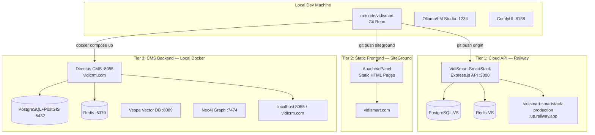
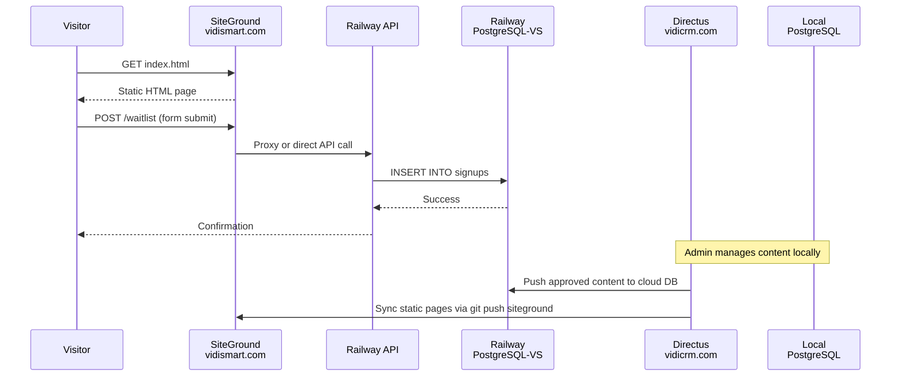
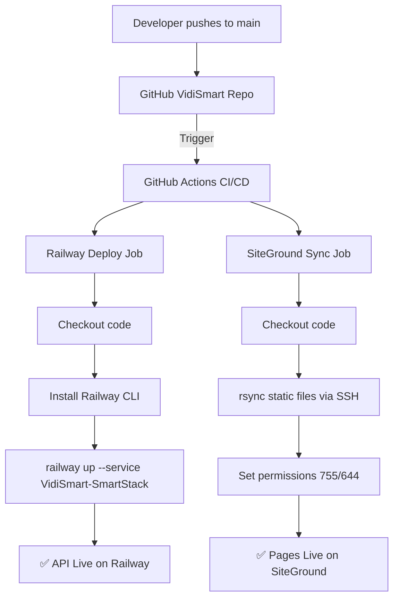

# VidiSmart Unified Platform Deployment Plan

**Date:** April 17, 2026  
**Status:** READY FOR IMPLEMENTATION  
**Version:** 3.0 — Consolidated from 15+ planning documents

---

## Executive Summary

VidiSmart is a **3-tier platform** that deploys to **3 different targets**. This is by design — not an accident. Each tier serves a distinct purpose in the overall architecture.



---

## The Three Tiers Explained

### Tier 1: Railway — API Server (Cloud)

| Property | Value |
|----------|-------|
| **Purpose** | Public-facing API backend, waitlist signup, dynamic endpoints |
| **URL** | `https://vidismart-smartstack-production.up.railway.app` |
| **Tech Stack** | Node.js, Express, PostgreSQL, Redis |
| **Entry Point** | [`api/server.js`](../api/server.js) — `cd api && npm start` |
| **Config** | [`railway.json`](../railway.json) — Nixpacks builder |
| **Services** | VidiSmart-SmartStack, PostgreSQL-VS, Redis-VS |

**What it serves:**
- REST API endpoints (waitlist signups, checklist CRUD, tech-stack data)
- Root `*.html` files as static content via Express `express.static()`
- Database operations via connection to Railway's PostgreSQL-VS

### Tier 2: SiteGround — Static Pages (CDN/Web Host)

| Property | Value |
|----------|-------|
| **Purpose** | Fast static HTML page delivery for SEO and public access |
| **URL** | `https://vidismart.com` |
| **Tech Stack** | Apache, cPanel, SSH git push |
| **Deploy Method** | `git push siteground main` → post-receive hook |
| **Hook Script** | [`.post-receive-hook.sh`](../.post-receive-hook.sh) |
| **Remote Path** | `/home/customer/www/vidismart.com/public_html/` |

**What it serves:**
- All root `*.html` files (index.html, waitlist.html, masterlist, etc.)
- `images/`, `assets/` directories
- `frontend/` directory (when ready for production)

### Tier 3: Local Docker — CMS & AI Services (Windows Server)

| Property | Value |
|----------|-------|
| **Purpose** | Content management, vector search, knowledge graph, AI processing |
| **URL** | `https://vidicrm.com` (local network exposed) |
| **Tech Stack** | Docker Compose, Directus, PostgreSQL+PostGIS, Redis, Vespa, Neo4j |
| **Compose File** | [`directus/docker-compose.yml`](../directus/docker-compose.yml) |
| **Status** | ✅ Running now (Docker launched) |

**Services running locally (from [`.PORT_ASSIGNMENTS.md`](../.PORT_ASSIGNMENTS.md)):**

| Port | Service | Status |
|------|---------|--------|
| 5432 | PostgreSQL + PostGIS | ✅ Running |
| 6379 | Redis Cache | ✅ Running |
| 8055 | Directus (VidiCRM) | ✅ Running |
| 8089 | Vespa (VidiAi) Vector DB | ✅ Running |
| 7474 | Neo4j Knowledge Graph | ✅ Running |
| 1234 | LM Studio API | ✅ Running |
| 5000 | OpenWebUI | ✅ Running |

---

## How Data Flows Between Tiers



---

## Git Repository Structure & Deployment Mapping

```
m:/code/vidismart/
│
├── 📦 DEPLOYS TO RAILWAY (Tier 1)
│   ├── api/server.js          ← Main Express entry point
│   ├── api/package.json       ← Dependencies for Nixpacks build
│   └── railway.json           ← Railway deploy config
│
├── 🌐 DEPLOYS TO SITEGROUND (Tier 2)
│   ├── *.html                 ← All landing pages (index, waitlist, etc.)
│   ├── images/                ← All images and assets
│   ├── assets/                ← SVGs, icons, webp files
│   ├── frontend/              ← Directus-connected pages (future)
│   │   ├── index.html
│   │   ├── about.html
│   │   ├── community.html
│   │   ├── directory.html
│   │   ├── resources.html
│   │   └── assets/js/directus-service.js ← Connects to localhost:8055
│   └── smart-book/            ← Interactive smart book
│
├── 🐳 LOCAL DOCKER ONLY (Tier 3)
│   ├── directus/              ← Docker compose, migrations, DB files
│   │   ├── docker-compose.yml
│   │   └── database/          ← PostgreSQL data files (NEVER push to cloud)
│   ├── converge/              ← Converge stack configs
│   └── .env                   ← Secrets (NEVER push to cloud)
│
├── 📚 PLANNING DOCS (Reference only)
│   ├── plans/                 ← All architecture plans
│   ├── *.md                   ← Documentation
│   └── agents/                ← Agent definitions
│
└── ⚙️ GIT CONFIG
    ├── .gitignore             ← Excludes database/, .env, node_modules/
    ├── .post-receive-hook.sh  ← SiteGround auto-deploy script
    └── railway.json           ← Railway service definition
```

---

## Current Git Remote Configuration

```
origin      → https://github.com/VidiBuzz/VidiFlow.git     ❌ WRONG REPO
siteground  → ssh://u2627-m33aqlpqghg3@gtxm1044.siteground.biz:18765/...  ✅ Correct
```

**Problem:** `origin` points to VidiFlow (a different project). Needs to be changed to a VidiSmart-specific repo.

---

## Proposed Dual Deployment Pipeline

### Option A: GitHub Actions (Recommended for automation)



**Workflow file:** `.github/workflows/deploy.yml`

Required GitHub Secrets:
| Secret | Value |
|--------|-------|
| `RAILWAY_TOKEN` | Railway API token (`_2r2_NK5...`) |
| `SG_HOST` | `gtxm1044.siteground.biz` |
| `SG_PORT` | `18765` |
| `SG_USER` | `u2627-m33aqlpqghg3` |
| `SG_SSH_KEY` | Private SSH key for SiteGround |

### Option B: Manual Dual Push (Simplest — current approach)

```bash
# After fixing origin remote:
git push origin main         # → GitHub → Railway auto-deploys
git push siteground main     # → SiteGround serves static files
```

---

## Implementation Steps

### Phase 1: Fix Git Infrastructure (Immediate)
- [ ] Create new GitHub repo: `VidiBuzz/VidiSmart`
- [ ] Update local origin: `git remote set-url origin https://github.com/VidiBuzz/VidiSmart.git`
- [ ] Push all branches to new origin
- [ ] Connect Railway to watch the new GitHub repo (or keep manual `railway up`)
- [ ] Verify Railway domain resolves correctly

### Phase 2: Set Up Deployment Pipeline
- [ ] Choose Option A (GitHub Actions) or Option B (Manual Push)
- [ ] If Option A: Create `.github/workflows/deploy.yml`
- [ ] If Option A: Add GitHub secrets for Railway + SiteGround
- [ ] Test deployment by pushing to main

### Phase 3: Connect Frontend to Directus
- [ ] Configure CORS on Directus to allow `vidismart.com` origins
- [ ] Update [`frontend/assets/js/directus-service.js`](../frontend/assets/js/directus-service.js) to point to `vidicrm.com`
- [ ] Test frontend → Directus data flow
- [ ] Deploy `frontend/` to SiteGround

### Phase 4: Complete Directus Setup (from [DIRECTUS-COMPLETE-STATUS.md](../DIRECTUS-COMPLETE-STATUS.md))
- [ ] Configure SMTP (Resend API) for email flows
- [ ] Create VidiMail flow in Directus
- [ ] Configure CORS properly
- [ ] Upload logo/branding assets to R2
- [ ] Install recommended extensions

### Phase 5: Domain & DNS (Future)
- [ ] Add custom domain to Railway: `api.vidismart.com`
- [ ] CNAME record: `api` → `vidismart-smartstack-production.up.railway.app`
- [ ] Keep `vidismart.com` → SiteGround for static content
- [ ] Keep `vidicrm.com` → Local Docker (exposed via tunnel if needed)

---

## Environment Variables Reference

### Railway (Tier 1 — Cloud)
| Variable | Source | Purpose |
|----------|--------|---------|
| `PORT` | Railway default | Listen port (3000) |
| `DATABASE_URL` | `${PostgreSQL-VS.DATABASE_URL}` | Cloud PostgreSQL |
| `REDIS_URL` | `${Redis-VS.REDIS_URL}` | Cloud Redis cache |
| `NODE_ENV` | Set to `production` | Production mode |
| `CORS_ORIGIN` | Set to `https://vidismart.com` | Allow frontend requests |

### Directus / Local Docker (Tier 3)
| Variable | Value | Purpose |
|----------|-------|---------|
| `DB_CLIENT` | `pg` | PostgreSQL driver |
| `DB_HOST` | `database` (Docker internal) | DB host |
| `DB_DATABASE` | `vidismart_community` | Database name |
| `STORAGE_R2_*` | (see docker-compose.yml) | Cloudflare R2 integration |
| `ADMIN_EMAIL` | `admin@vidismart.com` | Default admin |
| `CACHE_REDIS` | `redis://cache:6379` | Redis cache |

---

## Key Documents Index

| Document | Location | Focus Area |
|----------|----------|------------|
| Launch Plan | [`plans/VIDISMART_LAUNCH_PLAN.md`](VIDISMART_LAUNCH_PLAN.md) | 8-week phased launch roadmap |
| Community Plan | [`plans/VIDISMART_COMMUNITY_REFINED_PLAN.md`](VIDISMART_COMMUNITY_REFINED_PLAN.md) | Agent orchestration, MCP tools |
| Vector Stack | [`plans/VIDISMART_VECTOR_STACK_ARCHITECTURE.md`](VIDISMART_VECTOR_STACK_ARCHITECTURE.md) | Vespa, GraphRAG, PostGIS geolocation |
| VidiCity Plan | [`plans/vidicity-architecture-plan.md`](vidicity-architecture-plan.md) | 10-city community MVP |
| SmartChannel CX | [`plans/smartchannel-new-pages-architecture.md`](smartchannel-new-pages-architecture.md) | VidiMail, VidiTwin, Media Explorer |
| Graphics Guide | [`plans/Graphics.VidiSmart.md`](Graphics.VidiSmart.md) | UI/UX enhancement patterns |
| Dual Deploy Pipeline | [`plans/DUAL_DEPLOYMENT_PIPELINE.md`](DUAL_DEPLOYMENT_PIPELINE.md) | Railway + SiteGround CI/CD details |
| Directus Status | [`DIRECTUS-COMPLETE-STATUS.md`](DIRECTUS-COMPLETE-STATUS.md) | CMS current state + missing items |
| Migration Scripts | [`MIGRATION-README.md`](MIGRATION-README.md) | HTML → Directus migration tooling |
| Port Assignments | [`.PORT_ASSIGNMENTS.md`](.PORT_ASSIGNMENTS.md) | All local service ports |

---

## Decision Required

Before implementation, please confirm:

1. **Git Repo:** Create new `VidiBuzz/VidiSmart` GitHub repo? Or rename/reuse existing?
2. **Deployment:** Option A (GitHub Actions automated) or Option B (manual dual push)?
3. **Domain:** Does Railway need a custom domain (`api.vidismart.com`) or keep default Railway URL?
4. **Priority:** Which phase to tackle first after git fix?
